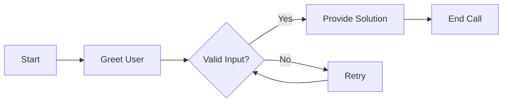
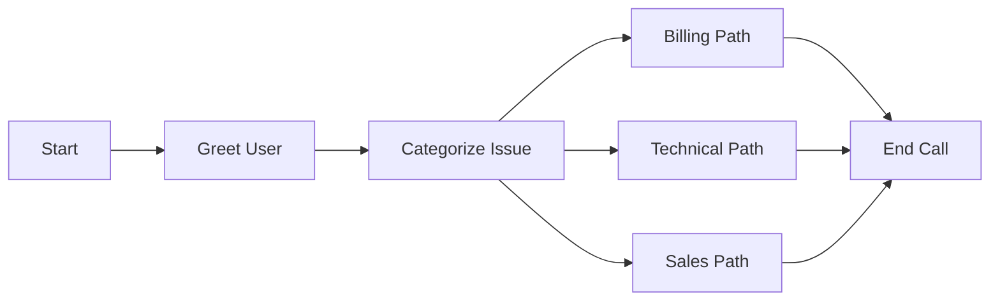

# Best Practices

Master the art of building effective, maintainable, and performant Flow Agents with proven patterns and strategies used by top developers on the Hamsa platform.

---

## Flow Design Principles

### 1. Start Simple, Scale Gradually

<Tip>
**Build your MVP flow first**: Create a basic happy path with 3-5 nodes, test it thoroughly, then add complexity.
</Tip>

**Phase 1 - Happy Path**:


**Phase 2 - Add Error Handling**:



**Phase 3 - Add Branching**:



### 2. Design for Failure

**Every node should handle**:

- Invalid user input
- Missing variables
- Tool failures
- Timeout scenarios
- User confusion

**Example: Robust Input Collection**

```yaml
❌ Fragile Design:
Node: "Get Account Number"
  Message: "What's your account number?"
  Transitions:
    - Natural Language: "provided number" → Verify_Account

# No fallback, no validation, no retry logic


✅ Robust Design:
Node: "Get Account Number" (attempt 1/3)
  Message: "Please provide your 8-digit account number"
  Variable Extraction:
    - account_number (type: string, validation: length == 8)

  Transitions:
    - Equation: account_number.length == 8 → Verify_Account
    - Equation: attempt_count < 3 → Retry_Account_Number
    - Equation: attempt_count >= 3 → Transfer_to_Agent
    - Natural Language: "don't know" → Account_Lookup_Alternative
    - Always → Clarify_Format
```

### 3. Keep Nodes Focused

Each node should have **one primary purpose**:

**❌ Multi-Purpose Node (Avoid)**:

```yaml
Node: "Handle Everything"
  Message: "Tell me your account number, the issue you're having, when it started, and what you've tried so far"
  # Too much at once - overwhelming for user and AI
```

**✅ Single-Purpose Nodes (Preferred)**:

```yaml
Node 1: "Collect Account Number"
  Message: "Please provide your account number"

Node 2: "Describe Issue"
  Message: "What issue are you experiencing?"

Node 3: "When Started"
  Message: "When did this issue begin?"

Node 4: "Previous Attempts"
  Message: "What have you tried so far?"
```

### 4. Provide Clear Escape Hatches

Users should always know how to:

- Transfer to a human
- Return to main menu
- End the call
- Get help

**Implementation**:

```yaml
Global Nodes (Always Available):
  - "Transfer to Agent" (trigger: "speak to human" OR DTMF: 0)
  - "Main Menu" (trigger: "main menu" OR DTMF: 9)
  - "End Call" (trigger: "end call" OR DTMF: #)
  - "Help" (trigger: "help" OR DTMF: *)

Announcements:
  Welcome Message: "...You can press 0 at any time to speak with an agent."
  Every Menu: "...or press 9 to return to the main menu."
```

---

## Node Organization

### Naming Conventions

**Use descriptive, action-oriented names**:

```yaml
❌ Bad Names:
  - Node 1
  - Conversation
  - Router
  - Tool
  - Transfer

✅ Good Names:
  - Welcome_and_Identify_Caller
  - Collect_Account_Number
  - Verify_Customer_Identity
  - Route_by_Issue_Type
  - Lookup_Account_Balance
  - Transfer_to_Billing_Specialist
```

**Naming Pattern**:

```
{Action}_{Object}_{Context}

Examples:
- Collect_Phone_Number_for_Callback
- Verify_Account_Status_Before_Support
- Route_to_Department_by_Issue
- Send_Confirmation_Email_After_Booking
```

### Visual Layout

**Organize flows left-to-right, top-to-bottom**:

```
┌──────────┐       ┌──────────┐       ┌──────────┐
│  Start   │  →    │  Greet   │  →    │ Identify │
└──────────┘       └──────────┘       └──────────┘
                                             │
                                             ↓
                                       ┌──────────┐
                                       │  Router  │
                                       └──────────┘
                                        ↙    │    ↘
                              ┌─────────┐  │  ┌─────────┐
                              │ Billing │  │  │  Tech   │
                              └─────────┘  │  └─────────┘
                                           ↓
                                      ┌─────────┐
                                      │  Sales  │
                                      └─────────┘
```

**Layout Guidelines**:

- **Start node**: Top-left
- **Main flow**: Left to right
- **Branches**: Vertical spread from routers
- **End nodes**: Right side
- **Global nodes**: Separate area (bottom or side)
- **Error handling**: Below main flow

### Grouping Related Nodes

Use visual proximity and naming to group related functionality:

```yaml
# Account Management Cluster
- Verify_Account_Identity
- Check_Account_Status
- Update_Account_Info
- Account_Security_Check

# Billing Cluster
- Billing_Issue_Categorization
- Check_Payment_Status
- Process_Payment_Update
- Billing_Dispute_Handler

# Support Cluster
- Technical_Issue_Triage
- Troubleshooting_Steps
- Escalation_Decision
- Create_Support_Ticket
```

---

## Variable Management

### Naming Conventions

**Always use snake_case**:

```yaml
✅ Good:
  - customer_name
  - account_balance
  - issue_category
  - callback_requested
  - payment_due_date

❌ Bad:
  - customerName       (camelCase)
  - Customer-Name      (kebab-case)
  - CUSTOMER_NAME      (SCREAMING_SNAKE)
  - customer name      (spaces)
```

**Be descriptive and specific**:

```yaml
❌ Vague:
  - number
  - id
  - status
  - data

✅ Specific:
  - account_number
  - customer_id
  - payment_status
  - customer_data
```

### Variable Scope Planning

**Plan variable lifecycle before building**:

```yaml
Variables Needed:
  System Variables (built-in):
    - session_id
    - current_time
    - user_input
    - call_duration

  Custom Variables (API-provided):
    - customer_tier
    - business_hours
    - service_region

  Extracted Variables (conversation):
    - customer_name (Node: Welcome)
    - account_number (Node: Identify)
    - issue_type (Node: Categorize)
    - issue_severity (Node: Triage)
    - resolution_notes (Node: Resolve)
```

### Avoid Variable Pollution

**Don't extract variables you won't use**:

```yaml
❌ Over-Extraction:
Node: "Collect Info"
  Extract:
    - customer_name
    - customer_age
    - customer_gender
    - customer_location
    - customer_occupation
    - favorite_color
    # Only actually using customer_name and location

✅ Minimal Extraction:
Node: "Collect Info"
  Extract:
    - customer_name
    - customer_location
    # Only what you actually need
```

### Default Values and Validation

**Always provide fallbacks**:

```yaml
✅ Safe Variable Usage:
Message: "Hello {{customer_name || 'valued customer'}}, your balance is ${{account_balance || 0}}."
# If variables don't exist:
# "Hello valued customer, your balance is $0."
```

**Validate before using**:

```yaml
Router: "Check Account Status"
  Transitions:
    - Logic: all
      Conditions:
        - Variable: account_number
          Operator: exists
        - Variable: account_number
          Operator: not_equals
          Value: ""
      Target: Proceed_with_Lookup

    - Always → Request_Account_Number_Again
```

---

## Transition Design

### Priority Strategy

**Use consistent priority ranges**:

```yaml
Priority Ranges:
  900-1000: Critical overrides (emergency, DTMF shortcuts)
  700-800:  High priority (VIP routing, urgent issues)
  500-600:  Medium priority (standard categorization)
  300-400:  Low priority (fallback natural language)
  100-200:  Very low priority (broad catch-alls)
  0-50:     Always transitions (fallbacks)

Example:
Transitions:
  - DTMF: 0 → Emergency_Transfer (priority: 1000)
  - Natural: "urgent" → Priority_Path (priority: 700)
  - Natural: "billing" → Billing_Path (priority: 500)
  - Natural: "general question" → General_Path (priority: 300)
  - Always → Default_Path (priority: 0)
```

### Natural Language vs. Equations

**Decision Matrix**:

```yaml
Use Natural Language When: ✓ Detecting user intent
  ✓ Sentiment analysis
  ✓ Topic categorization
  ✓ Fuzzy matching
  ✓ Understanding context

Use Equations When: ✓ Variable comparisons
  ✓ Numeric thresholds
  ✓ String matching
  ✓ Boolean logic
  ✓ Data validation

Use DTMF When: ✓ IVR menus
  ✓ Simple selection
  ✓ Quick shortcuts
  ✓ Accessibility needed
```

**Example: Optimal Combination**:

```yaml
Node: "VIP Routing"
  Transitions:
    # DTMF for instant access
    - DTMF: 1 → VIP_Sales (priority: 1000)

    # Equations for data-based routing
    - Equation: customer_tier == "platinum" → VIP_Concierge (priority: 800)
    - Equation: lifetime_value > 50000 → VIP_Account_Manager (priority: 700)

    # Natural language for intent
    - Natural: "urgent issue" → Priority_Support (priority: 500)
    - Natural: "general question" → Standard_Support (priority: 300)

    # Always as fallback
    - Always → Standard_Path (priority: 0)
```

### Avoiding Transition Conflicts

**Test for overlap**:

```yaml
❌ Conflicting Transitions:
- Natural: "User wants help" (priority: 100)
- Natural: "User needs assistance" (priority: 100)
# Both trigger for same input!

✅ Distinct Transitions:
- Natural: "User wants to speak with a human agent" (priority: 200)
- Natural: "User wants to return to the main menu" (priority: 100)
```

---

## Error Handling Patterns

### Pattern 1: Retry with Guidance

```yaml
Node: "Collect Account Number" (Attempt 1)
  Message: "Please provide your account number"

  Transitions:
    - Equation: account_number_valid == true → Verify_Account
    - Equation: retry_count < 3 → Retry_with_Help
    - Always → Transfer_to_Agent

Node: "Retry Account Number" (Attempt 2)
  Message: "I didn't get a valid account number. It should be 8 digits. You can say them one at a time or all together."
  # Provides more guidance

Node: "Final Retry" (Attempt 3)
  Message: "Let me transfer you to an agent who can help you look up your account."
  # Gives up gracefully
```

### Pattern 2: Progressive Escalation

```yaml
Stage 1: "Self-Service"
  → Try automated solution

Stage 2: "Guided Self-Service"
  → Provide detailed instructions

Stage 3: "Specialist Transfer"
  → Transfer to trained agent

Stage 4: "Priority Escalation"
  → Route to senior support

Implementation:
Router: "Escalation Decision"
  Transitions:
    - Equation: attempt_count == 1 → Automated_Solution
    - Equation: attempt_count == 2 → Guided_Instructions
    - Equation: attempt_count >= 3 → Transfer_to_Specialist
```

### Pattern 3: Fallback Chains

```yaml
Primary Method:
  → Try main solution

Secondary Method:
  → Try alternative approach

Tertiary Method:
  → Offer workaround

Final Fallback:
  → Human transfer or graceful failure

Example:
Node: "Verify Customer"
  Transitions:
    - Try account number lookup → Success_Path
    - Try phone number lookup → Success_Path
    - Try email lookup → Success_Path
    - Offer manual verification → Manual_Verification
    - Transfer to agent → Agent_Verification
```

### Pattern 4: Context Preservation on Error

```yaml
# Save context before error handling
Node: "Before Error"
  Extract:
    - error_context_node: "Payment Processing"
    - error_context_data: "{{payment_amount}}"
    - error_timestamp: "{{current_time}}"

  Transitions:
    - Tool fails → Error_Handler

Node: "Error Handler"
  Message: "I encountered an issue while processing your {{error_context_data}} payment at {{error_timestamp}}. Let me get you help."

  # User knows exactly what went wrong
```

---

## Performance Optimization

### Minimize Natural Language Transitions

**Impact**:

- Each natural language transition: 200-800ms latency
- Cost: ~100-300 tokens per evaluation
- Multiple NL transitions multiply these costs

**Strategy**:

```yaml
❌ Slow (5 NL transitions = 1-4 second delay):
Transitions:
  - Natural: "billing question" → Billing
  - Natural: "technical issue" → Tech
  - Natural: "account inquiry" → Account
  - Natural: "sales question" → Sales
  - Natural: "general question" → General

✅ Fast (1 NL transition + equations):
Transitions:
  - Natural: "categorize user intent" → Intent_Router
    # Single NL evaluation to categorize

Intent_Router:
  - Equation: intent_category == "billing" → Billing
  - Equation: intent_category == "technical" → Tech
  - Equation: intent_category == "account" → Account
  - Equation: intent_category == "sales" → Sales
  - Always → General
    # Fast equation-based routing
```

### Optimize Global Nodes

**Limit to 3-5 essential global nodes**:

```yaml
✅ Optimized (3 global nodes):
- Transfer to Agent (critical)
- Main Menu Return (navigation)
- End Call (exit)
Total: 3 × 300ms = 900ms max overhead per turn

❌ Slow (10 global nodes):
- Transfer to Sales Agent
- Transfer to Support Agent
- Transfer to Billing Agent
- Transfer to Tech Support
- Main Menu
- Help
- End Call
- Cancel Process
- Repeat Last
- Account Info
Total: 10 × 300ms = 3000ms (3 seconds!) overhead per turn
```

### Batch Tool Calls

**Call multiple tools in parallel when possible**:

```yaml
❌ Sequential (slow):
Tool Node 1: "Get Account Info" → 2 seconds
  → Go to next node
Tool Node 2: "Get Payment History" → 2 seconds
  → Go to next node
Total: 4 seconds

✅ Parallel (fast):
Tool Node: "Get All Data"
  Tool 1: Get Account Info
  Tool 2: Get Payment History
  Execute in parallel → 2 seconds
Total: 2 seconds
```

### Cache Frequently Accessed Data

```yaml
Pattern: Cache in Custom Variables
  # Set at start of call
  Start Node Tool: "Load Customer Profile"
    Output: customer_tier, account_status, payment_method
    Store as custom variables

  # Reuse throughout flow
  Router: "Check Customer Tier"
    - Equation: customer_tier == "platinum" → ...
    # No additional API call needed
```

### Use DTMF for Hot Paths

```yaml
# For frequently used paths, offer DTMF
Node: "Main Menu"
  Message: "Press 1 for Billing, 2 for Support, or describe your issue"

  Transitions:
    - DTMF: 1 → Billing (instant)
    - DTMF: 2 → Support (instant)
    - Natural: categorize → Router (200-800ms)

# Most users will learn to press 1/2 (instant routing)
# New users can still speak naturally
```

---

## Conversation Design

### Write Natural Prompts

**Sound like a human, not a robot**:

```yaml
❌ Robotic:
"Please state your account identification number consisting of eight numerical digits."

✅ Natural:
"What's your account number? It should be 8 digits."
```

### Keep Messages Concise

**Users' attention spans are short**:

```yaml
❌ Too Long:
"Thank you for calling our customer support line. We really appreciate your business and want to help you today. Before we begin, I need to collect some information from you to ensure I can provide you with the best possible service. First, I'll need your account number, which you can find on your most recent statement or invoice, or in your account portal online. It should be exactly 8 digits long. Please provide that now."

✅ Concise:
"Thanks for calling! To help you, I'll need your 8-digit account number."
```

### Provide Clear Instructions

**Tell users exactly what to do**:

```yaml
❌ Vague:
"Let me know about your issue."

✅ Specific:
"Briefly describe the problem you're experiencing in one or two sentences."
```

### Confirm Critical Information

```yaml
Pattern: Confirm-Correct-Proceed
  1. Collect data
  2. Repeat back to user
  3. Ask for confirmation
  4. Allow correction
  5. Proceed when confirmed

Example:
Node: "Collect Phone Number"
  Extract: callback_number

Node: "Confirm Phone Number"
  Message: "I have {{callback_number}} as your callback number. Is that correct?"

  Transitions:
    - Natural: "yes" → Schedule_Callback
    - Natural: "no" → Collect_Phone_Number_Again
    - Always → Repeat_Confirmation
```

### Handle Ambiguity Gracefully

```yaml
# User: "I need help with my account"
# (Vague - billing? technical? access?)

Node: "Clarify Account Issue"
  Message: "I can help with your account. Is this about:
    - Billing or payments
    - Technical access issues
    - Updating account information
    - Something else?"

  Transitions:
    - Natural: "billing" → Billing_Path
    - Natural: "technical" → Tech_Path
    - Natural: "update info" → Account_Update_Path
    - Natural: "other" → General_Inquiry
```

---

## Testing Strategies

### Unit Testing: Individual Nodes

**Test each node in isolation**:

```yaml
Node: "Collect Account Number"
  Test Cases:
    ✓ Valid input: "12345678"
    ✓ Valid input spoken: "one two three four five six seven eight"
    ✗ Too short: "123456"
    ✗ Too long: "123456789"
    ✗ Invalid characters: "abcd1234"
    ✗ Empty input: ""
    ✓ User doesn't know: "I don't have it"
    ✓ User needs help: "where do I find that?"
```

### Integration Testing: Flow Paths

**Test complete user journeys**:

```yaml
Test Journey 1: Happy Path - Simple Inquiry
  Start → Greet → Identify → Categorize → Resolve → End
  Expected: < 2 minute duration, no errors

Test Journey 2: Complex Path - Multiple Attempts
  Start → Greet → Identify (fail) → Retry (fail) → Transfer
  Expected: Graceful degradation to human agent

Test Journey 3: Global Node Interruption
  Start → Greet → [User requests agent] → Transfer
  Expected: Immediate transfer, context preserved
```

### Edge Case Testing

```yaml
Test Scenarios: ✓ User speaks over agent (interrupt handling)
  ✓ Long silence periods (timeout behavior)
  ✓ Unexpected input at every node
  ✓ Rapid repeated inputs
  ✓ Very long user responses (> 1 minute)
  ✓ Background noise (phone quality)
  ✓ Multiple language switching
  ✓ DTMF during voice response
  ✓ Network interruption/reconnection
```

### Regression Testing

**After any flow changes, re-test**:

```yaml
Regression Test Suite: 1. All critical paths (must work)
  2. All transition conditions (must evaluate correctly)
  3. All variable extractions (must capture accurately)
  4. All tool integrations (must execute successfully)
  5. All global nodes (must trigger appropriately)
  6. All error handlers (must recover gracefully)
```

---

## Common Pitfalls to Avoid

### 1. Over-Complicated First Version

❌ **Don't build the perfect flow upfront**

- Trying to handle every edge case from day one
- Creating 50+ nodes before testing basic functionality
- Over-engineering for scenarios that may never happen

✅ **Start simple, iterate based on real usage**

### 2. No Fallback Transitions

❌ **Leaving nodes without Always transitions**

```yaml
# Natural language might not match
# User conversation stalls!
```

✅ **Always include fallback paths**

### 3. Variable Name Inconsistency

❌ **Using different formats**:

```yaml
- customerName
- customer_phone
- CUSTOMER-EMAIL
- Customer Address
```

✅ **Consistent snake_case everywhere**

### 4. Unclear Global Conditions

❌ **Vague global triggers**:

```yaml
globalCondition: 'User needs help'
# Too broad - triggers inappropriately
```

✅ **Specific global triggers**:

```yaml
globalCondition: 'User explicitly requests to speak with a human agent'
```

### 5. Ignoring Performance

❌ **Multiple natural language transitions per node**
❌ **10+ global nodes**
❌ **Sequential tool calls that could be parallel**

✅ **Optimize for speed and cost**

### 6. Poor Error Messages

❌ **Generic errors**:

```yaml
'An error occurred. Please try again.'
```

✅ **Specific, actionable errors**:

```yaml
"I couldn't verify that account number. Please check that it's 8 digits and try again, or press 0 to speak with an agent who can help."
```

### 7. No User Testing

❌ **Only developer testing**

- You know how the flow works
- You know what inputs to provide
- You know the "correct" path

✅ **Test with real users**

- They'll find issues you never considered
- They'll use unexpected phrasing
- They'll expose unclear instructions

### 8. Forgetting Mobile Context

❌ **Assuming perfect audio**

- Users may be in cars, on street, in noisy environments
- Phone connection quality varies
- Background noise interferes

✅ **Design for real-world conditions**

- Repeat critical information
- Offer DTMF alternatives
- Confirm important data verbally

---

## Production Readiness Checklist

Before deploying your flow to production:

### Functionality

- [ ] All critical paths tested end-to-end
- [ ] Error handling for every node
- [ ] Fallback transitions on all nodes (except terminal)
- [ ] Global escape hatches (agent transfer, main menu, end call)
- [ ] Variable validation before usage
- [ ] Tool failure handling
- [ ] Timeout scenarios handled

### User Experience

- [ ] Clear, concise messages (< 3 sentences)
- [ ] Natural, conversational tone
- [ ] Confirmation for critical actions
- [ ] Helpful error messages
- [ ] Progress indicators for long operations
- [ ] Accessible via DTMF for key functions

### Performance

- [ ] < 5 global nodes total
- [ ] Minimal natural language transitions (< 5 per node)
- [ ] Equations used where possible instead of NL
- [ ] Parallel tool calls where applicable
- [ ] No redundant API calls

### Validation

- [ ] All nodes have names
- [ ] All transitions have descriptions
- [ ] No broken edges/references
- [ ] No validation errors in flow builder
- [ ] All variables follow snake_case
- [ ] Global nodes use only system/custom variables

### Documentation

- [ ] Flow diagram exported/documented
- [ ] Node purposes documented
- [ ] Variable list maintained
- [ ] Known limitations documented
- [ ] Escalation paths documented

### Monitoring

- [ ] Webhook configured for call events
- [ ] Outcome tracking implemented
- [ ] Key metrics identified
- [ ] Alert thresholds defined
- [ ] Regular review schedule set

---

## Maintenance Best Practices

### Version Control

```yaml
Approach: 1. Use snapshot history feature
  2. Name snapshots descriptively
  3. Test changes in development snapshots
  4. Rollback if issues found

Snapshot Naming: ✓ "v1.2 - Added billing FAQ path"
  ✓ "v1.3 - Fixed account verification bug"
  ✗ "snapshot 1"
  ✗ "test"
```

### Regular Audits

**Monthly Flow Review**:

- Check for unused nodes (remove)
- Review most/least used paths (optimize)
- Identify high error rates (improve)
- Update outdated information
- Verify all tools still work

### Gradual Changes

**Don't make sweeping changes in production**:

```yaml
❌ Risky: Rebuild entire flow at once
✅ Safe: Change one branch at a time

Process: 1. Identify improvement area
  2. Test change in snapshot
  3. Deploy to production
  4. Monitor for issues
  5. Move to next improvement
```

### A/B Testing

```yaml
Pattern: Duplicate flow for testing
  Flow A: Current version (80% of traffic)
  Flow B: Experimental version (20% of traffic)

  Monitor:
    - Completion rates
    - Average call duration
    - User satisfaction scores
    - Transfer rates

  If Flow B performs better:
    → Gradually shift traffic (50/50, then 20/80, then 100%)
```

---

## Examples: Before & After

### Example 1: Inefficient to Optimized

**❌ Before**:

```yaml
Node: "Billing Help"
  Message: "I can help with billing. Tell me everything about your billing issue including your account number, what the charge is for, when it occurred, whether you've disputed it before, and what resolution you're looking for."

  Transitions:
    - Natural: "wants refund" → Refund_Flow
    - Natural: "has question" → Billing_FAQ
    - Natural: "wants to pay" → Payment_Flow
    - Natural: "dispute charge" → Dispute_Flow
    - Natural: "update billing info" → Update_Info
    - Natural: "something else" → General_Billing

# Issues:
# - Overwhelming message (too many questions at once)
# - 6 natural language transitions (slow, expensive)
# - No fallback transition
# - No clear path forward if none match
```

**✅ After**:

```yaml
Node: "Billing Help"
  Message: "I can help with billing. Are you calling about a charge, payment, or billing information update?"

  Transitions:
    - Natural: "charge or dispute" → Charge_Router (priority: 200)
    - Natural: "payment" → Payment_Flow (priority: 200)
    - Natural: "update info" → Update_Info (priority: 200)
    - Always → Billing_Clarification (priority: 0)

Charge_Router:
  Transitions:
    - Natural: "wants refund" → Refund_Flow
    - Natural: "wants to dispute" → Dispute_Flow
    - Always → General_Charge_Help

# Improvements:
# - Focused question (one thing at a time)
# - 3 NL transitions instead of 6 (faster, cheaper)
# - Fallback transition (safer)
# - Two-stage routing (simpler conditions)
```

### Example 2: Fragile to Robust

**❌ Before**:

```yaml
Tool Node: "Check Account Balance"
  Tool: "GetBalanceAPI"
  Parameters:
    - account_id: "{{account_number}}"

  Transitions:
    - Always → Show_Balance

# Issues:
# - Doesn't check if account_number exists
# - No error handling if tool fails
# - No validation of account_number format
# - Assumes tool always succeeds
```

**✅ After**:

```yaml
Router: "Validate Account Number"
  Transitions:
    - Logic: all
      Conditions:
        - account_number exists
        - account_number.length == 8
      Target: Check_Account_Balance
    - Always → Request_Account_Number

Tool Node: "Check Account Balance"
  Tool: "GetBalanceAPI"
  Parameters:
    - account_id: "{{account_number}}"
  Timeout: 5000ms
  Retry Attempts: 2
  On Error: continue

  Transitions:
    - Equation: tool_success == true → Show_Balance
    - Equation: error_code == "not_found" → Account_Not_Found
    - Equation: error_code == "timeout" → API_Timeout
    - Always → Generic_Error_Handler

# Improvements:
# - Validates account_number exists and is correct format
# - Handles tool failures gracefully
# - Different paths for different error types
# - Retry logic for transient failures
```

---

## Next Steps

<CardGroup cols={2}>
  <Card title="Debugging Guide" icon="bug" href="./debugging">
    Learn validation, testing, and troubleshooting
  </Card>
  <Card title="Node Reference" icon="book-open" href="./nodes/overview">
    Detailed documentation for all node types
  </Card>
  <Card title="Variables Guide" icon="brackets-curly" href="./variables">
    Master variable usage and scoping
  </Card>
  <Card title="Transitions Guide" icon="shuffle" href="./transitions">
    Deep dive into transition logic
  </Card>
</CardGroup>
