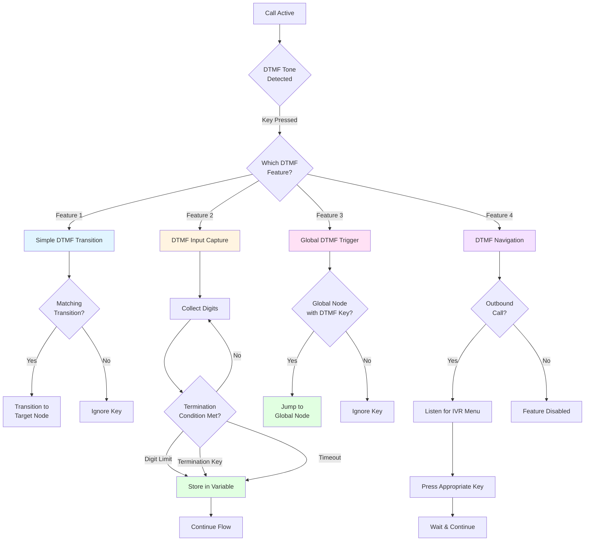
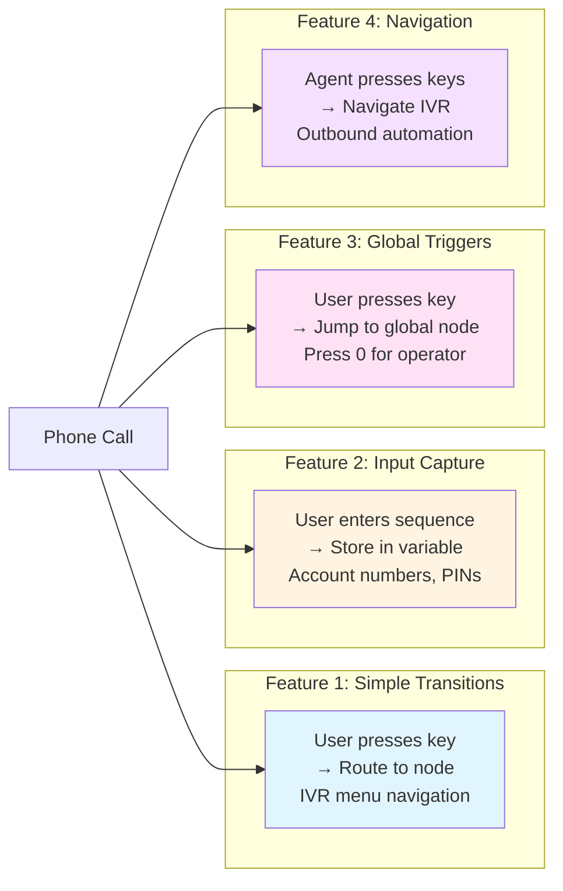

# DTMF Features

DTMF (Dual-Tone Multi-Frequency) signaling represents keypad button presses (0-9, \*, #) in telecommunication systems. Hamsa provides **four distinct DTMF features** for different use cases.

## Overview

| Feature                | Purpose                    | Availability                        | Use Case                           |
| ---------------------- | -------------------------- | ----------------------------------- | ---------------------------------- |
| **Simple Transitions** | IVR menu navigation        | Conversation & Start nodes          | "Press 1 for Sales"                |
| **Input Capture**      | Collect digit sequences    | Conversation & Start nodes\*        | Account numbers, PINs              |
| **Global Triggers**    | Universal keypad shortcuts | All nodes (except web_tool & start) | "Press 0 for operator anytime"     |
| **Navigation**         | AI navigates external IVRs | Outbound calls only                 | Navigate phone trees automatically |

\*Start nodes support DTMF input capture but do not have completion condition UI (timeout/termination/digitLimit).

### DTMF Processing Flow



### DTMF Feature Comparison



---

## Feature 1: Simple DTMF Transitions

<Info>
**Always available** on conversation and start nodes. No toggle or special configuration required.
</Info>

### Purpose

Enable IVR-style menu navigation where users press a single key to select an option and advance to a specific node.

### How It Works

Create menu options like "Press 1 for Sales, Press 2 for Support" by adding DTMF transitions to your nodes.

### Configuration

<Steps>
  <Step title="Add Transition">
    On a conversation or start node, click "+ Add Transition"
  </Step>
  <Step title="Select Type">
    Choose "DTMF" as the transition type
  </Step>
  <Step title="Pick Key">
    Click a key on the 3×4 keypad grid (0-9, *, #)
  </Step>
  <Step title="Connect Node">
    Draw an edge to the target node
  </Step>
</Steps>

### Example

```yaml
Conversation Node: 'Welcome! Press 1 for Sales, Press 2 for Support'
├─ Transition: DTMF key=1 → Sales_Department
└─ Transition: DTMF key=2 → Support_Department
```

<Tip>
Use descriptive auto-generated labels like "Press 1" for clarity in your flow diagram.
</Tip>

---

## Feature 2: DTMF Input Capture

<Warning>
Available on **conversation nodes and start nodes**. Requires variable name when enabled.

**Note:** Start nodes support DTMF input capture but do not display completion condition UI (timeout/termination/digitLimit). These conditions only appear on conversation nodes.
</Warning>

### Purpose

Capture a sequence of DTMF digits (account number, PIN, phone number) and store it in a variable for use throughout your workflow.

### How It Works

When enabled, the AI listens for multiple keypad presses and stores the complete sequence in a named variable. Capture completes based on optional conditions.

### Configuration

<Steps>
  <Step title="Enable Capture">
    Open conversation node form → Find "DTMF Input Capture" → Toggle ON
  </Step>
  <Step title="Set Variable Name">
    Enter variable name (required): `account_number`, `pin_code`, etc.

    **Must follow snake_case format**: lowercase, underscores allowed, starts with letter

  </Step>
  <Step title="Configure Completion">
    Set optional conditions (at least one recommended):
    - **Digit Limit**: Stop after X digits (1-20)
    - **Termination Key**: Stop when user presses #, *, or 0-9
    - **Timeout**: Stop after X seconds of no input (1-30)
  </Step>
</Steps>

### Schema

```typescript
{
  enabled: boolean,
  variableName: string,        // Required: ^[a-z][a-z0-9_]*$
  digitLimit?: number,          // Optional: 1-20
  terminationKey?: '0'-'9'|'#'|'*',  // Optional
  timeoutMs?: number           // Optional: 1000-30000
}
```

### Variable Usage

<Info>
DTMF captured variables are **fully integrated** into the variable system and available to all downstream nodes.
</Info>

Once captured, use the variable in:

- **Message templates**: `"Your account number is {{account_number}}"`
- **Tool parameters**: Pass to API calls
- **Router conditions**: Branch based on value
- **Subsequent prompts**: Reference in any downstream node

### Example

```yaml
Node: Account_Lookup
Message: "Please enter your 6-digit account number followed by pound"

DTMF Input Capture:
  enabled: true
  variableName: account_number
  digitLimit: 6
  terminationKey: #
  timeout: 15 seconds

→ User enters: 1-2-3-4-5-6-#
→ Variable {{account_number}} = "123456"

Next Node (Tool):
  API Call: lookup_customer
  Parameters:
    account_id: {{account_number}}
```

<Tip>
The captured variable appears on the node with a phone icon badge for easy identification.
</Tip>

<Warning>
**DTMF Capture Restriction:** When DTMF input capture is enabled on a node, number keys (0-9) **cannot be used** for DTMF transitions on that same node. Only **#** and **\*** keys remain available for menu navigation. This prevents conflicts between digit capture and menu options.
</Warning>

---

## Feature 3: Global Node DTMF Triggers

<Info>
Available on all node types except **web_tool** and **start** nodes.
</Info>

### Purpose

Allow global nodes to be triggered from anywhere in the workflow by pressing a specific key, providing quick access to critical functions.

### How It Works

When a node is marked as global with DTMF trigger type, pressing the configured key from anywhere in the call immediately activates that node.

### Configuration

<Steps>
  <Step title="Enable Global Mode">
    Open any node form → Find "Global" section → Toggle ON
  </Step>
  <Step title="Select Trigger Type">
    Choose between:
    - **Natural Language (Prompt)**: Triggered by speech
    - **Keypad Press (DTMF)**: Triggered by key press
  </Step>
  <Step title="Configure DTMF Key">
    If DTMF selected, choose key from keypad grid

    **Common conventions:**
    - 0: Operator/human agent
    - 9: Repeat main menu
    - *: Go back/previous menu
    - #: Confirm/submit

  </Step>
</Steps>

### Schema

```typescript
{
  isGlobal: true,
  globalConditionType: 'dtmf',  // or 'prompt'
  globalDtmfKey: '0',          // Required when type='dtmf'
}
```

### Examples

#### Operator Transfer (DTMF 0)

```yaml
Transfer Call Node (Global):
  isGlobal: true
  globalConditionType: dtmf
  globalDtmfKey: 0
  phoneNumber: +1-800-OPERATOR

→ User can press 0 anytime to reach operator
```

#### Repeat Menu (DTMF 9)

```yaml
Conversation Node (Global):
  isGlobal: true
  globalConditionType: dtmf
  globalDtmfKey: 9
  message: "Main menu: Press 1 for Sales, 2 for Support"

→ User can press 9 anytime to hear menu again
```

#### Emergency Support (DTMF \*)

```yaml
Transfer Call Node (Global):
  isGlobal: true
  globalConditionType: dtmf
  globalDtmfKey: *
  phoneNumber: +1-800-EMERGENCY

→ User can press * anytime for emergency support
```

---

## Feature 4: DTMF Navigation for Outbound Calls

<Info>
Configured globally in **Agent Settings**, not at the node level. Only active for **outbound calls**.
</Info>

### Purpose

Enable AI agents to automatically navigate external IVR (Interactive Voice Response) systems when making outbound calls. The AI listens for menu prompts and presses the appropriate keys to reach the desired destination.

### How It Works

When DTMF Navigation is enabled, the AI agent can:

1. Listen to external IVR menu options ("Press 1 for Sales, Press 2 for Support")
2. Automatically press keys based on your instructions
3. Navigate complex phone trees to reach the right department
4. Handle multi-level IVR systems with configurable delays

This is particularly useful for:

- **Automated outreach** that needs to reach specific departments
- **B2B calling** through corporate phone systems
- **Appointment confirmations** requiring extension navigation
- **Survey calls** to specific contacts

### Configuration

<Steps>
  <Step title="Open Agent Settings">
    Navigate to your agent's settings page
  </Step>
  <Step title="Find DTMF Navigation">
    Locate the "DTMF Navigation" section in agent settings
  </Step>
  <Step title="Enable Feature">
    Toggle "Enabled" to ON
  </Step>
  <Step title="Set Instructions">
    Provide clear instructions for navigating IVR menus (required)

    Example: "Press 1 for sales department, then press 3 for enterprise sales"

  </Step>
  <Step title="Configure Delays (Optional)">
    - **Digit Delay**: Milliseconds between key presses (100-2000ms, default: 500ms)
    - **Auto Operator**: Enable to automatically press 0 for operator if lost
    - **Max Retries**: Attempts before giving up (1-5, default: 3)
  </Step>
</Steps>

### Schema

```typescript
// Located in agentSettings.dtmfNavigation
{
  enabled: boolean,              // Required: Enable/disable feature
  instructions: string,          // Required: Navigation instructions for AI
  digitDelay?: number,           // Optional: 100-2000ms between presses
  autoOperator?: boolean,        // Optional: Auto-press 0 if confused
  maxRetries?: number           // Optional: 1-5 retry attempts
}
```

### Examples

#### Basic Sales Department Navigation

```yaml
Agent Settings > DTMF Navigation:
  enabled: true
  instructions: "Press 1 for Sales Department"
  digitDelay: 500
  autoOperator: false
  maxRetries: 3

→ AI calls company, hears menu, automatically presses 1
```

#### Multi-Level IVR Navigation

```yaml
Agent Settings > DTMF Navigation:
  enabled: true
  instructions: "Press 2 for Customer Service, then press 3 for existing customers, then press 5 for account updates"
  digitDelay: 800
  autoOperator: true
  maxRetries: 2

→ AI navigates: 2 → waits 800ms → 3 → waits 800ms → 5
→ If confused at any point, presses 0 for operator
```

#### Extension Dialing

```yaml
Agent Settings > DTMF Navigation:
  enabled: true
  instructions: "Wait for the tone, then dial extension 4582"
  digitDelay: 300
  autoOperator: false
  maxRetries: 3

→ AI waits for prompt, then presses 4-5-8-2 with 300ms delays
```

#### Corporate Directory Navigation

```yaml
Agent Settings > DTMF Navigation:
  enabled: true
  instructions: "Press 1 for directory, then 2 for last name search, then dial 7-6-5-4 for Smith"
  digitDelay: 600
  autoOperator: true
  maxRetries: 3

→ AI follows multi-step directory navigation automatically
```

### Best Practices

<Accordion title="Writing Effective Instructions">
  ### Be Specific and Sequential
  ```
  ✅ "Press 1 for Sales, then press 3 for Enterprise"
  ❌ "Get to Enterprise Sales"
  ```

### Account for Delays

```
✅ "Wait for the greeting to finish, then press 2"
✅ "After the tone, dial extension 1234"
```

### Handle Common Patterns

```
✅ "Press 1 for English first, then press 2 for Support"
✅ "If asked for extension, press 0 for operator"
```

</Accordion>

<Accordion title="Timing Configuration">
  ### Digit Delay Guidelines
  - **100-300ms**: Fast, modern IVR systems
  - **500ms (default)**: Standard corporate systems
  - **800-1000ms**: Older or slower IVR systems
  - **1500-2000ms**: Very slow systems with long prompts

### Auto Operator Fallback

Enable `autoOperator: true` when:

- Navigating unfamiliar IVR systems
- Phone trees change frequently
- Human backup is acceptable

Disable when:

- You need to reach specific extensions only
- Operator transfer defeats the purpose
</Accordion>

<Accordion title="Testing and Reliability">
  ### Test Your Navigation
  1. Call the number manually first
  2. Document the exact key sequence
  3. Note any long pauses or unusual prompts
  4. Test with your agent multiple times
  5. Monitor for IVR system changes

### Handle Failures Gracefully

- Set appropriate `maxRetries` (2-3 recommended)
- Use `autoOperator` as safety net
- Log navigation failures for analysis
- Update instructions when IVR systems change
</Accordion>

### Limitations

<Warning>
- **Outbound calls only**: Does not apply to inbound calls (use other DTMF features)
- **Agent-level setting**: Cannot vary per call or node
- **AI interpretation**: Relies on AI understanding IVR prompts correctly
- **System changes**: External IVR changes require instruction updates
- **No visual confirmation**: Cannot verify navigation success visually
</Warning>

### Troubleshooting

<AccordionGroup>
  <Accordion title="AI not pressing keys">
    **Possible causes:**
    - Feature not enabled in agent settings
    - Call is inbound (feature only works outbound)
    - Instructions unclear or missing

    **Solution:** Verify enabled status, confirm outbound call, clarify instructions

</Accordion>

  <Accordion title="Keys pressed too fast/slow">
    **Possible causes:**
    - Digit delay too short/long for target IVR
    - IVR has long prompts between options

    **Solution:** Adjust `digitDelay` setting, add "wait for..." instructions

</Accordion>

  <Accordion title="AI gets lost in menu">
    **Possible causes:**
    - IVR structure changed
    - Instructions don't match actual menu
    - Complex multi-level navigation

    **Solution:** Enable `autoOperator`, update instructions, reduce complexity

</Accordion>

  <Accordion title="Navigation stops mid-sequence">
    **Possible causes:**
    - Max retries exceeded
    - Unexpected IVR prompt
    - Connection quality issues

    **Solution:** Increase `maxRetries`, update instructions, check call quality

</Accordion>
</AccordionGroup>

---

## Complete IVR Flow Example

Here's a comprehensive example using the first three DTMF features (Features 1-3 are node-level, Feature 4 is configured in agent settings):

```mermaid
graph TD
    Start[Start Node: Main Menu<br/>Press 1=Sales, 2=Support, 0=Operator]
    Sales[Sales Node:<br/>Enter Customer ID]
    Support[Support Node]
    Lookup[Tool: Lookup Customer]
    Operator[Global: Transfer to Operator<br/>DTMF Key: 0]
    Menu[Global: Repeat Menu<br/>DTMF Key: 9]

    Start -->|DTMF: 1| Sales
    Start -->|DTMF: 2| Support
    Sales -->|Capture: customer_id| Lookup

    Start -.->|DTMF: 0 (anytime)| Operator
    Start -.->|DTMF: 9 (anytime)| Menu
```

**Implementation:**

```yaml
Start Node (Conversation):
  message: "Welcome! Press 1 for Sales, 2 for Support, 0 for operator"
  transitions:
    - type: dtmf, key: 1 → Sales_Node
    - type: dtmf, key: 2 → Support_Node

Sales Node (Conversation):
  message: "Please enter your customer ID followed by #"
  dtmfInputCapture:
    enabled: true
    variableName: customer_id
    terminationKey: #
    timeout: 15s
  transitions:
    - type: always → Lookup_Tool

Lookup Tool (Tool):
  tool: lookup_customer
  parameters:
    id: {{customer_id}}  # Uses captured DTMF variable

Operator Node (Transfer Call - Global):
  isGlobal: true
  globalConditionType: dtmf
  globalDtmfKey: 0
  phoneNumber: +1-800-OPERATOR

Repeat Menu Node (Conversation - Global):
  isGlobal: true
  globalConditionType: dtmf
  globalDtmfKey: 9
  message: "Main menu: Press 1 for Sales, 2 for Support"
```

---

## Validation

<Warning>
DTMF features are validated at both node and workflow levels. Errors prevent saving until resolved.
</Warning>

### Validation Rules

| Feature               | Field         | Requirement             | Error                     |
| --------------------- | ------------- | ----------------------- | ------------------------- |
| **Input Capture**     | Variable Name | Required when enabled   | Must be snake_case format |
| **Simple Transition** | DTMF Key      | Required                | Must select a key         |
| **Global Trigger**    | DTMF Key      | Required when type=dtmf | Must select a key         |

### Error Indicators

- **Node level**: Red icon in node header
- **Workflow level**: Errors in workflow header dropdown
- **Focus button**: Navigate to problematic nodes

---

## Best Practices

<Accordion title="Design Principles">
  ### Keep it Simple
  - Don't overwhelm users with too many menu options (max 5-7)
  - Use consistent key mappings across your flow (always 0 for operator)
  - Provide clear instructions before expecting input

### Always Provide Escape Routes

- Always offer global 0 for operator
- Consider global 9 for repeat menu
- Provide fallback for invalid input
</Accordion>

<Accordion title="User Experience">
  ### Clear Instructions
  ```
  ✅ "Press 1 for Sales, Press 2 for Support, or Press 0 for operator"
  ❌ "Choose an option"
  ```

### Set Appropriate Timeouts

- Short timeouts (5-10s) for simple menus
- Longer timeouts (15-30s) for data entry
- Always provide feedback for timeouts

### Confirm Important Data

```yaml
After DTMF capture:
  message: 'You entered {{account_number}}. Is this correct? Press 1 for yes, 2 to re-enter'
```

</Accordion>

<Accordion title="Technical Considerations">
  ### Variable Naming
  - Use descriptive names: `account_number` not `var1`
  - Follow snake_case strictly
  - Avoid conflicts with system variables

### Completion Conditions

- Always set at least one completion condition
- Use termination keys (#) for variable-length input
- Use digit limits for fixed-length input (PINs, zip codes)

### Test Thoroughly

- Test with actual phone (not just browser)
- Verify all keypad buttons work correctly
- Test timeout behavior
- Verify global triggers work from all nodes
</Accordion>

---

## Troubleshooting

<AccordionGroup>
  <Accordion title="DTMF transitions not working">
    **Possible causes:**
    - Key not selected in popover
    - Transition not connected to target node
    - Using on unsupported node type (not conversation/start)

    **Solution:** Verify key selection and node connections

</Accordion>

  <Accordion title="Input capture variable empty">
    **Possible causes:**
    - User didn't enter any digits
    - Timeout occurred before input
    - Variable name typo in usage

    **Solution:** Add validation, check variable name syntax

</Accordion>

  <Accordion title="Global DTMF not triggering">
    **Possible causes:**
    - Node not marked as global
    - DTMF key not configured
    - Trigger type set to 'prompt' instead of 'dtmf'

    **Solution:** Verify global settings and trigger type

</Accordion>

  <Accordion title="Validation errors on save">
    **Possible causes:**
    - Missing variable name when input capture enabled
    - Invalid variable name format
    - DTMF key not selected

    **Solution:** Check workflow header dropdown, click "Focus" to navigate to errors

</Accordion>
</AccordionGroup>

---

## Migration Guide

If upgrading from older versions:

<CodeGroup>

```typescript Old Schema
{
  dtmfEnabled: boolean; // ❌ Removed
}
```

```typescript New Schema
{
  dtmfInputCapture: {   // ✅ New
    enabled: boolean,
    variableName: string,
    digitLimit?: number,
    terminationKey?: string,
    timeoutMs?: number
  } | null
}
```

</CodeGroup>

**Migration steps:**

1. Replace `dtmfEnabled: false` with `dtmfInputCapture: null`
2. Update all conversation nodes
3. Remove `dtmfEnabled` from start nodes
4. Test thoroughly

---

## Next Steps

<CardGroup cols={2}>
  <Card title="Variables" icon="code" href="/agents/flow-agent/variables">
    Learn how to use captured variables throughout your flow
  </Card>
  <Card title="Transitions" icon="arrows-split-up-and-left" href="/agents/flow-agent/transitions">
    Master all transition types including DTMF
  </Card>
  <Card title="Router Node" icon="route" href="/agents/flow-agent/nodes/router-node">
    Use captured variables in routing logic
  </Card>
  <Card title="Best Practices" icon="check" href="/agents/flow-agent/best-practices">
    Learn flow agent best practices
  </Card>
</CardGroup>
