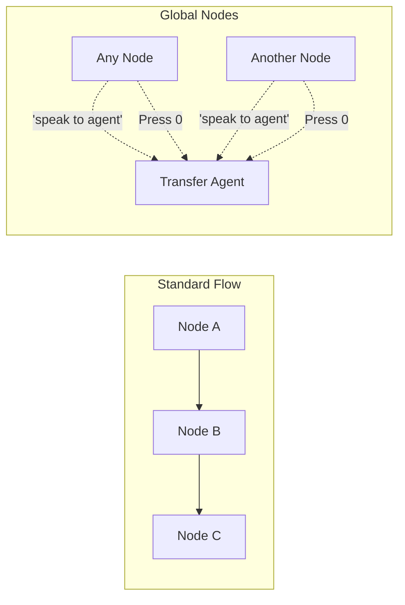

# Global Nodes

Global nodes are special nodes that can be triggered from **any point in your conversation flow** without explicit edges. They act as universal shortcuts, accessible via natural language prompts or DTMF keypresses, providing consistent access to common functionality.

## What are Global Nodes?

### Standard Nodes vs. Global Nodes



**Standard Nodes**:

- Connected via explicit transitions
- Only reachable from specific nodes
- Follow defined conversation paths

**Global Nodes**:

- Accessible from anywhere (dotted lines)
- Triggered by universal conditions
- Bypass normal flow structure

### When to Use Global Nodes

✅ **Ideal Use Cases**:

- Transfer to human agent
- Emergency/urgent escalation
- Help/information requests
- Main menu return
- Exit/cancel operations
- FAQ access

❌ **Poor Use Cases**:

- Standard conversation flow steps
- Sequential processes
- One-time operations
- Context-dependent actions

---

## Configuration

### Enabling Global Status

Every node type except **start nodes** can be made global:

```yaml
Supported Node Types: ✓ Conversation Node
  ✓ Tool Node
  ✓ Router Node
  ✓ Transfer Call Node
  ✓ Transfer Agent Node
  ✓ End Call Node
  ✗ Start Node (cannot be global)
```

### Global Node Settings

```typescript
interface GlobalNodeConfig {
  isGlobal: boolean; // Enable global status
  globalCondition: string; // Trigger description (required if global)
  requiresDoubleConfirm: boolean; // Ask for confirmation before triggering
  skipResponse: boolean; // Skip node's message (execute silently)
}
```

**isGlobal**: Toggle to enable global status

**globalCondition**: Natural language description of when to trigger

- Required field (min 1 character)
- Supports template syntax with system/custom variables only
- Cannot use extracted variables

**requiresDoubleConfirm**: Safety feature for destructive actions

- If true, asks user to confirm before triggering
- Example: "Are you sure you want to end this call?"

**skipResponse**: Execute without speaking

- Useful for silent routing or data collection
- Node logic runs but no message is spoken

---

## Global Trigger Conditions

### Natural Language Triggers

The `globalCondition` is a natural language prompt evaluated by the LLM at every conversation turn.

### Examples

**Transfer to Agent**:

```yaml
Node: "Transfer to Human Agent"
  Type: Transfer Agent
  isGlobal: true
  globalCondition: "The user wants to speak with a human agent or representative"
  requiresDoubleConfirm: false
```

**Emergency Escalation**:

```yaml
Node: "Emergency Support"
  Type: Conversation
  isGlobal: true
  globalCondition: "The user has an urgent or emergency situation"
  requiresDoubleConfirm: false
  message: "I understand this is urgent. Connecting you to emergency support now."
```

**Return to Main Menu**:

```yaml
Node: "Main Menu"
  Type: Conversation
  isGlobal: true
  globalCondition: "The user wants to return to the main menu or start over"
  requiresDoubleConfirm: false
  message: "Returning to main menu..."
```

**End Call**:

```yaml
Node: "End Call - User Requested"
  Type: End Call
  isGlobal: true
  globalCondition: "The user wants to end the call or hang up"
  requiresDoubleConfirm: true  # Confirm before ending
  finalMessage: "Thank you for calling. Goodbye!"
```

**Help/FAQ**:

```yaml
Node: "General Help"
  Type: Conversation
  isGlobal: true
  globalCondition: "The user asks for help or doesn't understand what to do"
  message: "I can help with billing, technical support, or account questions. What do you need?"
```

**Cancel Operation**:

```yaml
Node: "Cancel Process"
  Type: Router
  isGlobal: true
  globalCondition: "The user wants to cancel the current process or go back"
  requiresDoubleConfirm: true
  skipResponse: true  # Silent routing
```

### Writing Effective Global Conditions

<Tip>
**Be specific but not restrictive**: "User wants to speak with a human" is better than "User says agent" (too narrow) or "User needs help" (too broad).
</Tip>

**DO:**

- Focus on user intent, not exact phrases
- Cover variations ("agent", "representative", "person")
- Be unambiguous about when to trigger
- Consider context and conversation state

**DON'T:**

- Make conditions too broad (triggers too often)
- Make conditions too narrow (never triggers)
- Overlap with other global nodes
- Use extracted variables (only system/custom allowed)

### Testing Global Conditions

```yaml
Global Condition: "User wants to speak with a human agent"

✓ Should Trigger:
  - "I want to talk to a person"
  - "Can I speak with someone?"
  - "Transfer me to an agent"
  - "I need to speak with a human"
  - "Get me to a representative"

✗ Should NOT Trigger:
  - "What are your agent hours?" (information, not request)
  - "My agent told me..." (talking about an agent, not requesting)
  - "Do you have human agents?" (question, not request)
```

---

## Global DTMF Triggers

In addition to natural language, global nodes can be triggered by DTMF keypresses - providing instant, universal access.

<Info>
See the **[DTMF Features](./dtmf)** guide for complete DTMF documentation.
</Info>

### Configuration

Global DTMF triggers are configured separately from the `globalCondition` field:

```yaml
Node: "Transfer to Operator"
  Type: Transfer Agent
  isGlobal: true
  globalCondition: "User wants to speak with an operator"
  globalDtmfTrigger: "0"  # Press 0 from anywhere
```

### Common DTMF Conventions

```yaml
0 = Transfer to Operator/Agent (universal standard)
9 = Return to Main Menu
* = Repeat Last Message
# = Continue/Confirm
```

### Example: Multi-Trigger Global Node

```yaml
Node: "Transfer to Agent"
  Type: Transfer Agent
  isGlobal: true

  # Natural language trigger
  globalCondition: "User wants to speak with a human agent or operator"

  # DTMF trigger
  globalDtmfTrigger: "0"

  # Can be triggered by:
  # 1. Saying "I want to talk to someone"
  # 2. Pressing 0 on keypad
```

### Announcing Global DTMF Options

Remind users of global shortcuts:

```yaml
Conversation Node: "Welcome"
  Message: "Welcome to Acme Support. How can I help you today? Press 0 at any time to reach an operator."

Conversation Node: "Main Menu"
  Message: "Press 1 for billing, 2 for support. You can return to this menu anytime by pressing 9."
```

---

## Variable Restrictions

Global nodes have strict variable limitations to ensure they work from any conversation context.

### Allowed Variables

**System Variables** ✅:

```yaml
globalCondition: "User wants help, and the current time {{current_time}} is during business hours"

Available System Variables:
  - {{session_id}}
  - {{user_input}}
  - {{current_time}}
  - {{current_date}}
  - {{call_duration}}
  - {{node_count}}
  (See Variables documentation for complete list)
```

**Custom Variables** ✅:

```yaml
globalCondition: "User wants priority support and {{custom_vip_status}} is true"

Custom variables are workflow-level variables you define via API or settings
```

### Prohibited Variables

**Extracted Variables** ❌:

```yaml
# INVALID - Will cause validation error
globalCondition: 'User wants account info for {{account_number}}'
# account_number is extracted during conversation and may not exist
# when global node is evaluated from different contexts
```

### Validation

The validation system checks for this:

```yaml
❌ Error: "Global node 'Transfer VIP' uses extracted variable 'customer_tier'"
   → Solution: Use custom variable instead, or use equation in transition

✅ Valid: Global node uses only system and custom variables
```

### Workaround for Context-Dependent Global Nodes

If you need context-aware global routing, use a **global router node**:

```yaml
Global Router Node: "Smart Transfer"
  isGlobal: true
  globalCondition: "User wants to speak with an agent"
  skipResponse: true

  Transitions:
    # Route based on extracted variables
    - Equation: customer_tier == "vip" → VIP_Agent
    - Equation: issue_type == "technical" → Tech_Support_Agent
    - Always → General_Agent
```

---

## Double Confirmation

The `requiresDoubleConfirm` feature adds a safety layer for destructive or important actions.

### How It Works

```mermaid
graph TD
    A[User: "End the call"] --> B{Global Node: End Call<br/>requiresDoubleConfirm: true}
    B --> C["Agent: 'Are you sure you want to end this call?'"]
    C --> D{User Response}
    D -->|"Yes"| E[Execute End Call]
    D -->|"No"| F[Return to Previous Context]
```

### Configuration

```yaml
Node: "Delete Account"
  Type: Tool
  isGlobal: true
  globalCondition: "User wants to delete or close their account"
  requiresDoubleConfirm: true  # Ask for confirmation
  toolName: "DeleteAccountAPI"
```

When triggered, the agent automatically asks:

```
"Are you sure you want to delete your account?"
```

### Use Cases for Double Confirm

✅ **Should Use**:

- Ending calls
- Deleting/canceling accounts
- Removing data
- Making purchases
- Confirming appointments
- Irreversible actions

❌ **Should NOT Use**:

- Transferring to agent (low stakes)
- Returning to menu (easily reversible)
- Getting help (non-destructive)
- Informational requests

### Customizing Confirmation

The confirmation prompt is auto-generated but you can influence it:

```yaml
Node Name: "Cancel Subscription"
→ Agent asks: "Are you sure you want to cancel your subscription?"

Node Name: "End Call"
→ Agent asks: "Are you sure you want to end this call?"

Node Name: "Delete All Data"
→ Agent asks: "Are you sure you want to delete all your data?"
```

---

## Skip Response Mode

The `skipResponse` setting allows global nodes to execute silently without speaking their message.

### Use Cases

**Silent Routing**:

```yaml
Global Router: "Context-Aware Transfer"
  isGlobal: true
  globalCondition: "User wants to speak with someone"
  skipResponse: true  # Don't speak, just route

  Transitions:
    - Equation: issue_complexity == "high" → Senior_Agent
    - Equation: customer_tier == "vip" → VIP_Agent
    - Always → Standard_Agent
```

**Background Data Collection**:

```yaml
Global Tool Node: "Log Escalation"
  isGlobal: true
  globalCondition: "User is frustrated or angry"
  skipResponse: true  # Log silently, don't interrupt flow
  toolName: "LogEscalationEvent"

  Transitions:
    - Always → Continue_Conversation  # Return to where user was
```

**Implicit Actions**:

```yaml
Global Node: "Record Callback Request"
  Type: Tool
  isGlobal: true
  globalCondition: "User requests a callback"
  skipResponse: true  # Record request silently
  toolName: "CreateCallbackTicket"

  Transitions:
    - Always → Callback_Confirmation  # Then confirm to user
```

### Standard Response vs. Skip Response

**Standard (skipResponse: false)**:

```
User: "I want to speak with an agent"
Agent: "I'll transfer you to an agent now." [Node's message]
[Transfer happens]
```

**Skip Response (skipResponse: true)**:

```
User: "I want to speak with an agent"
[Transfer happens immediately - no message]
```

---

## Common Patterns

### Pattern 1: Universal Agent Transfer

```yaml
Node: "Transfer to Human Agent"
  Type: Transfer Agent
  isGlobal: true
  globalCondition: "User wants to speak with a human agent, representative, or person"
  agentId: "general-support-pool"
  transferMessage: "Transferring you to an agent now. Please hold."

  # Accessible from ANY node in the flow via:
  # - "I want to talk to someone"
  # - "Get me a human"
  # - "Transfer me to an agent"
```

### Pattern 2: Main Menu Return

```yaml
Node: "Main Menu"
  Type: Conversation
  isGlobal: true
  globalCondition: "User wants to return to the main menu or start over"
  globalDtmfTrigger: "9"
  message: "Returning to main menu. Press 1 for Sales, 2 for Support, 3 for Billing."

  Transitions:
    - DTMF: key=1 → Sales
    - DTMF: key=2 → Support
    - DTMF: key=3 → Billing
    - Always → Repeat_Menu
```

### Pattern 3: Emergency Escalation

```yaml
Node: "Emergency Escalation"
  Type: Transfer Agent
  isGlobal: true
  globalCondition: "User has an emergency, urgent situation, or critical issue"
  requiresDoubleConfirm: false  # No delay for emergencies
  agentId: "emergency-support-team"
  transferMessage: "I understand this is urgent. Connecting you to priority support immediately."
```

### Pattern 4: Smart Routing Hub

```yaml
Global Router: "Intelligent Transfer Router"
  Type: Router
  isGlobal: true
  globalCondition: "User wants to speak with a specialist or expert"
  skipResponse: true

  Transitions:
    # Route based on conversation context
    - Equation: last_topic == "billing" → Billing_Specialist (priority: 300)
    - Equation: last_topic == "technical" → Tech_Specialist (priority: 300)
    - Equation: customer_tier == "enterprise" → Enterprise_Support (priority: 200)
    - Natural Language: "sales question" → Sales_Team (priority: 100)
    - Always → General_Agent (priority: 0)
```

### Pattern 5: Graceful Exit

```yaml
Node: "End Call - User Initiated"
  Type: End Call
  isGlobal: true
  globalCondition: "User wants to end the call, hang up, or is done"
  requiresDoubleConfirm: true
  finalMessage: "Thank you for contacting us. Have a great day!"
  reason: "user_requested"
```

### Pattern 6: Help System

```yaml
Node: "Contextual Help"
  Type: Conversation
  isGlobal: true
  globalCondition: "User asks for help, is confused, or doesn't know what to do"
  message: "I can help you with:
    - Billing and payments
    - Technical support
    - Account management
    - General questions

    What do you need help with?"

  Transitions:
    - Natural Language: "billing" → Billing_Help
    - Natural Language: "technical" → Tech_Help
    - Natural Language: "account" → Account_Help
    - Always → General_Help
```

---

## Best Practices

### DO:

✅ Use global nodes for truly universal functionality
✅ Write clear, unambiguous global conditions
✅ Test global triggers from multiple conversation states
✅ Use double confirm for destructive actions
✅ Provide both DTMF and natural language triggers for accessibility
✅ Keep global nodes focused on a single purpose
✅ Use only system and custom variables in global conditions
✅ Announce global shortcuts to users (especially DTMF)

### DON'T:

❌ Make every node global (defeats the purpose)
❌ Create overlapping global conditions (ambiguous triggers)
❌ Use extracted variables in global conditions
❌ Make global conditions too broad (triggers inappropriately)
❌ Forget to test from different conversation contexts
❌ Use global nodes for sequential workflow steps
❌ Create global nodes that require specific prior context

---

## Global Node Validation

### Validation Rules

The flow builder validates global nodes:

```yaml
✓ Checks:
  - Global condition is not empty
  - Global condition doesn't use extracted variables
  - Node type supports global status (not Start)
  - DTMF trigger is valid key (0-9, *, #)
  - Double confirm is appropriate for node type
  - No circular global triggering

✗ Common Errors:
  - 'Global trigger condition is required'
  - "Global node uses extracted variable '{{account_id}}'"
  - 'Start nodes cannot be global'
  - 'Global condition overlaps with another global node'
```

### Testing Global Nodes

**Test Matrix**:

```yaml
Test From Different States: ✓ Beginning of conversation
  ✓ Middle of flow
  ✓ After tool execution
  ✓ After variable extraction
  ✓ From different conversation branches

Test Different Triggers: ✓ Direct phrase ("I want an agent")
  ✓ Indirect phrase ("Can you transfer me?")
  ✓ Contextual ("I need help with this")
  ✓ DTMF keypress (if configured)

Test Edge Cases: ✓ Multiple rapid triggers
  ✓ Triggering during another global node
  ✓ Triggering from end call node
  ✓ Triggering when required variables don't exist
```

---

## Performance Considerations

### Evaluation Overhead

Global nodes are evaluated **on every user input**:

```yaml
Flow with 3 global nodes:
  Every user input triggers 3 LLM evaluations
  Adds: 3 × 200-800ms = 600-2400ms latency
  Cost: 3 × ~100-300 tokens per evaluation
```

### Optimization Strategies

**1. Limit Global Nodes (3-5 maximum)**:

```yaml
# Good - Essential only
- Transfer to Agent
- Return to Main Menu
- End Call

# Too Many - Slow
- Transfer to Agent
- Transfer to Sales
- Transfer to Support
- Transfer to Billing
- Return to Menu
- Get Help
- End Call
- Cancel Process
(8 global nodes = significant latency)
```

**2. Use Specific Conditions**:

```yaml
# Slow - Too broad, triggers too often
globalCondition: "User needs help"

# Fast - Specific, triggers only when appropriate
globalCondition: "User explicitly requests to speak with a human agent"
```

**3. Combine with DTMF**:

```yaml
# Users can choose fast path (DTMF) or natural language
globalCondition: "User wants agent"
globalDtmfTrigger: "0"

Most users will learn to press 0 (instant, no LLM evaluation)
```

**4. Use Priority Routing**:

```yaml
# Instead of multiple global transfer nodes, use one router
Global Router: "Transfer Hub"
  globalCondition: "User wants specialist"
  skipResponse: true

  Transitions:
    - Equation: ... → Specific_Specialist
    - Always → General_Agent
```

---

## Troubleshooting

### "Global condition required" Error

```yaml
❌ Problem:
Node: "Transfer Agent"
  isGlobal: true
  globalCondition: ""  # Empty!

✅ Solution:
Node: "Transfer Agent"
  isGlobal: true
  globalCondition: "User wants to speak with an agent"
```

### Global Node Never Triggers

**Check Condition Specificity**:

```yaml
❌ Too specific (rarely matches):
globalCondition: "User says exactly 'I need to speak with a human agent right now'"

✅ Appropriately broad:
globalCondition: "User wants to speak with a human agent or representative"
```

**Check for Variable Issues**:

```yaml
❌ Uses extracted variable (validation error):
globalCondition: "User wants agent and {{account_verified}} is true"

✅ Uses only system/custom variables:
globalCondition: "User wants agent and {{custom_business_hours}} is true"
```

### Global Node Triggers Too Often

**Make Condition More Specific**:

```yaml
❌ Too broad:
globalCondition: "User mentions billing"  # Triggers even for "What are billing hours?"

✅ More specific:
globalCondition: "User has a billing issue or problem they need help with"
```

### Overlapping Global Conditions

```yaml
❌ Problem:
Global Node A: "User wants help"
Global Node B: "User needs assistance"
# Both trigger for same input!

✅ Solution:
Global Node A: "User wants to speak with a human agent"
Global Node B: "User wants to return to main menu"
# Distinct, non-overlapping conditions
```

---

## Examples by Use Case

### Customer Service

```yaml
Global Node: "Transfer to Agent"
  Type: Transfer Agent
  globalCondition: "User wants to speak with a human representative"
  globalDtmfTrigger: "0"
  agentId: "customer-service-pool"

Global Node: "Main Menu"
  Type: Conversation
  globalCondition: "User wants to return to the main menu"
  globalDtmfTrigger: "9"
  message: "Main menu..."
```

### Technical Support

```yaml
Global Node: "Emergency Support"
  Type: Transfer Agent
  globalCondition: "User has a critical system outage or emergency"
  requiresDoubleConfirm: false
  agentId: "emergency-support"

Global Node: "Create Ticket"
  Type: Tool
  globalCondition: "User wants to create a support ticket"
  toolName: "CreateSupportTicket"
```

### Sales

```yaml
Global Node: "Interested in Product"
  Type: Conversation
  globalCondition: "User shows interest in making a purchase"
  message: "Great! Let me connect you with a sales specialist."
  Transitions:
    - Always → Sales_Qualification

Global Node: "Pricing Information"
  Type: Conversation
  globalCondition: "User asks about pricing or costs"
  message: "Our pricing varies by package..."
```

### Appointment Booking

```yaml
Global Node: "Cancel Appointment"
  Type: Tool
  globalCondition: "User wants to cancel their appointment"
  requiresDoubleConfirm: true
  toolName: "CancelAppointmentAPI"

Global Node: "Reschedule"
  Type: Conversation
  globalCondition: "User wants to reschedule their appointment"
  message: "I can help you reschedule..."
```

---

## Next Steps

<CardGroup cols={2}>
  <Card title="Transitions" icon="shuffle" href="./transitions">
    Learn about all transition types and conditions
  </Card>
  <Card title="Variables" icon="brackets-curly" href="./variables">
    Understand variable scoping and restrictions
  </Card>
  <Card title="DTMF Features" icon="phone-volume" href="./dtmf">
    Master all DTMF capabilities
  </Card>
  <Card title="Best Practices" icon="star" href="./best-practices">
    Flow design patterns and optimization
  </Card>
</CardGroup>
