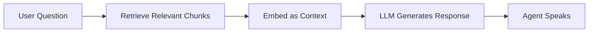

# Global Settings

Global settings define the default behavior and configuration for your entire Flow Agent. These settings apply across all nodes unless overridden at the node level, providing consistency while allowing flexibility where needed.

## Overview

Global settings are organized into 10 categories:

| Category               | Purpose                      | Impact                     |
| ---------------------- | ---------------------------- | -------------------------- |
| **System Prompt**      | Core AI instructions         | All conversation nodes     |
| **Voice Settings**     | Speech synthesis config      | All voice responses        |
| **LLM Settings**       | Language model config        | All AI-generated responses |
| **Noise Cancellation** | Audio processing             | Call quality               |
| **Knowledge Base**     | RAG data sources             | Context for responses      |
| **MCP Tools**          | Model Context Protocol tools | Available across flow      |
| **Outcome**            | Call result tracking         | Analytics & reporting      |
| **Phone Number**       | Assigned Twilio numbers      | Inbound/outbound calls     |
| **Call Settings**      | Timeout & behavior           | All calls                  |
| **Webhook**            | External integrations        | Event notifications        |

---

## System Prompt

The system prompt is the foundational instruction set for your AI agent. It defines the agent's personality, capabilities, constraints, and overall behavior.

<Warning>
System prompt is **required**. Your flow cannot be saved without it.
</Warning>

### Configuration

```yaml
System Prompt:
  - Label: 'System Instructions'
  - Type: Template string (supports variables)
  - Min Length: 1 character
  - Default: 'You are a helpful assistant that will answer users questions.'
  - Variables Allowed: Yes (system and custom variables only)
```

### Best Practices

<Tip>
**Keep it focused**: A good system prompt is 50-300 words. Longer prompts often dilute effectiveness.
</Tip>

**DO:**

- Define clear role and purpose
- Specify tone and personality
- List key capabilities
- Include important constraints
- Use variables for dynamic context

**DON'T:**

- Include node-specific instructions (use node prompts instead)
- Repeat information from knowledge base
- Make it overly prescriptive
- Use extracted variables (only system/custom variables allowed)

### Example: Customer Service Agent

```
You are a friendly and professional customer service representative for Acme Corp.

Your Role:
- Help customers with account inquiries, billing questions, and technical support
- Maintain a warm, patient tone even with frustrated customers
- Escalate complex issues to human agents when needed

Guidelines:
- Keep responses concise (2-3 sentences max)
- Always verify customer identity before discussing account details
- Use the customer's name ({{customer_name}}) when available
- If you don't know something, admit it honestly

Constraints:
- Never make promises about refunds or credits without manager approval
- Don't provide technical support for products outside your knowledge base
- Immediately transfer to security team if fraud is suspected
```

### Variables in System Prompt

System prompts support **system variables** and **custom variables** only:

```
Welcome! The current time is {{current_time}}.
Your session ID is {{session_id}}.
Agent version: {{custom_agent_version}}
```

<Warning>
**Cannot use extracted variables** in system prompt. Variables like `{{user_phone}}` or `{{account_number}}` extracted during conversation are not available here.
</Warning>

---

## Voice Settings

Control how your agent speaks, including voice selection, speed, pitch, and provider-specific settings.

### Configuration Schema

```typescript
{
  provider: 'deepgram' | 'elevenlabs' | 'playht' | 'openai' | 'custom',
  voice: string,              // Voice ID from provider
  speed: number,              // 0.25 - 4.0 (default: 1.0)
  pitch: number,              // -20 - 20 (default: 0)
  stability: number,          // 0 - 1 (default: 0.5) - ElevenLabs/PlayHT only
  similarity: number,         // 0 - 1 (default: 0.75) - ElevenLabs/PlayHT only
  format: 'mp3' | 'wav' | 'opus' | 'pcm',
  sampleRate: number          // Hz (default: 24000)
}
```

### Provider Options

#### Deepgram (Default)

- **Voices**: aura-asteria-en, aura-athena-en, aura-luna-en, etc.
- **Best For**: Low latency, cost-effectiveness
- **Languages**: 30+ languages
- **Pricing**: ~$0.015/minute

#### ElevenLabs

- **Voices**: Custom voice cloning + 100+ premade voices
- **Best For**: Most natural-sounding speech
- **Languages**: 29 languages
- **Pricing**: ~$0.30/minute

#### PlayHT

- **Voices**: 900+ ultra-realistic voices
- **Best For**: Wide language/accent variety
- **Languages**: 140+ languages
- **Pricing**: ~$0.24/minute

#### OpenAI

- **Voices**: alloy, echo, fable, onyx, nova, shimmer
- **Best For**: Integration with GPT models
- **Languages**: 50+ languages
- **Pricing**: ~$0.015/minute

### Voice Parameters Explained

**Speed**: How fast the agent speaks

- 0.5 = Half speed (very slow)
- 1.0 = Normal speed
- 2.0 = Double speed (very fast)
- **Recommended**: 0.9-1.1 for most use cases

**Pitch**: Voice frequency adjustment

- -20 = Much lower pitch
- 0 = Natural pitch
- +20 = Much higher pitch
- **Recommended**: -5 to +5 for subtle adjustments

**Stability** (ElevenLabs/PlayHT):

- Low (0-0.3): More expressive, variable
- Medium (0.4-0.6): Balanced
- High (0.7-1.0): Consistent, stable
- **Recommended**: 0.5 for general use, 0.7+ for formal settings

**Similarity** (ElevenLabs/PlayHT):

- Low (0-0.3): More creative interpretation
- Medium (0.4-0.6): Balanced
- High (0.7-1.0): Closer to original voice
- **Recommended**: 0.75 for cloned voices

### Node-Level Overrides

Voice settings can be overridden per node (conversation and start nodes only):

```yaml
Global Voice Settings:
  Provider: Deepgram
  Voice: aura-asteria-en
  Speed: 1.0

Node Override Example:
  Node: 'Important_Announcement'
  Voice Override:
    Speed: 0.85 # Slower for clarity
    Pitch: -3 # Slightly lower for authority
```

<Info>
Only specified parameters are overridden. Unspecified parameters inherit from global settings.
</Info>

---

## LLM Settings

Configure the language model that powers your agent's intelligence.

### Configuration Schema

```typescript
{
  provider: 'openai' | 'anthropic' | 'groq',
  model: string,
  temperature: number,         // 0 - 2 (default: 0.7)
  maxTokens: number,          // Positive integer (default: 1000)
  topP: number,               // 0 - 1 (default: 1)
  frequencyPenalty: number,   // -2 - 2 (default: 0)
  presencePenalty: number     // -2 - 2 (default: 0)
}
```

### Model Options

#### OpenAI (Default)

- **gpt-4o**: Most capable, balanced performance ($5/$15 per 1M tokens)
- **gpt-4o-mini**: Fast, cost-effective ($0.15/$0.60 per 1M tokens)
- **gpt-4-turbo**: Previous generation, still powerful
- **Best For**: General use, complex reasoning

#### Anthropic

- **claude-3-5-sonnet**: Excellent reasoning, long context ($3/$15 per 1M tokens)
- **claude-3-opus**: Most capable, highest quality ($15/$75 per 1M tokens)
- **claude-3-haiku**: Fastest, most affordable ($0.25/$1.25 per 1M tokens)
- **Best For**: Complex instructions, safety-critical applications

#### Groq

- **llama-3.1-70b**: Open source, ultra-fast inference
- **mixtral-8x7b**: High quality, fast
- **Best For**: Real-time responses, cost optimization

### Parameter Guide

**Temperature** (Creativity vs. Consistency)

```
0.0 - 0.3: Deterministic, consistent, factual
0.4 - 0.7: Balanced (recommended for most flows)
0.8 - 1.2: Creative, varied responses
1.3 - 2.0: Very creative, unpredictable
```

**Max Tokens** (Response Length)

```
100-300: Brief responses (1-2 sentences)
300-800: Medium responses (1-2 paragraphs)
800-2000: Detailed responses (multiple paragraphs)
2000+: Long-form content
```

**Top P** (Nucleus Sampling)

```
0.1: Only most likely words (focused)
0.5: Moderately diverse vocabulary
0.9-1.0: Full vocabulary range (default)
```

**Frequency Penalty** (Repetition Control)

```
-2 to 0: Allow/encourage repetition
0: No penalty (default)
0.1 - 1.0: Discourage repetition (recommended)
1.0 - 2.0: Strongly discourage repetition
```

**Presence Penalty** (Topic Diversity)

```
-2 to 0: Allow topic repetition
0: No penalty (default)
0.1 - 1.0: Encourage topic diversity
1.0 - 2.0: Strongly encourage new topics
```

### Node-Level Overrides

Like voice settings, LLM settings can be customized per conversation node:

```yaml
Global LLM:
  Model: gpt-4o-mini
  Temperature: 0.7
  MaxTokens: 800

Node "Complex_Reasoning":
  Model Override: gpt-4o # Upgrade for complex task
  Temperature: 0.3 # More deterministic
  MaxTokens: 1500 # Longer responses allowed
```

### Optimization Strategies

<Tip>
**Cost Optimization**: Use gpt-4o-mini globally, upgrade to gpt-4o only for nodes requiring complex reasoning.
</Tip>

**For Scripted Responses**:

- Temperature: 0.1-0.3
- Frequency Penalty: 0.5-1.0
- Model: gpt-4o-mini

**For Creative Conversations**:

- Temperature: 0.8-1.0
- Top P: 0.9
- Model: gpt-4o or claude-3-5-sonnet

**For Factual Q&A**:

- Temperature: 0.3-0.5
- Max Tokens: 300-500
- Model: gpt-4o (better accuracy)

---

## Noise Cancellation

Advanced audio processing to improve call quality in noisy environments.

### Configuration

```yaml
Noise Cancellation:
  Mode: 'disabled' | 'enabled'
  Apply Per: 'conversation' | 'call'
```

### Modes Explained

**Disabled** (Default)

- No audio processing beyond standard telephony
- Lowest latency (~50ms)
- Best for quiet environments
- Most cost-effective

**Enabled**

- AI-powered noise suppression
- Filters background sounds (traffic, music, other voices)
- Adds 100-150ms latency
- Additional $0.02/minute cost

### Apply Per Setting

**Per Conversation** (Recommended)

- Noise cancellation applied to each utterance
- Better quality for real-time conversation
- More resource-intensive

**Per Call**

- Noise cancellation applied once at call start
- Lower resource usage
- Suitable for consistently noisy/quiet environments

### When to Enable

✅ **Enable When:**

- Users call from outdoors, vehicles, public spaces
- Background music or TV is common
- Multiple people speaking nearby
- Call center environment with adjacent agents

❌ **Disable When:**

- Users primarily in quiet offices/homes
- Latency is critical (< 200ms required)
- Cost optimization is priority
- Testing/development environment

---

## Knowledge Base

Attach knowledge sources for Retrieval-Augmented Generation (RAG), allowing your agent to access specific information.

### What is Knowledge Base?

Knowledge base provides your agent with domain-specific information that's too large or dynamic for the system prompt. When a user asks a question, relevant knowledge is retrieved and provided to the LLM as context.

### Supported Sources

```yaml
Knowledge Base Items:
  - Type: PDF Documents
    Max Size: 50MB
    Pages: Unlimited

  - Type: Text Files (.txt, )
    Max Size: 10MB

  - Type: URLs/Websites
    Depth: Configurable crawl depth

  - Type: FAQs
    Format: Q&A pairs
```

### Configuration

<Steps>
  <Step title="Upload Knowledge">
    In global settings, click Knowledge Base → Add Item
  </Step>
  <Step title="Select Type">
    Choose PDF, Text, URL, or FAQ
  </Step>
  <Step title="Configure Processing">
    Set chunk size, overlap, and embedding model
  </Step>
  <Step title="Assign to Agent">
    Select which knowledge items apply to this flow
  </Step>
</Steps>

### How It Works



1. User asks question
2. System searches knowledge base for relevant information
3. Top N chunks are retrieved (default: 3-5)
4. Chunks are added to LLM context
5. LLM generates response using both system prompt and knowledge
6. Agent delivers response

### Best Practices

**Chunking Strategy**:

```yaml
Small Documents (< 10 pages):
  Chunk Size: 500-800 tokens
  Overlap: 50-100 tokens

Large Documents (> 50 pages):
  Chunk Size: 1000-1500 tokens
  Overlap: 150-200 tokens

FAQs:
  Chunk Size: One Q&A per chunk
  Overlap: 0 tokens
```

**Retrieval Settings**:

- **Top K**: 3-5 chunks (balance context vs. token usage)
- **Similarity Threshold**: 0.7+ (avoid irrelevant results)
- **Max Context**: 2000-4000 tokens total

<Warning>
**Knowledge base increases response latency** by 200-500ms due to retrieval time. Consider caching for frequently asked questions.
</Warning>

### Testing Knowledge Base

Verify your knowledge base is working:

1. Ask specific questions from your documents
2. Request citations or sources (if configured)
3. Ask edge cases not in knowledge base
4. Verify agent says "I don't know" for out-of-scope questions

---

## MCP Tools

Model Context Protocol (MCP) tools are globally available functions that nodes can access.

### What are MCP Tools?

MCP tools are external capabilities the AI can invoke during conversation:

- API integrations
- Database queries
- Custom business logic
- Third-party services

Unlike node-level tools, MCP tools are **always available** and can be called by any conversation node.

### Configuration

```typescript
MCP Tools:
  enabled: boolean
  tools: Array<{
    id: string           // Unique tool identifier
    name: string         // Display name
    type: 'MCP'
    config: object       // Tool-specific configuration
    timeout: number      // 30000ms default
    retryAttempts: number // 3 default
    priority: number     // 5 default (0-10)
  }>
```

### Example: CRM Integration

```yaml
MCP Tool: "Get Customer Info"
  ID: customer-lookup-api
  Type: MCP
  Endpoint: https://api.crm.example.com/customers/{id}
  Timeout: 5000ms
  Retry Attempts: 2

Available to all conversation nodes:
  - Welcome message can check customer status
  - Support nodes can pull account history
  - Billing nodes can retrieve payment info
```

### MCP vs. Node Tools

| Feature           | MCP Tools                   | Node Tools                   |
| ----------------- | --------------------------- | ---------------------------- |
| **Availability**  | All conversation nodes      | Single node only             |
| **Use Case**      | Frequently needed functions | One-time operations          |
| **Configuration** | Global settings             | Per-node settings            |
| **Overrides**     | Not available               | Per-node parameter overrides |

### Best Practices

<Tip>
**Use MCP for shared utilities**: Functions like "check business hours" or "validate phone number" that multiple nodes need.
</Tip>

**Good MCP Tools**:

- Customer lookup by ID/phone
- Business hours check
- Inventory availability
- Account balance query
- Address validation

**Bad MCP Tools** (use node tools instead):

- Create support ticket (one-time action)
- Send confirmation email (specific workflow step)
- Process payment (security-critical, should be explicit)

---

## Outcome

Define how call results are classified and reported for analytics.

### Purpose

Outcomes categorize call results for:

- Analytics and reporting
- Quality assurance
- Agent performance tracking
- Business intelligence

### Configuration

```typescript
Outcome:
  outcomeField: string                    // Name of outcome category
  outcomeResponseShape?: object           // Expected structure
  outcomeResponseShapeJson?: string       // JSON schema
```

### Common Outcome Structures

**Simple Categorization**:

```json
{
  "outcome": "SALE_COMPLETED" | "CALLBACK_SCHEDULED" | "INFORMATION_PROVIDED" | "TRANSFERRED_TO_AGENT"
}
```

**Detailed Outcome**:

```json
{
  "outcome": "APPOINTMENT_BOOKED",
  "details": {
    "appointment_date": "2024-11-20",
    "appointment_time": "14:00",
    "service_type": "Oil Change",
    "customer_confirmed": true
  }
}
```

**Multi-Dimensional**:

```json
{
  "primary_outcome": "ISSUE_RESOLVED",
  "satisfaction_score": 8,
  "resolution_time": 245,
  "escalation_required": false,
  "follow_up_needed": true
}
```

### Setting Outcomes in Flow

Outcomes are typically set in **End Call** nodes:

```yaml
End Call Node: "Successful Sale"
  Final Message: "Thank you for your purchase!"
  Outcome: SALE_COMPLETED

End Call Node: "Need Callback"
  Final Message: "We'll call you back tomorrow."
  Outcome: CALLBACK_SCHEDULED
```

You can also set outcomes via webhook or tool calls during the conversation.

---

## Phone Number

Associate Twilio phone numbers with your flow agent for inbound and outbound calling.

### Configuration

```yaml
Phone Numbers:
  twilioNumberIds: string[]    // Array of Twilio number IDs
```

### How It Works

**Inbound Calls**:

1. Customer calls assigned Twilio number
2. Twilio routes to Hamsa platform
3. Flow agent answers and executes

**Outbound Calls**:

1. Agent initiates call via API
2. Uses one of assigned numbers as caller ID
3. Flow agent executes when customer answers

### Multiple Numbers

You can assign multiple phone numbers:

```yaml
Assigned Numbers:
  - +1-555-0100 (Primary - Customer Service)
  - +1-555-0200 (Sales Line)
  - +1-555-0300 (Support Hotline)
```

<Info>
All assigned numbers use the **same flow configuration**. Create separate agents for different flows.
</Info>

### Best Practices

**For Local Presence**:

- Assign area code matching target market
- Use multiple local numbers for different regions

**For Tracking**:

- Different numbers for different marketing campaigns
- Track conversion by incoming number

---

## Call Settings

Configure timeout behaviors and call duration limits.

### Configuration

```typescript
Call Settings:
  userInactivityTimeout: number    // 5-30 seconds (default: 15)
  maxCallDuration: number          // 30-600 seconds (default: 300)
  responseDelay: number            // 100-1500ms (default: 400)
  interrupt: boolean               // Allow user interruption (default: false)
  backgroundNoise: boolean         // Background sound during silence (default: false)
  thinkingVoice: boolean          // Verbal "thinking" indicators (default: false)
```

### Parameters Explained

**User Inactivity Timeout**:

- How long to wait for user input before prompting or ending call
- Too short: Cuts off slow speakers
- Too long: Awkward silences
- **Recommended**: 15-20 seconds

**Max Call Duration**:

- Absolute maximum call length
- Prevents runaway costs
- Call ends gracefully when limit reached
- **Recommended**: 300-600 seconds (5-10 minutes)

**Response Delay**:

- Artificial pause before agent responds
- Makes conversation feel more natural
- Too short: Agent seems rushed
- Too long: Feels unresponsive
- **Recommended**: 300-500ms

**Interrupt**:

- Allow users to interrupt agent mid-sentence
- `true`: More natural, conversational
- `false`: Agent always completes thoughts
- **Recommended**: `true` for customer service, `false` for announcements

**Background Noise**:

- Subtle ambient sound during long pauses
- Prevents "dead air" feeling
- **Recommended**: `true` for longer calls

**Thinking Voice**:

- Agent says "Let me check..." or "One moment..." when processing
- Makes delays feel intentional
- **Recommended**: `true` for complex tool calls

### Example Configurations

**Quick FAQ Bot**:

```yaml
userInactivityTimeout: 10
maxCallDuration: 120
responseDelay: 200
interrupt: true
thinkingVoice: false
```

**Complex Support Agent**:

```yaml
userInactivityTimeout: 20
maxCallDuration: 600
responseDelay: 400
interrupt: true
thinkingVoice: true
```

**Formal Announcement**:

```yaml
userInactivityTimeout: 5
maxCallDuration: 180
responseDelay: 600
interrupt: false
thinkingVoice: false
```

---

## Webhook

Send call events and data to external systems via HTTP webhooks.

### Configuration

```typescript
Webhook:
  webhookUrl: string | null        // HTTP/HTTPS endpoint
  webhookAuth: {
    authKey: 'noAuth' | 'bearer' | 'basic'
    authSecret?: string
  }
```

### Event Types

Webhooks are triggered for these events:

```yaml
Events:
  - call.started
  - call.ended
  - node.entered
  - node.exited
  - variable.extracted
  - tool.executed
  - error.occurred
```

### Payload Structure

```json
{
  "event": "call.ended",
  "timestamp": "2024-11-16T14:30:00Z",
  "callId": "call_abc123",
  "agentId": "agent_xyz789",
  "data": {
    "duration": 245,
    "outcome": "SALE_COMPLETED",
    "variables": {
      "customer_name": "John Doe",
      "order_total": "149.99"
    }
  }
}
```

### Authentication Methods

**No Auth**:

```yaml
authKey: noAuth
authSecret: null
```

**Bearer Token**:

```yaml
authKey: bearer
authSecret: 'your-secret-token-here'
```

**Basic Auth**:

```yaml
authKey: basic
authSecret: 'base64-encoded-credentials'
```

### Webhook Best Practices

<Warning>
**Webhook endpoint must respond within 5 seconds** or the request will timeout.
</Warning>

**Implementation Tips**:

- Return 200 OK quickly, process asynchronously
- Implement retry logic on your server
- Log all webhook payloads for debugging
- Validate webhook signatures if possible
- Handle duplicate events gracefully

**Testing**:
Use services like webhook.site or ngrok during development to inspect payloads.

---

## Global Settings Priority

Understanding how global settings interact with node-level overrides:

```
Priority (Highest to Lowest):
1. Node-level explicit override
2. Global setting value
3. System default value
```

### Override Examples

**Voice Settings**:

```yaml
Global: Deepgram, aura-asteria-en, speed=1.0
Node A: (no override) → Uses global settings
Node B: speed=0.8 → Overrides speed only, keeps global voice
Node C: voice=aura-luna-en, speed=1.2 → Overrides both
```

**LLM Settings**:

```yaml
Global: gpt-4o-mini, temperature=0.7, maxTokens=800
Node A: (no override) → Uses global settings
Node B: model=gpt-4o → Upgrades model, keeps other settings
Node C: temperature=0.3 → More deterministic, keeps other settings
```

---

## Troubleshooting

### Common Issues

**"System instructions are required" Error**

- Ensure system prompt field is not empty
- Must be at least 1 character
- Check for whitespace-only content

**Voice not working as expected**

- Verify voice ID is valid for selected provider
- Check if node override is unintentionally applied
- Ensure provider API key is configured (if custom provider)

**Knowledge base not retrieving correctly**

- Verify knowledge items are properly indexed
- Check chunk size and overlap settings
- Ensure similarity threshold isn't too high
- Test with very specific questions from documents

**Webhook not receiving events**

- Verify URL is publicly accessible
- Check authentication credentials
- Ensure endpoint returns 200 OK quickly
- Look for events in webhook logs

**MCP tools not accessible**

- Confirm tools are enabled in global settings
- Verify tool IDs are unique
- Check timeout and retry settings
- Ensure tools are properly registered

### Validation

Before saving your flow, ensure:

- ✅ System prompt is filled
- ✅ Voice provider and voice ID are valid
- ✅ LLM model is available in your plan
- ✅ Knowledge base items are indexed
- ✅ Webhook URL is valid (if configured)
- ✅ Phone numbers are assigned (if using telephony)

---

## Next Steps

<CardGroup cols={2}>
  <Card title="Learn About Nodes" icon="sitemap" href="./nodes/overview">
    Explore different node types and their configurations
  </Card>
  <Card title="Transitions" icon="shuffle" href="./transitions">
    Understand how to create conversation flow logic
  </Card>
  <Card title="Variables" icon="brackets-curly" href="./variables">
    Master variable usage across your flow
  </Card>
  <Card title="Best Practices" icon="star" href="./best-practices">
    Learn optimal flow design patterns
  </Card>
</CardGroup>
