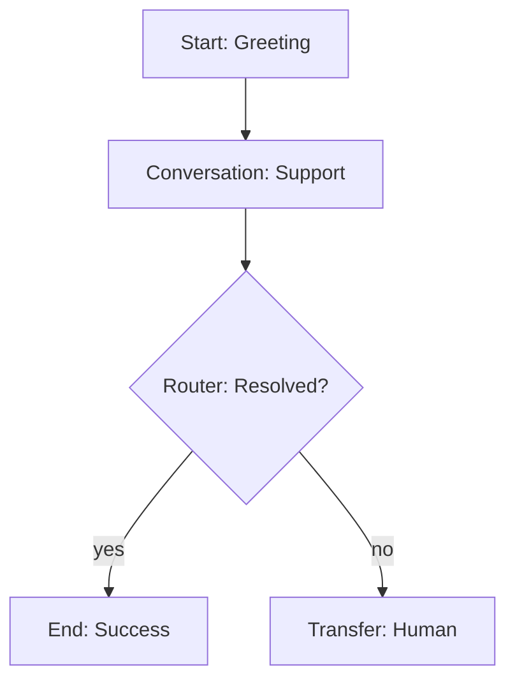
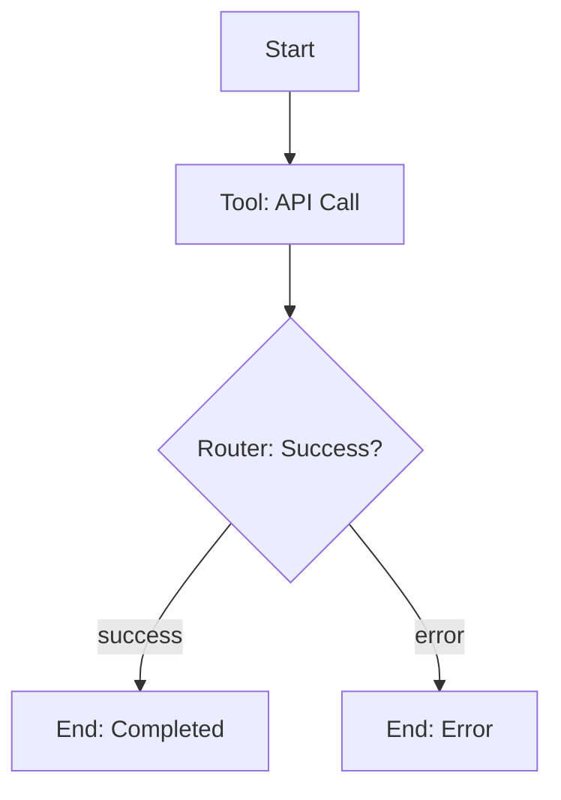
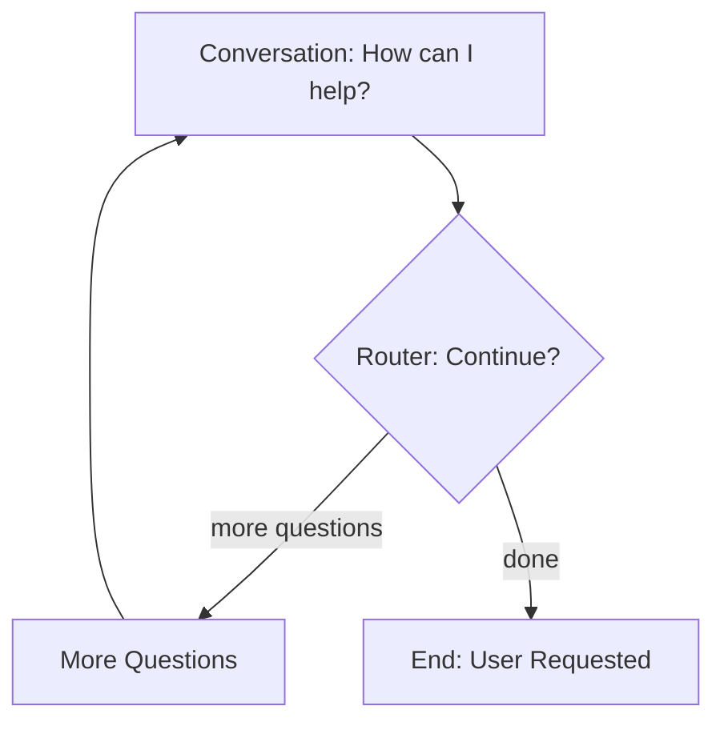

## Overview

End call nodes terminate the conversation and disconnect the call. They provide a clean, graceful way to end calls with optional farewell messages and tracking of call completion reasons. Every flow should have clear paths to end call nodes to avoid leaving callers hanging.

**Key characteristic:** End call nodes are terminal nodes—the flow stops here, and the call disconnects.

## When to Use

Use end call nodes to:

- **Successful completion** - Caller's needs were met
- **User-requested termination** - Caller asks to end call
- **Error scenarios** - Technical issues requiring call termination
- **Timeout handling** - No user input for extended period
- **After transfers** - Clean up after transferring to external number
- **Opt-out handling** - User declines service or opts out
- **Survey completion** - End of feedback collection
- **Appointment confirmation** - After successful booking

**Every flow should:**

- Have at least one end call node
- Provide clear paths to termination
- Handle both success and failure scenarios
- Give appropriate farewell messages

---

## Core Configuration

```typescript
{
  type: "end_call",
  label?: string,
  description?: string,

  // Final message (optional)
  finalMessage?: string,
  messageType: "static" | "prompt",  // Default: "prompt"

  // Reason for call ending
  reason: "completed" | "user_requested" | "error" | "timeout",  // Default: "completed"

  // No transitions (terminal node)
  transitions: []  // Always empty
}
```

<Info>
End call nodes are terminal nodes—they have no transitions. Once reached, the flow ends and the call disconnects.
</Info>

---

## Final Message

### Static Message

Exact, predetermined farewell message spoken every time.

```yaml
End Call Node: Call_Complete
  reason: completed

  Final Message:
    message: "Thank you for calling Acme Corporation. Have a great day!"
    messageType: static
```

**Use static when:**

- Consistent, professional farewell
- Brand-specific closing
- Legal disclaimers needed
- Simple, universal goodbye

### Prompt-Based Message

AI generates contextual farewell based on conversation.

```yaml
End Call Node: Call_Complete
  reason: completed

  Final Message:
    message: "Thank the caller warmly, reference their specific issue, and wish them a great day."
    messageType: prompt
```

**AI might say:**

- "Thank you for calling about your account update, {{customer_name}}. Have a wonderful day!"
- "I'm glad I could help with your question. Thanks for calling, and take care!"

**Use prompt when:**

- Want personalized, contextual farewell
- Reference specific conversation topics
- Natural, conversational ending
- Dynamic based on outcome

### Message with Variables

Use extracted variables in farewell.

```yaml
End Call Node: Appointment_Confirmed
  reason: completed

  Final Message:
    message: "Perfect! Your appointment is confirmed for {{appointment_date}} at {{appointment_time}}. We'll send a reminder to {{customer_email}}. Thank you, {{customer_name}}!"
    messageType: static
```

### Silent Termination (No Message)

End call immediately without farewell.

```yaml
End Call Node: Silent_End
  reason: error
  # No finalMessage - immediate disconnect
```

**Use when:**

- After transfer (new system handles goodbye)
- Error requires immediate termination
- User already said goodbye
- Abrupt ending is appropriate

---

## Call Reasons

Track why calls ended for analytics and reporting.

### Completed (Default)

Call successfully completed, caller's needs met.

```yaml
End Call Node: Success_Complete
  reason: completed
  finalMessage: "Thank you for calling. Your issue has been resolved. Have a great day!"
```

**Use when:**

- Problem solved
- Information provided
- Transaction completed
- Appointment booked
- Question answered

### User Requested

User asked to end the call.

```yaml
End Call Node: User_Ended
  reason: user_requested
  finalMessage: "Thank you for calling. If you need anything else, feel free to call back. Goodbye!"
```

**Use when:**

- Caller says "goodbye", "bye", "I'm done"
- User requests to hang up
- Caller indicates they're finished
- "No further questions" scenario

### Error

Technical error or system failure requires termination.

```yaml
End Call Node: Error_Terminate
  reason: error
  finalMessage: "I'm experiencing technical difficulties. Please try calling back in a few minutes. We apologize for the inconvenience."
```

**Use when:**

- API failures can't be recovered
- Critical system errors
- Database connection lost
- Unrecoverable tool failures
- Integration errors

### Timeout

No user input for extended period.

```yaml
End Call Node: Timeout_End
  reason: timeout
  finalMessage: "I haven't heard from you in a while. Please call back when you're ready. Goodbye!"
```

**Use when:**

- User not responding
- Long silence detected
- Inactivity timeout reached
- User appears to have left

---

## Use Cases & Examples

### Example 1: Successful Completion

**Scenario:** User's question answered, end positively.

```yaml
Conversation Node: Answer_Question
  message: "I hope that answers your question about our pricing."
  transitions:
    - Natural Language: "User is satisfied" → Call_Complete
    - Natural Language: "User has more questions" → Continue_Conversation

End Call Node: Call_Complete
  reason: completed

  Final Message:
    message: "Thank you for calling Acme Corp. If you have any other questions, feel free to call back. Have a wonderful day!"
    messageType: static
```

### Example 2: After Appointment Booking

**Scenario:** Appointment booked, confirm and end.

```yaml
Tool Node: Book_Appointment
  outputMapping:
    appointment_date: $.date
    appointment_time: $.time
    confirmation_number: $.confirmation_id
  transitions:
    - Always → Appointment_Confirmed

End Call Node: Appointment_Confirmed
  reason: completed

  Final Message:
    message: "Your appointment is confirmed for {{appointment_date}} at {{appointment_time}}. Your confirmation number is {{confirmation_number}}. We'll send a reminder email. Thank you, and see you then!"
    messageType: static
```

### Example 3: User Requested End

**Scenario:** User says they're done.

```yaml
Conversation Node: Anything_Else
  message: "Is there anything else I can help you with today?"

  transitions:
    - Natural Language: "User says no or goodbye" → User_Goodbye
    - Natural Language: "User has more questions" → Continue_Support

End Call Node: User_Goodbye
  reason: user_requested

  Final Message:
    message: "Thank you for calling. Have a great day!"
    messageType: static
```

### Example 4: Error Termination

**Scenario:** Critical API failure, can't continue.

```yaml
Tool Node: Critical_Database_Lookup
  onErrorBehavior: fail
  transitions:
    - Always → Database_Error_End

End Call Node: Database_Error_End
  reason: error

  Final Message:
    message: "I'm experiencing technical difficulties accessing our system. Please try calling back in a few minutes, or visit our website. We apologize for the inconvenience."
    messageType: static
```

### Example 5: Timeout Scenario

**Scenario:** User inactive for 60 seconds.

```yaml
Router Node: Check_User_Active
  # System monitors inactivity
  transitions:
    - Equation: {{seconds_since_input}} > 60 → Timeout_Warning
    - Always → Continue_Conversation

Conversation Node: Timeout_Warning
  message: "Are you still there? Let me know if you need more time."
  skipResponse: false

  transitions:
    - Natural Language: "User responds" → Resume_Conversation
    - Equation: {{seconds_since_input}} > 30 → Timeout_End

End Call Node: Timeout_End
  reason: timeout

  Final Message:
    message: "I haven't heard from you. Please call back when you're ready. Goodbye!"
    messageType: static
```

### Example 6: After Transfer

**Scenario:** Transfer to human, then end AI call.

```yaml
Transfer Call Node: Transfer_To_Human
  phoneNumber: +18005551234
  transferType: warm
  transferMessage: "I'm transferring you to a specialist now."

  transitions:
    - Always → End_After_Transfer

End Call Node: End_After_Transfer
  reason: completed
  # No final message - transfer system handles it
```

### Example 7: Opt-Out Handling

**Scenario:** User opts out of service.

```yaml
Conversation Node: Opt_Out_Confirmation
  message: "I understand you'd like to opt out. I've processed that request."

  transitions:
    - Always → Opt_Out_Complete

End Call Node: Opt_Out_Complete
  reason: user_requested

  Final Message:
    message: "Your opt-out request has been processed. You won't receive further calls. Thank you."
    messageType: static
```

### Example 8: Survey Completion

**Scenario:** Customer satisfaction survey finished.

```yaml
Conversation Node: Final_Question
  message: "On a scale of 1-10, how satisfied are you with our service?"

  Extract Variables:
    - satisfaction_score: "Extract rating 1-10"

  transitions:
    - Always → Survey_Complete

Tool Node: Submit_Survey
  tool: Save_Survey_Results
  parameters:
    score: {{satisfaction_score}}
  transitions:
    - Always → Thank_You_End

End Call Node: Thank_You_End
  reason: completed

  Final Message:
    message: "Thank you for your feedback! It helps us improve our service. Have a great day!"
    messageType: static
```

### Example 9: Multiple End Paths

**Scenario:** Different endings for different outcomes.

```yaml
Router Node: Outcome_Router
  transitions:
    - Equation: {{issue_resolved}} == true → Success_End
    - Equation: {{transferred_to_human}} == true → Transfer_End
    - Equation: {{user_frustrated}} == true → Apologetic_End
    - Always → Standard_End

End Call Node: Success_End
  reason: completed
  finalMessage: "I'm glad I could resolve your issue. Thank you for calling!"

End Call Node: Transfer_End
  reason: completed
  finalMessage: "You've been transferred. Have a great day!"

End Call Node: Apologetic_End
  reason: user_requested
  finalMessage: "I apologize we couldn't resolve this to your satisfaction. Please contact our support team for further assistance. Thank you."

End Call Node: Standard_End
  reason: completed
  finalMessage: "Thank you for calling. Goodbye!"
```

### Example 10: Contextual Personalized Ending

**Scenario:** Reference conversation details in goodbye.

```yaml
End Call Node: Personalized_Goodbye
  reason: completed

  Final Message:
    message: "Thank you, {{customer_name}}! Your {{order_type}} order for {{product_name}} will arrive on {{delivery_date}}. We appreciate your business!"
    messageType: static
```

---

## Flow Examples

### Example Flow 1: Simple Support



### Example Flow 2: Error Handling



### Example Flow 3: User Choice



---

## Best Practices

### ✅ Do's

**Provide farewell messages**

```yaml
✅ finalMessage: "Thank you for calling. Have a great day!"
❌ # No message - abrupt disconnect
```

**Reference conversation context**

```yaml
finalMessage: 'Thank you, {{customer_name}}! Your appointment is confirmed for {{appointment_date}}.'
```

**Use appropriate call reasons**

```yaml
✅ Success → reason: completed
✅ User goodbye → reason: user_requested
✅ API failure → reason: error
✅ No response → reason: timeout
```

**Have multiple end paths**

```yaml
# Different endings for different scenarios
- Success_End
- Error_End
- User_Requested_End
- Timeout_End
```

**Keep messages brief**

```yaml
✅ "Thank you for calling. Goodbye!"
❌ "Thank you so much for calling today. We really appreciate your business and hope you have a wonderful rest of your day. Please call back anytime. We're here to help. Take care and goodbye!"
```

**Confirm important information**

```yaml
finalMessage: 'Your confirmation number is {{confirmation_id}}. A receipt was sent to {{email}}.'
```

### ❌ Don'ts

**Don't end without closure**

```yaml
# ❌ Bad: No ending, flow just stops
Conversation Node: Answer
  # No transition to end

# ✅ Good: Clear path to end
Conversation Node: Answer
  transitions:
    - Always → Call_Complete
```

**Don't skip error end paths**

```yaml
# ❌ Bad: No error handling
Tool Node: Critical_API
  onErrorBehavior: fail
  # No transition to error end node

# ✅ Good: Error path to end
Tool Node: Critical_API
  onErrorBehavior: fail
  transitions:
    - Always → Error_End
```

**Don't make messages too long**

```yaml
❌ 5 sentence farewell
✅ 1-2 sentence farewell
```

**Don't forget timeout scenarios**

```yaml
# Always have a path for user inactivity
```

**Don't use wrong call reason**

```yaml
# ❌ Error as "completed"
reason: completed  # But call failed!

# ✅ Correct reason
reason: error
```

---

## Analytics & Reporting

Call reasons enable analytics and reporting:

### Tracking Call Outcomes

```typescript
// System automatically tracks:
{
  call_id: "...",
  end_reason: "completed" | "user_requested" | "error" | "timeout",
  final_message_spoken: "...",
  call_duration: 145,  // seconds
  nodes_visited: [...],
  timestamp: "..."
}
```

### Metrics to Monitor

**Completion rate:**

```
completed / total_calls
```

**User satisfaction:**

```
(completed + user_requested) / total_calls
```

**Error rate:**

```
error / total_calls
```

**Timeout rate:**

```
timeout / total_calls
```

### Optimization

Use call reasons to:

- Identify problematic flows (high error rate)
- Detect timeout issues (engagement problems)
- Measure success (completion rate)
- A/B test different endings

---

## Troubleshooting

### Issue: Calls ending abruptly

**Possible causes:**

- No final message configured
- Message generation failing
- Transition directly to end without conversation

**Solution:**

1. Add final message
2. Use static message if prompt fails
3. Add transition node before end

### Issue: Users confused at end

**Possible causes:**

- Unclear final message
- No confirmation of actions taken
- Missing next steps

**Solution:**

1. Clarify what happened in final message
2. Confirm important details
3. Provide next steps or follow-up info

### Issue: No path to end call

**Possible causes:**

- Flow has no end nodes
- Transitions don't lead to end
- Circular conversation loop

**Solution:**

1. Add end call nodes
2. Review all transition paths
3. Ensure every path can reach an end

### Issue: Wrong call reason tracked

**Possible causes:**

- Using wrong reason enum
- Not updating reason for scenario
- Copy-paste error

**Solution:**

1. Review reason field
2. Match reason to actual outcome
3. Test analytics tracking

---

## Schema Reference

```typescript
{
  type: "end_call",
  label?: string,
  description?: string,

  // Final message (optional)
  finalMessage?: string,
  messageType: "static" | "prompt",  // Default: "prompt"

  // Call reason (required)
  reason: "completed" | "user_requested" | "error" | "timeout",  // Default: "completed"

  // Transitions (always empty - terminal node)
  transitions: [],

  // Position
  position: { x: number, y: number }
}
```

---

## Call Reason Reference

| Reason           | When to Use                | Analytics Impact |
| ---------------- | -------------------------- | ---------------- |
| `completed`      | Successful call, needs met | Positive outcome |
| `user_requested` | User chose to end call     | Neutral outcome  |
| `error`          | Technical failure          | Negative outcome |
| `timeout`        | User inactive/unresponsive | Engagement issue |

---

## Common Patterns

### Pattern 1: Confirmation + End

```yaml
Conversation Node: Confirm_Action
  message: "I've completed {{action}}. Is there anything else?"
  transitions:
    - Natural Language: "no" → End_Complete
    - Natural Language: "yes" → Continue_Support

End Call Node: End_Complete
  reason: completed
  finalMessage: "Great! Thank you for calling."
```

### Pattern 2: Multi-Outcome Routing

```yaml
Router Node: Determine_Outcome
  transitions:
    - Equation: {{success}} == true → Success_End
    - Equation: {{error}} == true → Error_End
    - Always → Standard_End
```

### Pattern 3: Pre-End Feedback

```yaml
Conversation Node: Get_Feedback
  message: "Before you go, how was your experience today? Good, okay, or bad?"
  extractVariables:
    - feedback: "Extract sentiment"
  transitions:
    - Always → Thank_And_End

End Call Node: Thank_And_End
  reason: completed
  finalMessage: "Thank you for your feedback! Have a great day."
```

---

## Next Steps

<CardGroup cols={2}>
  <Card title="Start Node" icon="play" href="./start-node">
    Begin flows that end gracefully
  </Card>
  <Card title="Conversation Node" icon="comments" href="./conversation-node">
    Lead to satisfying conclusions
  </Card>
  <Card title="Router Node" icon="route" href="./router-node">
    Route to appropriate endings
  </Card>
  <Card title="Transfer Nodes" icon="phone-arrow-up-right" href="./transfer-call-node">
    Transfer before ending
  </Card>
  <Card title="Transitions" icon="arrows-split-up-and-left" href="../transitions">
    Path to end call nodes
  </Card>
  <Card title="Best Practices" icon="check" href="../best-practices">
    Build better flows
  </Card>
</CardGroup>
