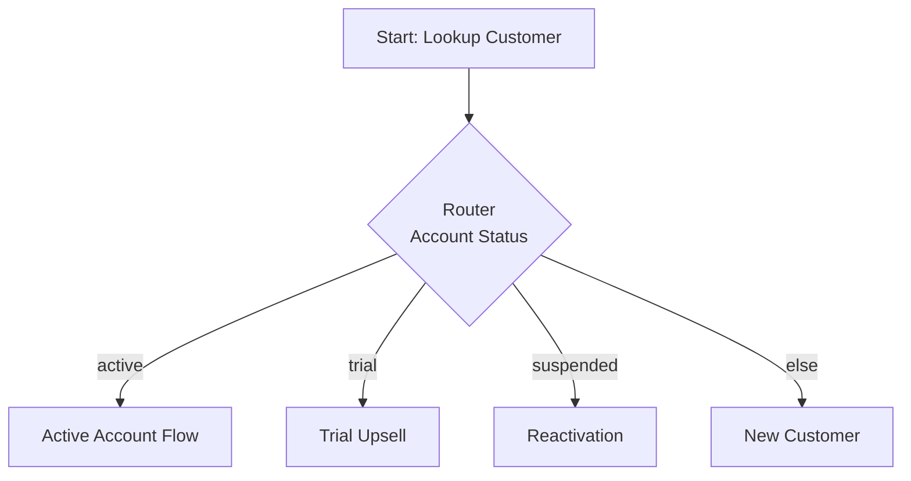
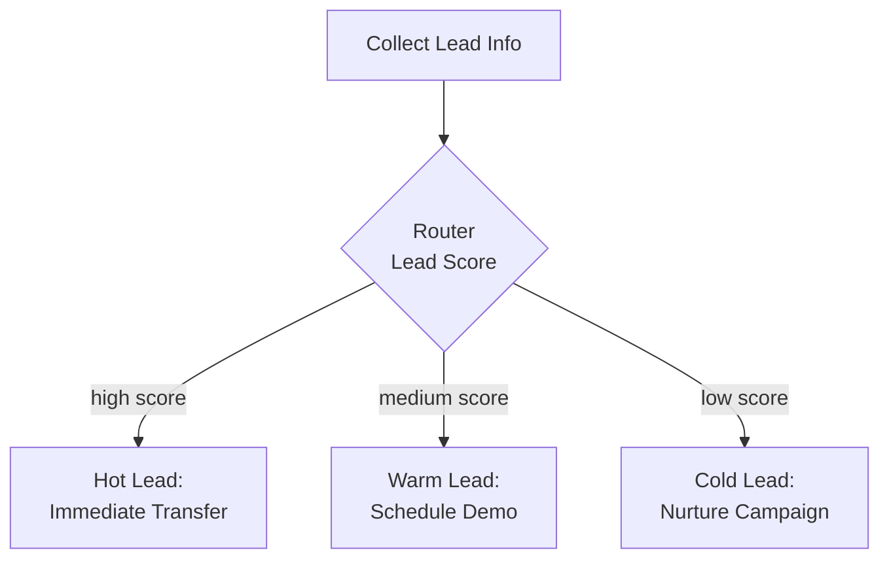
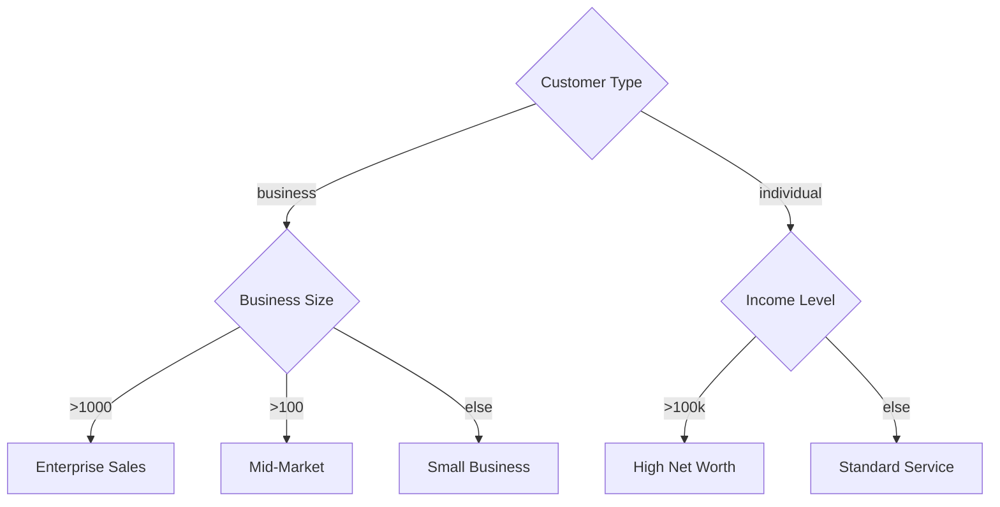

## Overview

Router nodes perform pure conditional logic routing without having any conversation. They instantly evaluate conditions based on variables and data, then transition to the appropriate next node. Think of router nodes as the "if/else" or "switch/case" statements of your flow.

**Key characteristic:** Router nodes execute instantly—no conversation, no waiting for user input, just logic evaluation and immediate transition.

## When to Use

Use router nodes to:

- **Route based on extracted data:** Direct flow based on account status, tier, location
- **Implement business logic:** Different paths for different customer segments
- **Create decision trees:** Multi-branch routing based on multiple conditions
- **Handle tool responses:** Route based on API results
- **A/B test flows:** Split traffic between different conversation paths
- **Time-based routing:** Different flows for business hours vs after hours
- **Priority routing:** High-value leads to different paths

**Use Router Node when:**

- Decision is based on variables/data, not conversation
- You need multiple conditional branches
- Logic is deterministic (not LLM-based)
- Instant routing without user interaction

**Use Conversation Node instead when:**

- Need to ask questions to determine next step
- Decision requires conversation context
- Want natural language understanding

---

## Core Configuration

Router nodes have minimal configuration—they're pure routing logic.

```typescript
{
  type: "router",
  label?: string,
  description?: string,

  // Router nodes only have transitions
  // No conversation, no tools, no settings

  transitions: Transition[]  // At least one required
}
```

<Info>
The power of router nodes is entirely in their transitions. All logic is defined through transition conditions.
</Info>

---

## Transition Types

Router nodes support structured equation and always transitions. Natural language transitions are not typically used (no conversation to evaluate).

### Structured Equation Transitions

Define logical conditions using variables and operators.

#### Simple Condition

```yaml
Router Node: Check_Account_Status
  transitions:
    - Equation: {{account_status}} == "active" → Active_Flow
    - Equation: {{account_status}} == "suspended" → Suspended_Flow
    - Equation: {{account_status}} == "closed" → Closed_Flow
    - Always → Unknown_Status_Flow
```

#### Multiple Conditions (AND Logic)

All conditions must be true.

```yaml
Router Node: Qualify_Lead
  transitions:
    - Structured Equation (logic: all):
        - {{budget}} >= 5000
        - {{is_decision_maker}} == true
        - {{timeline}} == "immediate"
      → High_Priority_Sales

    - Structured Equation (logic: all):
        - {{budget}} >= 1000
        - {{budget}} < 5000
      → Medium_Priority

    - Always → Low_Priority
```

#### Multiple Conditions (OR Logic)

Any condition can be true.

```yaml
Router Node: Emergency_Check
  transitions:
    - Structured Equation (logic: any):
        - {{urgency_level}} == "critical"
        - {{is_emergency}} == true
        - {{priority_customer}} == true
      → Immediate_Escalation

    - Always → Standard_Process
```

### Always Transition

Fallback when no other conditions match.

```yaml
Router Node: Category_Router
  transitions:
    - Equation: {{category}} == "sales" → Sales_Flow
    - Equation: {{category}} == "support" → Support_Flow
    - Equation: {{category}} == "billing" → Billing_Flow
    - Always → General_Flow  # Catch-all for unknown categories
```

<Warning>
Always include an "always" transition as a fallback. Router nodes without a matching transition will cause flow errors.
</Warning>

---

## Operators

Use these operators in equation conditions:

| Operator       | Description            | Example                           |
| -------------- | ---------------------- | --------------------------------- |
| `==`           | Equals                 | `{{status}} == "active"`          |
| `!=`           | Not equals             | `{{status}} != "suspended"`       |
| `>`            | Greater than           | `{{age}} > 18`                    |
| `<`            | Less than              | `{{balance}} < 0`                 |
| `>=`           | Greater than or equal  | `{{score}} >= 80`                 |
| `<=`           | Less than or equal     | `{{items}} <= 5`                  |
| `contains`     | String contains        | `{{email}} contains "@gmail.com"` |
| `not_contains` | String doesn't contain | `{{phone}} not_contains "+1"`     |

### Comparison Examples

**String comparison:**

```yaml
{{customer_tier}} == "premium"
{{location}} == "USA"
{{status}} != "inactive"
```

**Numeric comparison:**

```yaml
{{order_total}} >= 100
{{quantity}} > 0
{{discount_percentage}} <= 20
```

**Boolean comparison:**

```yaml
{{is_verified}} == true
{{has_subscription}} == false
```

**Contains:**

```yaml
{{email}} contains "@company.com"
{{full_name}} contains "Smith"
{{phone}} not_contains "+1"
```

---

## Use Cases & Examples

### Example 1: Account Status Routing

**Scenario:** Different flows for different account statuses.

```yaml
# Previous node extracts account_status
Tool Node: Lookup_Account
  outputMapping:
    account_status: $.status
  transitions:
    - Always → Status_Router

Router Node: Status_Router
  label: "Route by account status"

  transitions:
    - Equation: {{account_status}} == "active"
      → Active_Account_Flow

    - Equation: {{account_status}} == "suspended"
      → Reactivation_Flow

    - Equation: {{account_status}} == "trial"
      → Trial_Extension_Flow

    - Equation: {{account_status}} == "cancelled"
      → Win_Back_Flow

    - Always → New_Customer_Flow
```

### Example 2: Budget-Based Lead Qualification

**Scenario:** Route leads to different sales tiers based on budget.

```yaml
Conversation Node: Qualify_Budget
  message: "What's your budget range for this project?"
  extractVariables:
    - budget_amount: "Extract budget in dollars"
  transitions:
    - Always → Budget_Router

Router Node: Budget_Router
  transitions:
    - Equation: {{budget_amount}} >= 50000
      → Enterprise_Sales_Team

    - Structured Equation (logic: all):
        - {{budget_amount}} >= 10000
        - {{budget_amount}} < 50000
      → Mid_Market_Team

    - Structured Equation (logic: all):
        - {{budget_amount}} >= 1000
        - {{budget_amount}} < 10000
      → Small_Business_Team

    - Always → Self_Service_Flow
```

### Example 3: Time-Based Routing

**Scenario:** Different flows for business hours vs after hours.

```yaml
Router Node: Time_Router
  label: "Route based on business hours"

  transitions:
    - Structured Equation (logic: all):
        - {{current_hour}} >= 9
        - {{current_hour}} < 17
        - {{current_day_of_week}} != "Saturday"
        - {{current_day_of_week}} != "Sunday"
      → Business_Hours_Flow

    - Always → After_Hours_Flow
```

### Example 4: Geographic Routing

**Scenario:** Route to region-specific agents.

```yaml
Router Node: Region_Router
  transitions:
    - Structured Equation (logic: any):
        - {{caller_state}} == "CA"
        - {{caller_state}} == "OR"
        - {{caller_state}} == "WA"
      → West_Coast_Team

    - Structured Equation (logic: any):
        - {{caller_state}} == "NY"
        - {{caller_state}} == "NJ"
        - {{caller_state}} == "CT"
      → East_Coast_Team

    - Always → National_Team
```

### Example 5: Customer Tier & Purchase History

**Scenario:** VIP treatment for premium customers with purchase history.

```yaml
Tool Node: Lookup_Customer
  outputMapping:
    membership_tier: $.tier
    lifetime_value: $.lifetime_value
    last_purchase_days: $.days_since_purchase
  transitions:
    - Always → Customer_Router

Router Node: Customer_Router
  transitions:
    # VIP path: Premium tier AND high lifetime value
    - Structured Equation (logic: all):
        - {{membership_tier}} == "premium"
        - {{lifetime_value}} >= 10000
      → VIP_Concierge_Service

    # Loyal path: Recent purchase
    - Equation: {{last_purchase_days}} <= 30
      → Active_Customer_Flow

    # Win-back path: No recent purchase
    - Structured Equation (logic: all):
        - {{last_purchase_days}} > 90
        - {{membership_tier}} != "cancelled"
      → Reactivation_Campaign

    # Default path
    - Always → Standard_Service
```

### Example 6: Multi-Factor Lead Scoring

**Scenario:** Complex lead scoring with multiple factors.

```yaml
Conversation Node: Qualify_Lead
  extractVariables:
    - company_size: "Number of employees"
    - budget_range: "Annual budget"
    - timeline: "When to start"
    - decision_maker: "Are they the decision maker"
  transitions:
    - Always → Lead_Score_Router

Router Node: Lead_Score_Router
  # High-priority leads
  transitions:
    - Structured Equation (logic: all):
        - {{company_size}} >= 100
        - {{budget_range}} >= 50000
        - {{timeline}} == "immediate"
        - {{decision_maker}} == true
      → Hot_Lead_Immediate_Transfer

    # Medium-priority leads
    - Structured Equation (logic: all):
        - {{company_size}} >= 20
        - {{budget_range}} >= 10000
        - {{decision_maker}} == true
      → Warm_Lead_Schedule_Demo

    # Low-priority leads
    - Structured Equation (logic: any):
        - {{company_size}} < 20
        - {{budget_range}} < 10000
        - {{decision_maker}} == false
      → Nurture_Campaign

    # Unqualified
    - Always → Self_Service_Resources
```

### Example 7: Inventory-Based Routing

**Scenario:** Different flows based on product availability.

```yaml
Tool Node: Check_Inventory
  outputMapping:
    stock_quantity: $.available
    next_shipment_days: $.next_shipment_in_days
  transitions:
    - Always → Inventory_Router

Router Node: Inventory_Router
  transitions:
    # In stock
    - Equation: {{stock_quantity}} > 0
      → Process_Order

    # Out of stock but coming soon
    - Structured Equation (logic: all):
        - {{stock_quantity}} == 0
        - {{next_shipment_days}} <= 7
      → Backorder_Option

    # Out of stock, long wait
    - Structured Equation (logic: all):
        - {{stock_quantity}} == 0
        - {{next_shipment_days}} > 7
      → Suggest_Alternatives

    # Unknown availability
    - Always → Manual_Check_Flow
```

### Example 8: Payment Status Routing

**Scenario:** Handle different payment outcomes.

```yaml
Tool Node: Process_Payment
  outputMapping:
    payment_status: $.status
    decline_reason: $.decline_reason
  transitions:
    - Always → Payment_Router

Router Node: Payment_Router
  transitions:
    - Equation: {{payment_status}} == "succeeded"
      → Payment_Success_Flow

    - Equation: {{payment_status}} == "insufficient_funds"
      → Insufficient_Funds_Flow

    - Equation: {{payment_status}} == "card_declined"
      → Card_Declined_Flow

    - Equation: {{payment_status}} == "requires_authentication"
      → 3DS_Authentication_Flow

    - Always → Payment_Error_Flow
```

---

## Advanced Patterns

### Nested Routers

Chain multiple routers for complex decision trees.

```yaml
Router Node: Primary_Router
  transitions:
    - Equation: {{customer_type}} == "business"
      → Business_Size_Router
    - Equation: {{customer_type}} == "individual"
      → Individual_Income_Router
    - Always → Unknown_Router

Router Node: Business_Size_Router
  transitions:
    - Equation: {{company_size}} >= 1000
      → Enterprise_Flow
    - Equation: {{company_size}} >= 100
      → Mid_Market_Flow
    - Always → Small_Business_Flow

Router Node: Individual_Income_Router
  transitions:
    - Equation: {{annual_income}} >= 100000
      → High_Net_Worth_Flow
    - Always → Standard_Individual_Flow
```

### Router + Conversation Hybrid

Use routers to branch, then personalize with conversation.

```yaml
Router Node: Tier_Router
  transitions:
    - Equation: {{tier}} == "premium"
      → Premium_Greeting
    - Always → Standard_Greeting

Conversation Node: Premium_Greeting
  message: "Welcome back, {{name}}! As a premium member, you have priority access to our specialists."

Conversation Node: Standard_Greeting
  message: "Thanks for calling! How can I help you today?"
```

### A/B Testing

Split traffic randomly or by criteria for testing.

```yaml
Router Node: AB_Test_Router
  label: "50/50 split for testing new flow"

  transitions:
    # Use session_id hash or random value to split
    - Equation: {{session_id}} contains "a"
      → Flow_Variant_A

    - Equation: {{session_id}} contains "b"
      → Flow_Variant_B

    - Always → Flow_Variant_A
```

### Priority Escalation

Route urgent cases immediately.

```yaml
Router Node: Priority_Router
  transitions:
    # Critical priority
    - Structured Equation (logic: any):
        - {{urgency}} == "critical"
        - {{account_value}} >= 100000
        - {{is_escalation}} == true
      → Immediate_Human_Transfer

    # High priority
    - Structured Equation (logic: all):
        - {{urgency}} == "high"
        - {{issue_complexity}} == "complex"
      → Senior_Agent_Queue

    # Standard
    - Always → Standard_Support_Flow
```

---

## Flow Examples

### Example Flow 1: Customer Service Routing



### Example Flow 2: Lead Qualification



### Example Flow 3: Nested Decision Tree



---

## Best Practices

### ✅ Do's

**Always include fallback transitions**

```yaml
Router Node:
  transitions:
    - Equation: {{status}} == "A" → Path_A
    - Equation: {{status}} == "B" → Path_B
    - Always → Default_Path  # ✅ Fallback for unknown values
```

**Use descriptive labels**

```yaml
Router Node: Customer_Tier_Router
  label: "Route based on membership tier and lifetime value"
  # Not: "Router_1"
```

**Group related conditions**

```yaml
# ✅ Good: Logical grouping
- Structured Equation (logic: all):
    - {{tier}} == "premium"
    - {{lifetime_value}} >= 10000
  → VIP_Flow

# vs scattered conditions
```

**Order transitions by priority**

```yaml
# Most specific/important first
transitions:
  - High priority condition → Critical_Path
  - Medium priority → Standard_Path
  - Always → Fallback
```

**Test all paths**

- Verify every transition works
- Test edge cases
- Ensure fallback handles unexpected values

**Use routers for data-based decisions**

```yaml
# ✅ Good: Data-driven
Router based on {{account_status}}

# ❌ Bad: Should use conversation node
Router based on user's spoken words
```

### ❌ Don'ts

**Don't skip the always transition**

```yaml
# ❌ Bad: No fallback
Router Node:
  transitions:
    - Equation: {{type}} == "A" → Path_A
    - Equation: {{type}} == "B" → Path_B
    # What happens if type is "C"? Flow breaks!

# ✅ Good: Has fallback
Router Node:
  transitions:
    - Equation: {{type}} == "A" → Path_A
    - Equation: {{type}} == "B" → Path_B
    - Always → Unknown_Type_Handler
```

**Don't use routers for conversation-based logic**

```yaml
# ❌ Bad: Needs conversation to determine
Router based on "what user wants"

# ✅ Good: Use conversation node with transitions
Conversation node: "How can I help?"
  transitions:
    - Natural Language: "wants sales" → Sales
```

**Don't make overly complex conditions**

```yaml
# ❌ Too complex
- Structured Equation (logic: all):
    - {{a}} > 5
    - {{b}} < 10
    - {{c}} == "x"
    - {{d}} != "y"
    - {{e}} >= 3
  → Complex_Path

# ✅ Better: Split into multiple routers
```

**Don't route on undefined variables**

```yaml
# ❌ Bad: Variable might not exist
- Equation: {{undefined_var}} == "value"

# ✅ Good: Ensure variable exists first
Tool Node: Extract_Data
  outputMapping:
    my_var: $.field
  → Router_Using_My_Var
```

**Don't create unreachable paths**

```yaml
# ❌ Bad: Second condition never reached
transitions:
  - Equation: {{status}} == "active" → Active
  - Always → Default  # This always fires!
  - Equation: {{status}} == "inactive" → Inactive  # Never reached!

# ✅ Good: All before always
transitions:
  - Equation: {{status}} == "active" → Active
  - Equation: {{status}} == "inactive" → Inactive
  - Always → Default
```

---

## Troubleshooting

### Issue: Router always takes the same path

**Possible causes:**

- Variable not being set correctly
- Variable value is different than expected
- Always transition is first (catches everything)

**Solution:**

1. Check variable extraction in previous nodes
2. Debug variable values using test calls
3. Verify transition order (always should be last)
4. Add logging to see actual variable values

### Issue: Flow gets stuck at router

**Possible causes:**

- No transition matches and no always fallback
- Variable doesn't exist
- Condition syntax error

**Solution:**

1. Always add an "always" transition
2. Verify variables exist before router
3. Check condition syntax
4. Test with various input values

### Issue: Wrong path being taken

**Possible causes:**

- Variable type mismatch (string vs number)
- Unexpected variable value
- Condition logic error

**Solution:**

1. Check variable data types
2. Use correct comparison operators
3. Test conditions independently
4. Review extracted variable values

### Issue: Cannot reference variable in router

**Possible causes:**

- Variable not extracted yet
- Variable name typo
- Wrong variable scope

**Solution:**

1. Ensure variable is extracted before router
2. Check variable name spelling: `{{exact_name}}`
3. Verify variable is in scope
4. Review flow order

---

## Performance Considerations

Router nodes are extremely fast:

- **No LLM calls:** Pure logic evaluation
- **No API requests:** Local computation
- **Instant transitions:** Sub-millisecond routing
- **Efficient:** Minimal resource usage

**Best practices for performance:**

- Use routers for high-volume routing
- Prefer routers over conversation nodes for data-based decisions
- Keep condition logic simple for fastest evaluation
- Order transitions with most likely first

---

## Schema Reference

```typescript
{
  type: "router",
  label?: string,         // Optional display label
  description?: string,   // Optional internal description

  // Router nodes are pure logic - minimal config
  // All behavior is defined through transitions

  transitions: Array<{
    id: string,
    name?: string,
    priority: number,     // Higher = evaluated first
    isEnabled: boolean,

    condition: {
      type: "structured_equation" | "always",

      // For structured_equation
      logic?: "all" | "any",  // AND or OR
      conditions?: Array<{
        variable: string,
        operator: "equals" | "not_equals" | "greater_than" |
                 "less_than" | "greater_than_or_equal" |
                 "less_than_or_equal" | "contains" | "not_contains",
        value: string | number | boolean
      }>,

      // For always
      description?: string
    },

    targetNodeId: string
  }>,

  position: { x: number, y: number }
}
```

---

## Next Steps

<CardGroup cols={2}>
  <Card title="Transitions" icon="arrows-split-up-and-left" href="../transitions">
    Master all transition types and conditions
  </Card>
  <Card title="Variables" icon="code" href="../variables">
    Learn about variable extraction and usage
  </Card>
  <Card title="Tool Node" icon="wrench" href="./tool-node">
    Extract data to use in router conditions
  </Card>
  <Card title="Conversation Node" icon="comments" href="./conversation-node">
    Collect data before routing
  </Card>
  <Card title="Best Practices" icon="check" href="../best-practices">
    Build better flows
  </Card>
</CardGroup>
