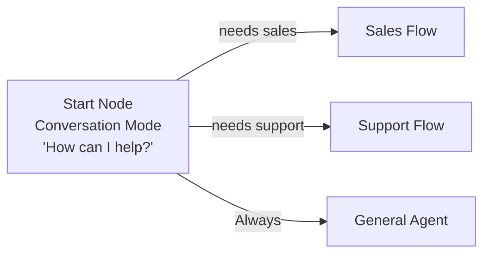
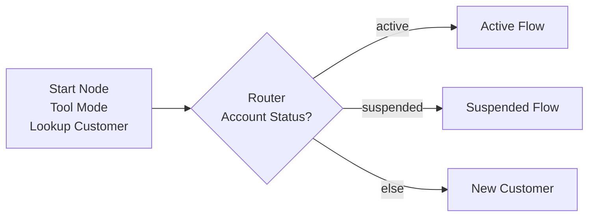
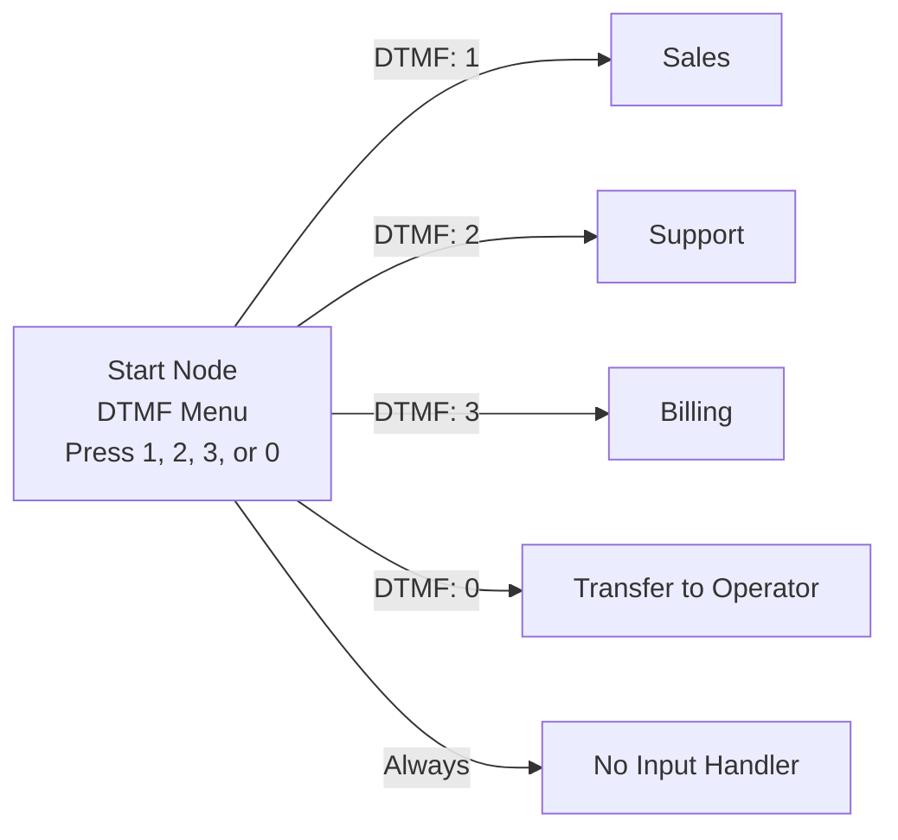

## Overview

The start node is the entry point for every flow agent. It's the first node executed when a call begins and must be present in every flow (you cannot delete it). Unlike other node types, the start node can operate in two distinct modes: **conversation mode** for greeting callers, or **tool mode** for pre-fetching data before any conversation begins.

<Info>
**Every flow has exactly one start node.** It cannot be deleted, but it can be configured in multiple ways to match your needs.
</Info>

## Operating Modes

### Conversation Mode (Default)

In conversation mode, the start node behaves like a standard conversation node—greeting the caller and initiating dialogue.

**Best for:**

- Standard flows that begin with a greeting
- IVR-style menus with DTMF options
- Flows where immediate conversation is needed
- Initial qualification or triage

### Tool Mode

In tool mode, the start node executes a tool before any conversation happens, allowing you to pre-fetch caller data or perform initial setup actions.

**Best for:**

- Looking up caller information from CRM
- Checking account status before greeting
- Pre-loading personalized data
- Logging call initiation
- Fetching context from external systems

---

## Configuration: Conversation Mode

### Basic Setup

```typescript
{
  type: "start",
  subType: "conversation",
  messageType: "prompt" | "static",
  message: string,

  // Optional: Variable extraction
  extractVariables: {
    enabled: boolean,
    variables: Variable[]
  },

  // Optional: Model/voice overrides
  modelSettings?: ModelSettings,
  voiceSettings?: VoiceSettings,
  transcriberSettings?: TranscriberSettings
}
```

### Message Types

#### Prompt (Dynamic)

The AI generates responses based on context and conversation flow.

```yaml
Start Node (Conversation - Prompt):
  subType: conversation
  messageType: prompt
  message: |
    ## Objective
    Welcome the caller warmly and identify their reason for calling.

    ## Instructions
    - Greet them professionally
    - Ask how you can help today
    - Listen for their main concern
    - Be friendly and patient
```

**AI might say:**

- "Good morning! Thanks for calling Acme Corporation. How can I help you today?"
- "Hi there! This is Acme Corp. What can I do for you?"

#### Static (Fixed)

The AI speaks exactly what you write, every time.

```yaml
Start Node (Conversation - Static):
  subType: conversation
  messageType: static
  message: 'Thank you for calling Acme Corporation. This call may be recorded for quality assurance. How may I help you today?'
```

**AI always says exactly this message.**

### DTMF Transitions

Start nodes in conversation mode support DTMF transitions for IVR-style menus.

**Example - Department Selection Menu:**

```yaml
Start Node (Conversation):
  messageType: static
  message: 'Welcome to Acme Corp. Press 1 for Sales, Press 2 for Support, Press 3 for Billing, or stay on the line to speak with an agent.'

  Transitions:
    - DTMF: key=1 → Sales_Department
    - DTMF: key=2 → Support_Department
    - DTMF: key=3 → Billing_Department
    - Always → General_Agent
```

<Tip>
DTMF transitions are evaluated immediately when the user presses a key, even while the agent is still speaking. This provides a responsive IVR experience.
</Tip>

### Variable Extraction

Extract data from the initial conversation to use throughout the flow.

```yaml
Start Node (Conversation):
  messageType: prompt
  message: "Welcome! May I have your name and account number to get started?"

  Extract Variables:
    enabled: true
    variables:
      - name: customer_name
        description: "Customer's full name"
        extractionPrompt: "Extract the customer's full name"
        dataType: string
        isRequired: true

      - name: account_number
        description: "Account number"
        extractionPrompt: "Extract the account number (digits only)"
        dataType: string
        isRequired: true

  Transitions:
    - Natural Language: "Name and account number collected" → Verify_Account
```

**[→ Learn More: Variable Extraction](../variables)**

---

## Configuration: Tool Mode

### Basic Setup

```typescript
{
  type: "start",
  subType: "tool",

  // Tool configuration is in agentSettings.tools where tool.nodeId === 'start'
  // No tool reference fields on the node itself

  // Error handling
  timeout: number,  // milliseconds, default 30000
  onErrorBehavior: "continue" | "retry" | "fail",
  errorMessage?: string,

  // Response customization
  overrideResponse: boolean,
  customResponse?: string,
  outputMapping: Record<string, string>,

  // Processing message
  processingMessage?: string,
  processingMessageType: "static" | "prompt"  // Default: "static"
}
```

<Info>
**Tool Reference:** When subType is 'tool', the tool configuration is stored in `agentSettings.tools` array where `tool.nodeId === 'start'`. The node itself doesn't contain tool details—only execution settings.
</Info>

### Selecting a Tool

When you switch to tool mode, you select from your tool library:

1. Click on the start node
2. Change **Sub Type** to "Tool"
3. Click **Select Tool**
4. Choose from your tool templates

**What happens behind the scenes:**

- Selecting a tool creates an entry in `agentSettings.tools` array
- This entry has `nodeId: 'start'` to link it to the start node
- Tool configuration (toolId, toolType, parameters, overrides) is stored in that entry
- The start node itself only contains execution settings (timeout, error handling, output mapping)

**Available tool types:**

- **API Request (Function):** HTTP requests to external APIs
- **MCP Server:** Model Context Protocol integrations
- **Web Tool:** Browser-based tools for SDK deployments

**[→ Learn more about tools and configuration/features/tools)**

### Parameter Mapping

Parameters and overrides are configured in the tool reference (stored in `agentSettings.tools`), not on the node itself.

**Example - Caller Lookup:**

```yaml
# In agentSettings.tools array:
Tool Reference:
  nodeId: 'start' # Links to start node
  toolId: 'crm-lookup-tool-id'
  toolType: 'FUNCTION'
  persistentId: 'crm_lookup'
  version: 1
  overrides:
    parameters:
      phone_number: { { caller_id } } # System variable
      include_history: true # Static value
      fields: 'name,account,status' # Static value

# On the start node:
Start Node (Tool):
  subType: tool
  timeout: 10000
  onErrorBehavior: continue

  outputMapping:
    customer_name: $.data.name
    customer_id: $.data.id
    account_status: $.data.account.status
    membership_tier: $.data.account.tier

  processingMessage: 'Please hold while I look up your information...'
  processingMessageType: static

  transitions:
    - Always → Personalized_Greeting
```

<Tip>
When you configure a tool in the UI, you don't need to manually edit the agentSettings.tools array. The interface handles the tool reference creation and linkage automatically.
</Tip>

### Output Mapping

Extract data from tool responses into flow variables using JSON path syntax.

**Response from CRM tool:**

```json
{
  "data": {
    "id": "CUST-12345",
    "name": "John Smith",
    "account": {
      "status": "active",
      "tier": "premium"
    }
  }
}
```

**Output mapping:**

```yaml
Output Mapping:
  customer_name: $.data.name # "John Smith"
  customer_id: $.data.id # "CUST-12345"
  account_status: $.data.account.status # "active"
  membership_tier: $.data.account.tier # "premium"
```

**Use extracted variables in next node:**

```yaml
Conversation Node: Personalized_Greeting
  message: "Welcome back, {{customer_name}}! As a {{membership_tier}} member, I'm happy to help you today."
```

### Error Handling

Configure what happens when tool execution fails.

**Continue (Recommended)**

```yaml
Error Handling:
  onErrorBehavior: continue
  errorMessage: "I'm having trouble accessing your account. Let's continue anyway."
```

Flow continues to next node even if tool fails. Use for non-critical operations.

**Retry**

```yaml
Error Handling:
  onErrorBehavior: retry
  retryAttempts: 2
  errorMessage: 'Let me try that again...'
```

Automatically retries the tool call. Use for intermittent API issues.

**Fail**

```yaml
Error Handling:
  onErrorBehavior: fail
  errorMessage: "I'm experiencing technical difficulties. Please try again later."
```

Stops flow execution. Use when tool is critical to conversation.

### Custom Response Override

By default, the agent handles tool results silently. You can override this to speak custom messages.

**Without override (silent):**

```yaml
Start Node (Tool):
  tool: Lookup_Caller
  overrideResponse: false
  # Agent says nothing, just transitions to next node
```

**With override (custom message):**

```yaml
Start Node (Tool):
  tool: Lookup_Caller
  overrideResponse: true
  customResponse: "Welcome back, {{customer_name}}! I see you're a {{membership_tier}} member with an {{account_status}} account."
  # Agent speaks this custom message using extracted variables
```

### Processing Message

Show a message while the tool executes (especially useful for slow APIs).

**Static processing message:**

```yaml
Processing Message:
  message: 'One moment while I look up your information...'
  messageType: static
```

**Dynamic processing message:**

```yaml
Processing Message:
  message: 'Let me check your account details.'
  messageType: prompt
```

### Timeout Configuration

Set maximum wait time for tool execution.

```yaml
Tool Settings:
  timeout: 10000 # 10 seconds
```

**Recommendations:**

- Fast APIs (< 2s): 5000ms (5 seconds)
- Standard APIs: 10000ms (10 seconds)
- Slow operations: 30000ms (30 seconds max)

<Warning>
If a tool exceeds the timeout, it follows the `onErrorBehavior` setting.
</Warning>

---

## Use Cases

### Use Case 1: Standard Greeting (Conversation Mode)

**Scenario:** Simple customer service greeting.

```yaml
Start Node (Conversation):
  subType: conversation
  messageType: static
  message: "Thank you for calling Acme Corporation. How can I help you today?"

  Transitions:
    - Natural Language: "User needs sales" → Sales_Flow
    - Natural Language: "User needs support" → Support_Flow
    - Always → General_Conversation
```

### Use Case 2: IVR Menu (Conversation Mode + DTMF)

**Scenario:** Department routing with keypad.

```yaml
Start Node (Conversation):
  subType: conversation
  messageType: static
  message: 'Welcome to Acme Corp. For Sales, press 1. For Support, press 2. For Billing, press 3. Or press 0 for the operator.'

  Transitions:
    - DTMF: key=1 → Sales_Department
    - DTMF: key=2 → Support_Department
    - DTMF: key=3 → Billing_Department
    - DTMF: key=0 → Operator_Transfer
    - Always → No_Input_Handler
```

### Use Case 3: Personalized Greeting (Tool Mode)

**Scenario:** Look up caller, greet by name.

```yaml
Start Node (Tool):
  subType: tool
  tool: Lookup_Customer_By_Phone

  Parameters:
    phone_number: { { caller_id } }

  Output Mapping:
    customer_name: $.name
    customer_tier: $.tier
    last_order_date: $.last_order

  Custom Response:
    overrideResponse: true
    customResponse: 'Welcome back, {{customer_name}}! How can I help you today?'

  Processing Message:
    message: 'Please hold while I pull up your account...'

  Transitions:
    - Always → Main_Conversation
```

### Use Case 4: Account Status Check (Tool Mode)

**Scenario:** Check if account is active before proceeding.

```yaml
Start Node (Tool):
  subType: tool
  tool: Check_Account_Status

  Parameters:
    phone: {{caller_id}}

  Output Mapping:
    account_status: $.status
    account_balance: $.balance
    account_id: $.id

  Error Handling:
    onErrorBehavior: continue
    errorMessage: "I couldn't find your account in our system. Let's verify your information."

  Transitions:
    - Equation: {{account_status}} == "active" → Active_Account_Flow
    - Equation: {{account_status}} == "suspended" → Suspended_Account_Flow
    - Always → New_Customer_Flow
```

### Use Case 5: Call Logging (Tool Mode)

**Scenario:** Log call start for analytics.

```yaml
Start Node (Tool):
  subType: tool
  tool: Log_Call_Initiation

  Parameters:
    caller_id: { { caller_id } }
    call_id: { { call_id } }
    timestamp: { { current_time } }
    agent_id: { { agent_id } }

  Error Handling:
    onErrorBehavior: continue
    # Silent failure - logging shouldn't block conversation

  Transitions:
    - Always → Welcome_Greeting
```

### Use Case 6: Multi-Language Routing (Conversation + Tool)

**Scenario:** Detect language, route to appropriate agent.

```yaml
Start Node (Conversation):
  subType: conversation
  messageType: static
  message: "Welcome to Acme Corporation. For English, press 1. Para español, oprima 2."

  Transitions:
    - DTMF: key=1 → English_Flow
    - DTMF: key=2 → Transfer_Spanish_Agent

Transfer Agent Node: Transfer_Spanish_Agent
  agentId: "spanish-support-agent"
  transferMessage: "Let me connect you with our Spanish representative."
```

---

## Advanced Features

### Model Settings Override

Use a different LLM model for the start node.

```yaml
Start Node (Conversation):
  message: 'Complex qualification script...'

  Model Override:
    provider: openai
    model: gpt-4
    temperature: 0.3 # More deterministic for initial greeting
```

### Voice Settings Override

Use a specific voice for the greeting.

```yaml
Start Node (Conversation):
  message: 'Welcome to Acme Corporation!'

  Voice Override:
    provider: elevenlabs
    voice: professional-female
    speed: 0.9 # Slightly slower for clarity
```

### Transcriber Settings Override

Adjust speech recognition for initial greeting.

```yaml
Start Node (Conversation):
  message: 'How can I help you?'

  Transcriber Override:
    endpointing: 500 # Wait longer before assuming user is done speaking
```

---

## Flow Examples

### Example 1: Simple Customer Service



### Example 2: Personalized Experience



### Example 3: IVR with Operator Fallback



---

## Best Practices

### ✅ Do's

**Use conversation mode for standard flows**

- Most flows should start with a greeting
- Builds rapport immediately
- Sets friendly tone

**Use tool mode for personalization**

- Look up caller data before greeting
- Provide context-aware experience
- "Welcome back, John!"

**Keep initial messages short**

- 1-2 sentences maximum
- Don't overwhelm callers immediately
- Get to the point quickly

**Always provide fallback transitions**

- DTMF menus need "always" transition for no input
- Natural language transitions need defaults
- Handle unexpected user responses

**Pre-fetch critical data**

- Account status checks
- Customer identification
- Routing prerequisites

**Use static messages for legal disclaimers**

- Recording notifications
- Terms of service
- Compliance requirements

### ❌ Don'ts

**Don't make tool mode calls block unnecessarily**

- If tool fails, continue conversation
- Don't fail entire call for non-critical lookups
- Use "continue" error behavior

**Don't overload the start node**

- Keep it focused on greeting or initial data fetch
- Complex logic belongs in subsequent nodes
- Don't try to do too much at once

**Don't use dynamic messages for disclaimers**

- Legal text should be exact, use static
- Compliance requires consistent messaging

**Don't forget timeout handling**

- Set realistic timeouts for tools
- Handle slow APIs gracefully
- Don't make users wait too long

**Don't skip processing messages for slow tools**

- User needs feedback during long operations
- "Please hold while I look that up..."
- Silence feels broken

---

## Troubleshooting

### Issue: Tool not appearing in selection

**Possible causes:**

- Tool is inactive
- Tool not in current project
- Browser cache issue

**Solution:**

1. Verify tool is active in tool library
2. Refresh the page
3. Check tool project ownership

### Issue: Tool times out

**Possible causes:**

- API is slow
- Timeout set too low
- Network connectivity

**Solution:**

1. Increase timeout value
2. Check API performance
3. Add retry logic
4. Use "continue" behavior to avoid blocking

### Issue: Variables not extracted from tool response

**Possible causes:**

- Incorrect JSON path in output mapping
- API response format changed
- Variable name mismatch

**Solution:**

1. Check tool response format
2. Verify JSON path syntax ($.data.field)
3. Test with API directly
4. Review output mapping configuration

### Issue: DTMF not working on start node

**Possible causes:**

- Transitions not configured correctly
- DTMF key not selected
- Using tool mode (DTMF only works in conversation mode)

**Solution:**

1. Ensure start node is in conversation mode
2. Verify DTMF transitions are configured
3. Test with actual phone call

### Issue: Custom response not spoken

**Possible causes:**

- `overrideResponse` is false
- `customResponse` is empty
- Variables referenced don't exist

**Solution:**

1. Set `overrideResponse: true`
2. Provide custom response text
3. Verify variable names match output mapping

---

## Schema Reference

### Conversation Mode Schema

```typescript
{
  type: "start",
  subType: "conversation",

  // Message configuration
  messageType: "static" | "prompt",
  message: string,  // Required

  // Variable extraction
  extractVariables: {
    enabled: boolean,
    variables: Array<{
      name: string,
      description?: string,
      dataType: "string" | "number" | "boolean",
      isRequired: boolean,
      extractionPrompt?: string
    }>
  },

  // Optional overrides
  modelSettings?: {
    provider: "openai" | "anthropic" | "groq",
    model: string,
    temperature: number,
    maxTokens: number
  },

  voiceSettings?: {
    provider: "deepgram" | "elevenlabs" | "playht",
    voice: string,
    speed: number,
    pitch: number
  },

  transcriberSettings?: {
    provider: "deepgram" | "openai" | "assemblyai",
    model: string,
    language: string,
    endpointing: number
  }
}
```

### Tool Mode Schema

```typescript
{
  type: "start",
  subType: "tool",

  // Tool configuration is stored in agentSettings.tools where tool.nodeId === 'start'
  // Tool selection, parameters, and overrides are NOT on the node

  // Execution settings
  timeout: number,  // milliseconds, default 30000
  onErrorBehavior: "continue" | "retry" | "fail",  // default: "continue"
  errorMessage?: string,

  // Response customization
  overrideResponse: boolean,  // default: false
  customResponse?: string,
  outputMapping: Record<string, string>,  // JSON path mapping, default: {}

  // Processing message
  processingMessage?: string,
  processingMessageType: "static" | "prompt"  // default: "static"
}
```

<Note>
**Where is the tool configuration?**
The tool itself (including toolId, toolType, parameters, overrides, etc.) is configured in the `agentSettings.tools` array. The start node in tool mode only contains execution and response settings, not the tool reference itself.
</Note>

---

## Next Steps

<CardGroup cols={2}>
  <Card title="Conversation Node" icon="comments" href="./conversation-node">
    Continue the conversation after start
  </Card>
  <Card title="Tool Node" icon="wrench" href="./tool-node">
    Execute additional tools in your flow
  </Card>
  <Card title="Router Node" icon="route" href="./router-node">
    Route based on extracted variables
  </Card>
  <Card title="Transitions" icon="arrows-split-up-and-left" href="../transitions">
    Learn about all transition types
  </Card>
  <Card title="Variables" icon="code" href="../variables">
    Master the variable system
  </Card>
  <Card title="DTMF Features" icon="grid-2" href="../dtmf">
    Understand DTMF capabilities
  </Card>
</CardGroup>
