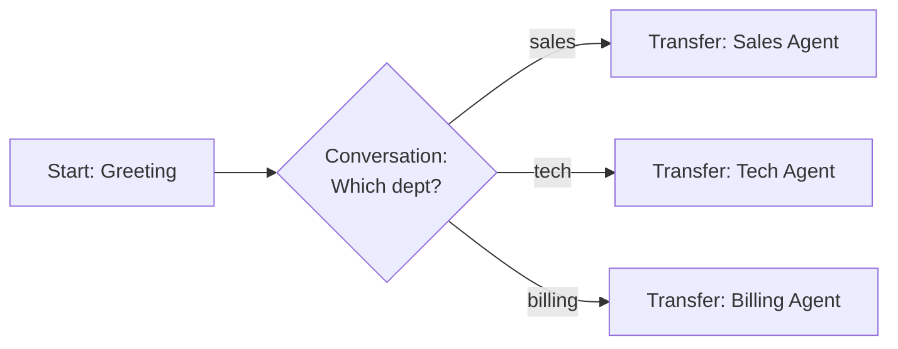
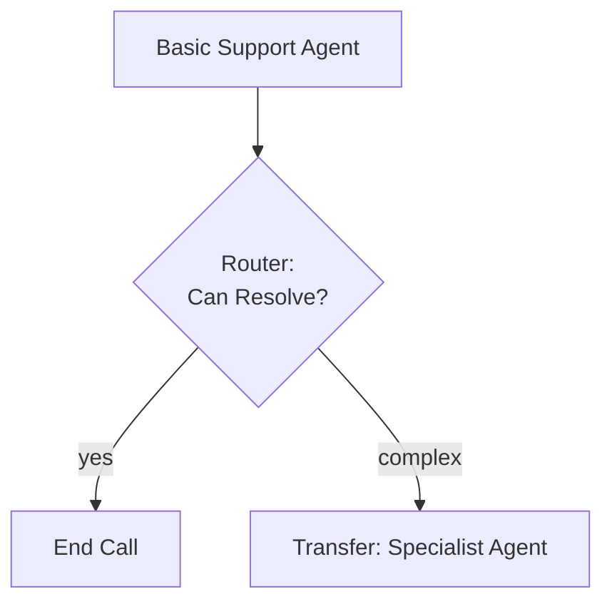
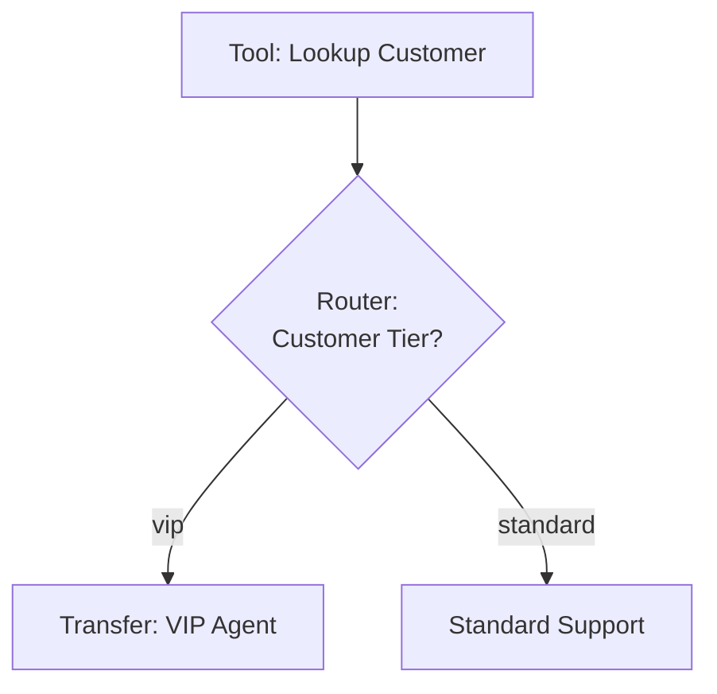

## Overview

Transfer agent nodes hand off the conversation to a different Hamsa AI agent within your workspace. Unlike transfer call nodes that connect to external phone numbers, transfer agent nodes keep the conversation within your AI ecosystem, providing faster transfers with full context preservation.

**Key characteristic:** Transfer agent nodes maintain the call connection while switching which AI agent is handling the conversation—no phone system transfer needed.

## When to Use

Use transfer agent nodes to:

- **Specialist routing** - Technical support, billing, sales specialists
- **Language switching** - English → Spanish → Mandarin agents
- **Skill-based routing** - Route to agents with specific capabilities
- **Complexity escalation** - Simple → advanced agent for complex issues
- **Department handoff** - Different agents for different departments
- **Workflow stages** - Lead qualification → sales closing agents
- **Regional expertise** - Route to agents familiar with specific regions
- **Product-specific agents** - Different agents for different product lines

**Use Transfer Agent Node when:**

- Destination is another Hamsa AI agent
- Want to preserve conversation history and context
- Need faster, more reliable transfers than phone transfers
- Staying within your AI agent ecosystem
- Want seamless transitions without hold music or ringing

**Use Transfer Call Node instead when:**

- Transferring to human agents at phone numbers
- Connecting to external phone systems
- Regulatory requirements for human interaction
- Need to connect to traditional phone lines

**[→ Compare: Transfer Call Node](./transfer-call-node)**

---

## Core Configuration

```typescript
{
  type: "transfer_agent",
  label?: string,
  description?: string,

  // Target agent (required)
  agentId: string,  // ID of the Hamsa agent to transfer to

  // Transfer message (optional)
  transferMessage?: string,
  transferMessageType: "static" | "prompt",  // Default: "static"

  // Timeout
  timeout: number,  // milliseconds, default: 30000

  // Global node settings
  isGlobal?: boolean,
  globalConditionType?: "prompt" | "dtmf",
  globalCondition?: string,
  globalDtmfKey?: string,

  // Transitions (usually none needed)
  transitions?: Transition[]
}
```

---

## Agent Selection

### Selecting the Target Agent

1. Click on the Transfer Agent Node
2. In configuration panel, click **Select Agent**
3. Choose from available agents in your workspace
4. Agent details auto-populate (name, ID)

**Available agents:**

- All Flow Agents in your workspace
- All Single Prompt Agents in your workspace
- Agents from same project

<Info>
You can only transfer to agents within your workspace. Agents in other workspaces are not accessible.
</Info>

### Agent ID

Each agent has a unique ID used for transfers.

```yaml
Transfer Agent Node: Transfer_To_Spanish
  agentId: "agent_abc123xyz"  # Spanish support agent
```

### Using Variables for Dynamic Routing

```yaml
# Extract or determine which agent to use
Router Node: Language_Router
  transitions:
    - Equation: {{preferred_language}} == "spanish"
      → Transfer_Spanish
    - Equation: {{preferred_language}} == "french"
      → Transfer_French

Transfer Agent Node: Transfer_Spanish
  agentId: "spanish_support_agent_id"

Transfer Agent Node: Transfer_French
  agentId: "french_support_agent_id"
```

---

## Transfer Message

### Static Message (Default)

Exact message spoken before transfer.

```yaml
Transfer Agent Node: Transfer_To_Tech_Support
  agentId: "tech_support_agent"

  Transfer Message:
    message: "I'm connecting you with our technical specialist who can better assist you."
    messageType: static
```

**Use static when:**

- Professional, consistent messaging
- Short, simple transfer announcement
- No personalization needed

### Prompt-Based Message

AI generates contextual transfer message.

```yaml
Transfer Agent Node: Transfer_To_Billing
  agentId: "billing_agent"

  Transfer Message:
    message: "Explain to the user that you're transferring them to a billing specialist who can help with their specific question about invoices."
    messageType: prompt
```

**AI might say:**

- "Let me connect you with our billing team who specializes in invoice questions."
- "I'm getting you to someone in billing who can review your invoices."

**Use prompt when:**

- Want natural, conversational transfer
- Personalization based on context
- Flexible, adaptive messaging

### Message with Variables

Reference conversation data in transfer message.

```yaml
Transfer Agent Node: Transfer_Premium_Support
  agentId: "premium_support_agent"

  Transfer Message:
    message: "Thank you {{customer_name}}. As a {{tier}} member, I'm connecting you with our premium support specialist."
    messageType: static
```

### Silent Transfer (No Message)

Omit transfer message for instant, seamless transition.

```yaml
Transfer Agent Node: Silent_Transfer
  agentId: "specialist_agent"
  # No transferMessage configured - instant transfer
```

---

## Timeout Configuration

Set maximum wait time for transfer to complete.

```yaml
Transfer Agent Node: Quick_Transfer
  agentId: "sales_agent"
  timeout: 15000  # 15 seconds
```

**Default:** 30000ms (30 seconds)
**Range:** 1000ms - 60000ms (1-60 seconds)

**Recommendations:**

- **Agent transfers:** 15-30 seconds (faster than phone transfers)
- **Critical transfers:** 10-15 seconds
- **Non-critical:** 30 seconds

<Info>
Agent transfers are typically much faster than phone transfers since there's no phone system involved. Most complete in under 1 second.
</Info>

---

## Context Preservation

One of the biggest advantages of transfer agent nodes is **full context preservation**.

### What Gets Transferred

**Conversation history:**

- All messages exchanged so far
- User inputs and agent responses
- Conversation flow path taken

**Variables:**

- All extracted variables
- System variables
- Custom variables

**Call metadata:**

- Call ID
- Caller ID
- Call duration
- Session information

**User context:**

- Customer information
- Previous interactions
- Current state

### What the New Agent Knows

The receiving agent has access to:

```yaml
# Full conversation context
{{conversation_history}}

# All previously extracted variables
{{customer_name}}
{{account_id}}
{{issue_type}}
{{budget_range}}

# System variables
{{call_id}}
{{caller_id}}
{{call_duration}}
```

### Benefits

**No repeated questions:**

```
❌ Bad (phone transfer):
  Agent 1: "What's your account number?"
  [Transfer]
  Agent 2: "What's your account number?" [User frustrated]

✅ Good (agent transfer):
  Agent 1: "What's your account number?"
  [Transfer with context]
  Agent 2: "I see your account {{account_id}} here..." [Seamless]
```

**Intelligent handoff:**
The new agent can immediately reference previous conversation, making the transition feel natural and efficient.

---

## Use Cases & Examples

### Example 1: Language Switching

**Scenario:** Transfer English speaker to Spanish-speaking agent.

```yaml
Conversation Node: Detect_Language
  message: "For English, press 1. Para español, oprima 2."
  transitions:
    - DTMF: key=1 → English_Flow
    - DTMF: key=2 → Transfer_Spanish

Transfer Agent Node: Transfer_Spanish
  agentId: "spanish_support_agent_id"

  Transfer Message:
    message: "Let me connect you with our Spanish-speaking representative."
    messageType: static

  timeout: 15000
```

### Example 2: Technical Support Escalation

**Scenario:** Basic support agent transfers complex technical issues.

```yaml
Conversation Node: Diagnose_Issue
  message: "Can you describe the technical problem you're experiencing?"

  Extract Variables:
    - issue_description: "Description of the issue"
    - issue_complexity: "Rate complexity: simple, moderate, complex"

  transitions:
    - Equation: {{issue_complexity}} == "complex" → Transfer_Tech_Specialist
    - Always → Attempt_Basic_Support

Transfer Agent Node: Transfer_Tech_Specialist
  agentId: "advanced_tech_support_agent"

  Transfer Message:
    message: "This sounds like a complex issue. Let me connect you with one of our senior technical specialists who can help."
    messageType: static
```

### Example 3: Department Routing

**Scenario:** Route to specialized department agents.

```yaml
Conversation Node: Identify_Department
  message: "Are you calling about sales, technical support, or billing?"

  transitions:
    - Natural Language: "sales" → Transfer_Sales
    - Natural Language: "technical" → Transfer_Tech
    - Natural Language: "billing" → Transfer_Billing

Transfer Agent Node: Transfer_Sales
  agentId: "sales_specialist_agent"
  transferMessage: "Connecting you with our sales team."

Transfer Agent Node: Transfer_Tech
  agentId: "tech_support_agent"
  transferMessage: "Connecting you with technical support."

Transfer Agent Node: Transfer_Billing
  agentId: "billing_specialist_agent"
  transferMessage: "Connecting you with our billing department."
```

### Example 4: VIP Customer Routing

**Scenario:** High-value customers get specialized agent.

```yaml
Tool Node: Lookup_Customer
  outputMapping:
    customer_tier: $.tier
    lifetime_value: $.ltv
  transitions:
    - Always → Tier_Router

Router Node: Tier_Router
  transitions:
    - Structured Equation (logic: all):
        - {{customer_tier}} == "vip"
        - {{lifetime_value}} >= 50000
      → Transfer_VIP_Concierge

    - Always → Standard_Support

Transfer Agent Node: Transfer_VIP_Concierge
  agentId: "vip_concierge_agent"

  Transfer Message:
    message: "As a VIP member, I'm connecting you with your dedicated concierge specialist."
    messageType: static
```

### Example 5: Product Specialist Routing

**Scenario:** Route to agents specialized in specific products.

```yaml
Conversation Node: Identify_Product
  message: "Which product do you need help with?"

  Extract Variables:
    - product_name: "Product name"

  transitions:
    - Always → Product_Router

Router Node: Product_Router
  transitions:
    - Equation: {{product_name}} contains "Enterprise"
      → Transfer_Enterprise_Specialist

    - Equation: {{product_name}} contains "API"
      → Transfer_API_Specialist

    - Always → Transfer_General_Product_Support

Transfer Agent Node: Transfer_Enterprise_Specialist
  agentId: "enterprise_product_agent"
  transferMessage: "Connecting you with our Enterprise product specialist."

Transfer Agent Node: Transfer_API_Specialist
  agentId: "api_specialist_agent"
  transferMessage: "Let me connect you with our API specialist."
```

### Example 6: Sales Pipeline Handoff

**Scenario:** Qualification agent hands off to closing agent.

```yaml
Conversation Node: Qualify_Lead
  message: "Let me understand your needs..."

  Extract Variables:
    - budget: "Budget amount"
    - timeline: "Purchase timeline"
    - decision_maker: "Are they the decision maker"

  transitions:
    - Always → Qualification_Router

Router Node: Qualification_Router
  transitions:
    - Structured Equation (logic: all):
        - {{budget}} >= 10000
        - {{timeline}} == "immediate"
        - {{decision_maker}} == true
      → Transfer_Closing_Agent

    - Always → Continue_Nurture

Transfer Agent Node: Transfer_Closing_Agent
  agentId: "sales_closing_specialist"

  Transfer Message:
    message: "Based on your needs, I'm connecting you with {{sales_rep_name}} who can finalize the details with you."
    messageType: static
```

### Example 7: After-Hours Language Support

**Scenario:** Route to 24/7 multilingual support after hours.

```yaml
Router Node: Hours_And_Language_Check
  transitions:
    - Structured Equation (logic: all):
        - {{current_hour}} < 9 OR {{current_hour}} >= 17
        - {{preferred_language}} != "english"
      → Transfer_24_7_Multilingual

    - Always → Standard_Support

Transfer Agent Node: Transfer_24_7_Multilingual
  agentId: "multilingual_24_7_agent"

  Transfer Message:
    message: "I'm connecting you with our 24/7 multilingual support team."
    messageType: static
```

### Example 8: Global Transfer (Anytime Access)

**Scenario:** Press 9 anytime to speak with a supervisor agent.

```yaml
Transfer Agent Node: Supervisor_Transfer
  # Global configuration
  isGlobal: true
  globalConditionType: dtmf
  globalDtmfKey: 9

  # Transfer configuration
  agentId: "supervisor_agent_id"

  Transfer Message:
    message: "I'm transferring you to a supervisor now."
    messageType: static
```

---

## Advantages Over Phone Transfers

| Feature                  | Transfer Agent Node    | Transfer Call Node       |
| ------------------------ | ---------------------- | ------------------------ |
| **Speed**                | \<1 second              | 5-15 seconds             |
| **Context**              | Full history preserved | Lost (new call)          |
| **Reliability**          | Very high              | Depends on phone network |
| **User Experience**      | Seamless               | Hold music, ringing      |
| **Costs**                | No additional cost     | Telephony transfer costs |
| **Latency**              | Minimal                | Noticeable               |
| **Variables**            | All available          | Not transferred          |
| **Conversation History** | Complete               | Starts fresh             |
| **Setup**                | Just agent ID          | Phone number needed      |

### Speed Comparison

**Transfer Agent Node:**

```
Agent 1: "Let me connect you with our specialist."
[<1 second]
Agent 2: "Hi, I understand you need help with {{issue}}."
```

**Transfer Call Node:**

```
Agent 1: "Let me transfer you."
[Ringing... 5-15 seconds]
[Hold music...]
Human: "Thanks for calling, how can I help?"
Caller: [Repeats entire story]
```

---

## Global Agent Transfers

Make transfer agent nodes accessible from anywhere in the flow.

### Global via DTMF

```yaml
Transfer Agent Node: Global_Supervisor
  isGlobal: true
  globalConditionType: dtmf
  globalDtmfKey: 9

  agentId: "supervisor_agent_id"
  transferMessage: "Connecting you with a supervisor."
```

Press 9 from any node to transfer to supervisor.

### Global via Natural Language

```yaml
Transfer Agent Node: Global_Specialist_Request
  isGlobal: true
  globalConditionType: prompt
  globalCondition: "User asks for a specialist or expert"

  agentId: "specialist_agent_id"
  transferMessage: "I'm connecting you with a specialist."
```

Say "I need a specialist" from any node to trigger transfer.

**[→ Learn More: Global Nodes](../global-nodes)**

---

## Best Practices

### ✅ Do's

**Preserve context with transfers**

```yaml
# Context automatically preserved
Transfer Agent Node:
  agentId: 'specialist'
  # New agent has access to all variables and history
```

**Use for specialized routing**

```yaml
# Different agents for different expertise
- Technical issues → Technical agent
- Billing questions → Billing agent
- Sales inquiries → Sales agent
```

**Provide clear transfer messages**

```yaml
transferMessage: "I'm connecting you with our {{department}} specialist who can better assist you."
```

**Route based on complexity**

```yaml
- Simple issues → Basic agent
- Complex issues → Advanced agent
- VIP customers → Premium agent
```

**Test agent availability**

- Ensure target agents are active
- Verify agents are in same workspace
- Test transfer flow end-to-end

**Use meaningful agent names**

```yaml
✅ agentId: 'spanish_support_specialist'
❌ agentId: 'agent_xyz_123'
```

### ❌ Don'ts

**Don't transfer without context**

```yaml
# ✅ Good: Transfer message explains why
transferMessage: "I'm connecting you with our billing specialist who can help with invoice questions."

# ❌ Bad: No explanation
transferMessage: "Transferring."
```

**Don't create circular transfers**

```yaml
# ❌ Bad: Agent A → Agent B → Agent A (infinite loop)
# ✅ Good: Clear, one-directional routing
```

**Don't transfer to inactive agents**

```yaml
# Always verify target agent is active and configured
```

**Don't lose important context**

```yaml
# ✅ Good: Extract variables before transfer
Extract {{customer_id}}, {{issue_type}}
→ Transfer to specialist
# ❌ Bad: Transfer without extracting context
```

**Don't over-transfer**

```yaml
# Only transfer when necessary
# Try to resolve with current agent first
```

---

## Troubleshooting

### Issue: Transfer fails

**Possible causes:**

- Target agent doesn't exist
- Target agent is inactive
- Invalid agent ID
- Agent in different workspace

**Solution:**

1. Verify agent exists and is active
2. Check agent ID is correct
3. Ensure agent is in same workspace
4. Test with different agent

### Issue: Context not available in new agent

**Possible causes:**

- Variables not extracted before transfer
- Variable scope issue
- Agent configuration error

**Solution:**

1. Verify variables are extracted before transfer
2. Check variable names are correct
3. Ensure variables are properly scoped
4. Test variable availability

### Issue: Transfer message not playing

**Possible causes:**

- Message field is empty
- Message type misconfigured
- Silent transfer configured

**Solution:**

1. Add transfer message content
2. Verify messageType setting
3. Check if silent transfer is intended

### Issue: Timeout occurring

**Possible causes:**

- Target agent has issues
- Network problems
- Timeout set too short

**Solution:**

1. Check target agent configuration
2. Increase timeout value
3. Test agent directly
4. Review agent logs

---

## Flow Examples

### Example Flow 1: Department Routing



### Example Flow 2: Complexity-Based Routing



### Example Flow 3: VIP Routing



---

## Schema Reference

```typescript
{
  type: "transfer_agent",
  label?: string,
  description?: string,

  // Target agent (required)
  agentId: string,  // UUID or ID of target Hamsa agent

  // Transfer message (optional)
  transferMessage?: string,
  transferMessageType: "static" | "prompt",  // Default: "static"

  // Timeout
  timeout: number,  // milliseconds, default: 30000

  // Global node settings
  isGlobal?: boolean,
  globalConditionType?: "prompt" | "dtmf",
  globalCondition?: string,  // For prompt-based global
  globalDtmfKey?: "0" | "1" | "2" | "3" | "4" | "5" | "6" | "7" | "8" | "9" | "*" | "#",

  // Transitions (optional, rarely needed)
  transitions?: Transition[],

  // Position
  position: { x: number, y: number }
}
```

---

## Next Steps

<CardGroup cols={2}>
  <Card title="Transfer Call Node" icon="phone-arrow-up-right" href="./transfer-call-node">
    Transfer to external phone numbers
  </Card>
  <Card title="Router Node" icon="route" href="./router-node">
    Route to appropriate agent
  </Card>
  <Card title="Global Nodes" icon="earth-americas" href="../global-nodes">
    Make transfers accessible anytime
  </Card>
  <Card title="Variables" icon="code" href="../variables">
    Pass context to new agent
  </Card>
  <Card title="Agent Management" icon="robot" href="/agents">
    Create and manage agents
  </Card>
  <Card title="Best Practices" icon="check" href="../best-practices">
    Build better flows
  </Card>
</CardGroup>
