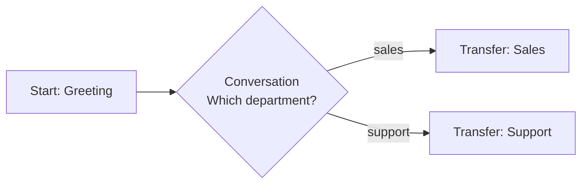
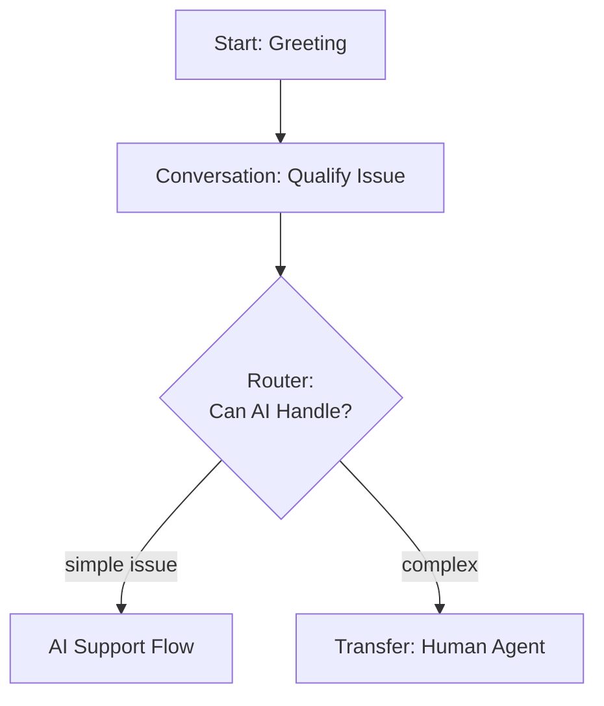
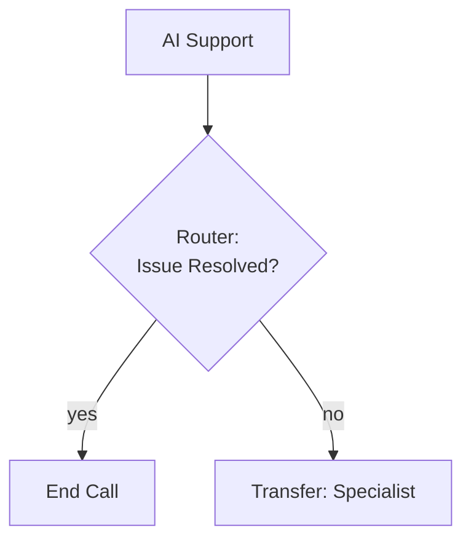

## Overview

Transfer call nodes transfer the active phone call to another phone number. This is useful for escalating to human agents, routing to specialized departments, or connecting callers to specific phone lines. Transfer call nodes support both warm transfers (with announcement) and cold transfers (immediate connection).

**Key characteristic:** Transfer call nodes connect the caller to a completely different phone number, ending the AI agent's involvement in the conversation.

## When to Use

Use transfer call nodes to:

- **Escalate to human agents** - Complex issues requiring human judgment
- **Department routing** - Transfer to sales, support, billing departments
- **Specialist connection** - Route to subject matter experts
- **After-hours routing** - Transfer to answering service outside business hours
- **Emergency scenarios** - Critical situations requiring immediate human attention
- **Geographic routing** - Connect to local office phone numbers
- **Compliance requirements** - Legal or regulatory requirements for human interaction

**Use Transfer Call Node when:**

- Caller needs to speak with a person at a phone number
- Issue is beyond AI agent's capabilities
- Regulatory or compliance requirements demand human interaction
- Specialized expertise is required

**Use Transfer Agent Node instead when:**

- Transferring to another Hamsa AI agent
- Want to maintain conversation context and history
- Need faster, more reliable handoff
- Staying within your AI agent ecosystem

**[→ Compare: Transfer Agent Node](./transfer-agent-node)**

---

## Core Configuration

```typescript
{
  type: "transfer_call",
  label?: string,
  description?: string,

  // Phone number (required)
  phoneNumber: string,  // E.164 format: +1234567890

  // Transfer type
  transferType: "warm" | "cold",  // Default: "cold"

  // Transfer message (optional)
  transferMessage?: string,
  transferMessageType: "static" | "prompt",  // Default: "prompt"

  // Timeout
  timeout: number,  // milliseconds, default: 30000

  // Global node settings
  isGlobal?: boolean,
  globalConditionType?: "prompt" | "dtmf",
  globalCondition?: string,
  globalDtmfKey?: string,

  // Transitions (optional - usually none needed)
  transitions?: Transition[]
}
```

---

## Phone Number Format

Phone numbers must be in **E.164 international format**.

### E.164 Format

```
+[country code][area code][local number]
```

**Valid examples:**

```
+14155551234   (USA)
+442071234567  (UK)
+61212345678   (Australia)
+33123456789   (France)
```

**Invalid examples:**

```
❌ (415) 555-1234      (Not E.164)
❌ 415-555-1234        (Missing country code)
❌ 14155551234         (Missing + prefix)
❌ +1-415-555-1234     (Contains dashes)
```

### Country Codes

Common country codes:

- **USA/Canada:** +1
- **UK:** +44
- **Australia:** +61
- **Germany:** +49
- **France:** +33

### Using Variables

```yaml
Transfer Call Node: Dynamic_Transfer
  phoneNumber: {{support_phone_number}}
  # Variable must contain E.164 formatted number
```

<Warning>
Invalid phone number format will cause transfer to fail. Always validate E.164 format.
</Warning>

---

## Transfer Types

### Cold Transfer (Default)

Immediately transfer the call without announcement. The caller is connected directly to the destination number.

```yaml
Transfer Call Node: Operator_Transfer
  phoneNumber: +18005551234
  transferType: cold
  # No transfer message - immediate connection
```

**User experience:**

1. Agent: "Let me transfer you now."
2. _Call immediately transfers_
3. Caller hears ringing or destination's greeting
4. AI agent disconnects

**Use cold transfer when:**

- Speed is important
- No context needs to be provided
- Destination will identify itself (IVR, receptionist)
- Simple, straightforward routing

### Warm Transfer

Announce the transfer before connecting. The agent speaks a transfer message, then connects the call.

```yaml
Transfer Call Node: Sales_Transfer
  phoneNumber: +18005551234
  transferType: warm

  Transfer Message:
    message: "I'm transferring you to our sales team who can better assist you with pricing and packages."
    messageType: static
```

**User experience:**

1. Agent: "I'm transferring you to our sales team..."
2. _Agent speaks full message_
3. _Call transfers after message completes_
4. Caller hears ringing or destination's greeting

**Use warm transfer when:**

- Caller should know why they're being transferred
- Setting expectations about who they'll reach
- Professional, courteous experience
- Context or explanation needed

---

## Transfer Message Configuration

### Static Message

Exact, predetermined message spoken every time.

```yaml
Transfer Message:
  message: 'Let me connect you with a specialist who can help. Please hold.'
  messageType: static
```

**Use static when:**

- Message should be identical every time
- Legal or compliance requirements
- Scripted professional transfer
- No personalization needed

### Prompt-Based Message

AI generates contextual transfer message based on conversation.

```yaml
Transfer Message:
  message: "Explain to the user that you're transferring them to a billing specialist who can help with their account balance question."
  messageType: prompt
```

**AI might say:**

- "I'm connecting you with our billing team who specializes in account balances."
- "Let me get you to someone in billing who can review your account."

**Use prompt when:**

- Want natural, conversational transfer
- Personalization based on conversation context
- Flexible, adaptive messaging
- Reference extracted variables

### Message with Variables

Use extracted variables in transfer messages.

```yaml
Transfer Message:
  message: "Thank you {{customer_name}}. I'm transferring you to {{department_name}} now."
  messageType: static
```

---

## Timeout Configuration

Set maximum wait time for transfer connection.

```yaml
Transfer Call Node: Support_Transfer
  phoneNumber: +18005551234
  timeout: 45000  # 45 seconds
```

**Default:** 30000ms (30 seconds)
**Range:** 1000ms - 60000ms (1-60 seconds)

**What happens on timeout:**

- Transfer attempt is cancelled
- Call returns to flow (if transitions configured)
- Otherwise, call typically ends

**Recommendations:**

- **Standard transfers:** 30 seconds
- **Busy departments:** 45-60 seconds
- **Quick routing:** 15-20 seconds

<Info>
If the destination doesn't answer within the timeout, the transfer fails. Plan for timeout scenarios with fallback transitions.
</Info>

---

## Use Cases & Examples

### Example 1: Simple Operator Transfer

**Scenario:** Transfer to operator with no announcement.

```yaml
Transfer Call Node: Operator
  phoneNumber: +18005550100
  transferType: cold
```

### Example 2: Department Routing with Message

**Scenario:** Route to sales with warm transfer.

```yaml
Conversation Node: Qualify_Need
  message: "Are you calling about sales, support, or billing?"
  transitions:
    - Natural Language: "sales" → Transfer_Sales
    - Natural Language: "support" → Transfer_Support
    - Natural Language: "billing" → Transfer_Billing

Transfer Call Node: Transfer_Sales
  phoneNumber: +18005551001
  transferType: warm

  Transfer Message:
    message: "I'm connecting you with our sales team who can discuss pricing and packages."
    messageType: static

  timeout: 30000
```

### Example 3: Emergency Transfer (Global)

**Scenario:** Global node for urgent issues, accessible anytime via DTMF 0.

```yaml
Transfer Call Node: Emergency_Transfer
  # Global configuration
  isGlobal: true
  globalConditionType: dtmf
  globalDtmfKey: 0

  # Transfer configuration
  phoneNumber: +18005550911
  transferType: cold

  Transfer Message:
    message: "Transferring you to emergency support now."
    messageType: static
```

### Example 4: After-Hours Routing

**Scenario:** Transfer to answering service outside business hours.

```yaml
Router Node: Business_Hours_Check
  transitions:
    - Structured Equation (logic: all):
        - {{current_hour}} >= 9
        - {{current_hour}} < 17
        - {{current_day_of_week}} != "Saturday"
        - {{current_day_of_week}} != "Sunday"
      → Business_Hours_Flow

    - Always → After_Hours_Transfer

Transfer Call Node: After_Hours_Transfer
  phoneNumber: +18005559999
  transferType: warm

  Transfer Message:
    message: "Our offices are currently closed. I'm transferring you to our after-hours answering service who can take a message or help with urgent matters."
    messageType: static

  timeout: 45000
```

### Example 5: Escalation with Context

**Scenario:** Transfer with personalized context about the caller.

```yaml
Tool Node: Lookup_Customer
  outputMapping:
    customer_name: $.name
    account_id: $.id
    issue_type: $.current_issue
  transitions:
    - Always → Escalate_Transfer

Transfer Call Node: Escalate_Transfer
  phoneNumber: +18005552222
  transferType: warm

  Transfer Message:
    message: "Thank you for your patience, {{customer_name}}. I'm transferring you to a specialist who can help with your {{issue_type}} issue. Your account number is {{account_id}}."
    messageType: static
```

### Example 6: VIP Customer Routing

**Scenario:** High-value customers get direct line to VIP team.

```yaml
Router Node: Customer_Tier_Check
  transitions:
    - Equation: {{customer_tier}} == "vip"
      → VIP_Transfer
    - Always → Standard_Support

Transfer Call Node: VIP_Transfer
  phoneNumber: +18005550VIP
  transferType: warm

  Transfer Message:
    message: "As a VIP member, I'm connecting you directly with our premium support team."
    messageType: static

  timeout: 20000  # VIP gets faster answer
```

### Example 7: Geographic Routing

**Scenario:** Transfer to regional office based on location.

```yaml
Router Node: Region_Router
  transitions:
    - Equation: {{caller_state}} == "CA"
      → West_Coast_Office
    - Equation: {{caller_state}} == "NY"
      → East_Coast_Office
    - Always → National_Line

Transfer Call Node: West_Coast_Office
  phoneNumber: +14155551234
  transferType: warm
  transferMessage: "Connecting you to our San Francisco office."

Transfer Call Node: East_Coast_Office
  phoneNumber: +12125551234
  transferType: warm
  transferMessage: "Connecting you to our New York office."
```

### Example 8: Timeout Fallback

**Scenario:** Handle transfer timeout with fallback to voicemail.

```yaml
Transfer Call Node: Attempt_Transfer
  phoneNumber: +18005551234
  timeout: 30000
  transferType: warm
  transferMessage: "Let me connect you with our team."

  # Transitions handle timeout
  transitions:
    - Natural Language: "transfer failed or timeout" → Leave_Voicemail

Conversation Node: Leave_Voicemail
  message: "Our team is currently unavailable. Would you like to leave a message or try again later?"
```

---

## Global Transfer Nodes

Make transfer nodes accessible from anywhere in the flow.

### Global via DTMF

Press a key anytime to transfer (common: 0 for operator).

```yaml
Transfer Call Node: Global_Operator
  isGlobal: true
  globalConditionType: dtmf
  globalDtmfKey: 0

  phoneNumber: +18005550100
  transferType: cold
```

**User can press 0 at any point to immediately transfer.**

### Global via Natural Language

Speak trigger phrase anytime to transfer.

```yaml
Transfer Call Node: Global_Human_Agent
  isGlobal: true
  globalConditionType: prompt
  globalCondition: "User wants to speak to a human agent or operator"

  phoneNumber: +18005550100
  transferType: warm
  transferMessage: "I'm connecting you with a live agent now."
```

**User can say "I want to speak to a person" at any point.**

### Common Global Transfer Patterns

```yaml
# Operator (DTMF 0)
Transfer Call Node:
  isGlobal: true
  globalConditionType: dtmf
  globalDtmfKey: 0
  phoneNumber: +18005550100

# Emergency (DTMF *)
Transfer Call Node:
  isGlobal: true
  globalConditionType: dtmf
  globalDtmfKey: *
  phoneNumber: +18005550911

# Speak to human (Natural language)
Transfer Call Node:
  isGlobal: true
  globalConditionType: prompt
  globalCondition: "User requests human agent, operator, or live person"
  phoneNumber: +18005550100
```

**[→ Learn More: Global Nodes](../global-nodes)**

---

## Transitions

Most transfer call nodes don't need transitions—they terminate the AI agent's involvement.

### When to Use Transitions

**Timeout handling:**

```yaml
Transfer Call Node: Busy_Support
  phoneNumber: +18005551234
  timeout: 30000

  transitions:
    - Always → Leave_Voicemail_Option
```

**Conditional flow continuation:**

```yaml
# Rare use case: Continue flow after failed transfer
Transfer Call Node: Optional_Transfer
  transitions:
    - Natural Language: "transfer failed" → Continue_AI_Support
    - Always → End_Call
```

**In practice:** Most transfer call nodes have no transitions and simply end the call after transfer.

---

## Best Practices

### ✅ Do's

**Use E.164 format for all phone numbers**

```yaml
✅ phoneNumber: +14155551234
❌ phoneNumber: (415) 555-1234
```

**Provide context in warm transfers**

```yaml
transferMessage: "I'm connecting you to our billing team who can help with your invoice question."
```

**Set realistic timeouts**

```yaml
timeout: 45000 # 45 seconds for busy departments
```

**Use global nodes for common transfers**

```yaml
# Operator accessible anytime via 0
isGlobal: true
globalDtmfKey: 0
```

**Store phone numbers as variables**

```yaml
# In agent configuration
support_phone: +18005551234

# In node
phoneNumber: { { support_phone } }
```

**Test transfers thoroughly**

- Call the destination number manually
- Verify it's reachable
- Test timeout behavior
- Confirm transfer completes

### ❌ Don'ts

**Don't use invalid phone formats**

```yaml
❌ phoneNumber: 555-1234
❌ phoneNumber: (800) CALL-NOW
❌ phoneNumber: 1-800-555-1234
```

**Don't transfer without context (when using warm)**

```yaml
❌ transferMessage: 'Transferring now.'
✅ transferMessage: "I'm transferring you to our billing team who can help with your invoice."
```

**Don't set timeouts too short**

```yaml
❌ timeout: 5000 # Too short, will likely timeout
✅ timeout: 30000 # Reasonable wait time
```

**Don't forget to test**

- Don't deploy without testing actual transfers
- Don't assume phone number is correct
- Don't skip timeout testing

**Don't use transfer call for agent-to-agent**

```yaml
# ❌ Don't do this for AI-to-AI transfer
Transfer Call Node to another AI agent phone number

# ✅ Do this instead
Transfer Agent Node: agent_id
```

---

## Troubleshooting

### Issue: Transfer fails immediately

**Possible causes:**

- Invalid phone number format
- Phone number doesn't exist
- Network connectivity issues
- Invalid country code

**Solution:**

1. Verify E.164 format: `+[country][area][number]`
2. Test phone number manually
3. Check country code is correct
4. Remove any spaces, dashes, or parentheses

### Issue: Transfer times out

**Possible causes:**

- Destination number not answering
- Timeout set too short
- Destination line is busy
- After-hours (no one available)

**Solution:**

1. Increase timeout value
2. Verify destination is staffed
3. Test during business hours
4. Add fallback transition for timeout

### Issue: Transfer message not playing

**Possible causes:**

- Using cold transfer (no message in cold transfer)
- Message is empty
- Message type misconfigured

**Solution:**

1. Use `transferType: warm` for messages
2. Verify message field has content
3. Check messageType is set correctly

### Issue: User disconnects during transfer

**Possible causes:**

- Long wait time (timeout)
- No context provided (user confused)
- Unexpected transfer (user didn't request it)

**Solution:**

1. Use warm transfer with explanation
2. Set appropriate expectations
3. Reduce wait time
4. Only transfer when appropriate

### Issue: Variables not interpolating in message

**Possible causes:**

- Variable doesn't exist
- Variable name misspelled
- Variable not extracted yet

**Solution:**

1. Verify variable exists (extracted earlier)
2. Check spelling: `{{exact_variable_name}}`
3. Ensure extraction happens before transfer
4. Test with static message first

---

## Flow Examples

### Example Flow 1: Simple Department Routing



### Example Flow 2: Smart Routing with Qualification



### Example Flow 3: Escalation Path



---

## Comparison: Transfer Call vs Transfer Agent

| Feature             | Transfer Call Node       | Transfer Agent Node            |
| ------------------- | ------------------------ | ------------------------------ |
| **Destination**     | Phone number             | Hamsa AI agent                 |
| **Speed**           | Slower (phone system)    | Faster (no phone transfer)     |
| **Reliability**     | Depends on phone network | More reliable                  |
| **Context**         | Lost (new call)          | Preserved (full history)       |
| **User Experience** | Hold music, ringing      | Seamless transition            |
| **Use Case**        | Human agents, external   | Other AI agents                |
| **Latency**         | 5-15 seconds             | \<1 second                      |
| **Costs**           | Telephony transfer costs | No transfer costs              |
| **Best For**        | Escalation to humans     | Routing between AI specialists |

**[→ Learn More: Transfer Agent Node](./transfer-agent-node)**

---

## Schema Reference

```typescript
{
  type: "transfer_call",
  label?: string,
  description?: string,

  // Phone number (required)
  phoneNumber: string,  // E.164 format: +1234567890

  // Transfer type
  transferType: "warm" | "cold",  // Default: "cold"

  // Transfer message (for warm transfers)
  transferMessage?: string,
  transferMessageType: "static" | "prompt",  // Default: "prompt"

  // Timeout
  timeout: number,  // milliseconds, default: 30000 (30 seconds)

  // Global node settings
  isGlobal?: boolean,
  globalConditionType?: "prompt" | "dtmf",
  globalCondition?: string,  // For prompt-based global
  globalDtmfKey?: "0" | "1" | "2" | "3" | "4" | "5" | "6" | "7" | "8" | "9" | "*" | "#",

  // Transitions (optional)
  transitions?: Transition[],

  // Position
  position: { x: number, y: number }
}
```

---

## Next Steps

<CardGroup cols={2}>
  <Card title="Transfer Agent Node" icon="user-group" href="./transfer-agent-node">
    Transfer to another Hamsa AI agent
  </Card>
  <Card title="Global Nodes" icon="earth-americas" href="../global-nodes">
    Make transfers accessible anytime
  </Card>
  <Card title="Router Node" icon="route" href="./router-node">
    Route before transferring
  </Card>
  <Card title="End Call Node" icon="phone-slash" href="./end-call-node">
    End calls gracefully
  </Card>
  <Card title="DTMF Features" icon="grid-2" href="../dtmf">
    Use keypad for transfer triggers
  </Card>
  <Card title="Best Practices" icon="check" href="../best-practices">
    Build better flows
  </Card>
</CardGroup>
