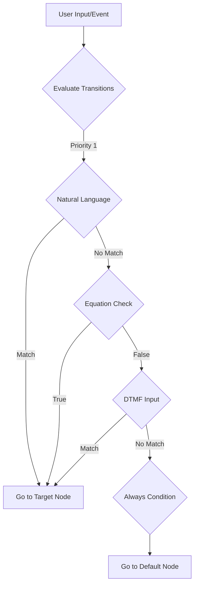

# Transitions

Transitions are the logic that determines how your conversation flows from one node to another. They enable branching, conditional routing, and dynamic behavior based on user input, variables, or other criteria.

## Overview

Hamsa provides **four types of transitions** to handle different routing scenarios:

| Type                    | Evaluation Method | Use Case                              | Example                          |
| ----------------------- | ----------------- | ------------------------------------- | -------------------------------- |
| **Natural Language**    | LLM-based         | Intent detection, sentiment analysis  | "User wants to speak to a human" |
| **Structured Equation** | Rule-based        | Variable comparisons, data validation | `account_balance > 1000`         |
| **DTMF**                | Keypad input      | IVR menus, simple selection           | Press 1 for Sales                |
| **Always**              | No condition      | Fallback, default path                | Catch-all else condition         |

---

## Transition Basics

### How Transitions Work



### Evaluation Order

Transitions are evaluated by **priority score** (highest first):

```yaml
Transition Evaluation: 1. Check all transitions sorted by priority (high to low)
  2. Evaluate each transition's condition
  3. Take FIRST transition that matches
  4. If no transitions match, conversation stalls (validation error)
```

<Warning>
**Always include a fallback transition** (Always type) to prevent conversation dead-ends.
</Warning>

### Priority System

```typescript
priority: number; // 0 to infinity (higher = evaluated first)
```

**Default Priorities**:

- Natural Language: 100
- Structured Equation: 200
- DTMF: 300
- Always: 0

You can manually adjust priorities for fine control:

```yaml
Transitions on "Welcome" Node:
  - DTMF "Press 1" → Sales (priority: 1000) # Evaluated first
  - Natural "urgent" → Priority_Support (priority: 500)
  - Equation "account_type == premium" → VIP_Path (priority: 200)
  - Always → Standard_Path (priority: 0) # Fallback
```

---

## Natural Language Transitions

Natural language transitions use the LLM to evaluate user intent, sentiment, or meaning.

### Configuration Schema

```typescript
{
  type: 'natural_language',
  prompt: string,          // Condition description (required, min 1 char)
  description?: string     // Optional human-readable label
}
```

### How It Works

1. User provides input (speech or text)
2. LLM receives:
   - User input
   - Conversation history
   - Available variables
   - Transition prompt
3. LLM determines if condition is met (true/false)
4. If true, transition fires

### Examples

**Intent Detection**:

```yaml
Transition:
  Type: Natural Language
  Prompt: 'The user wants to speak with a human agent'
  Target: Transfer_to_Agent
```

**Sentiment Analysis**:

```yaml
Transition:
  Type: Natural Language
  Prompt: 'The user is frustrated or angry'
  Target: Escalation_Path
```

**Topic Detection**:

```yaml
Transition:
  Type: Natural Language
  Prompt: 'The user is asking about billing or payment issues'
  Target: Billing_Department
```

**Affirmative Response**:

```yaml
Transition:
  Type: Natural Language
  Prompt: 'The user agrees or says yes'
  Target: Proceed_with_Action
```

**Negative Response**:

```yaml
Transition:
  Type: Natural Language
  Prompt: 'The user declines or says no'
  Target: Alternative_Path
```

### Advanced Patterns

**Multi-Criteria Detection**:

```yaml
Prompt: 'The user is a new customer AND is interested in premium services'
```

**Contextual Understanding**:

```yaml
Prompt: "Based on the conversation so far, the user's main concern is technical support rather than billing"
```

**Implicit Intent**:

```yaml
Prompt: "The user is implicitly asking for help even though they haven't directly said so"
```

### Best Practices

<Tip>
**Be specific and unambiguous**: Instead of "user wants help", use "user is asking for technical support with their account".
</Tip>

**DO:**

- Use clear, specific language
- Focus on one intent per transition
- Test with various phrasings
- Include edge case handling

**DON'T:**

- Make prompts too broad ("user needs something")
- Combine multiple unrelated intents
- Assume LLM knows implicit context
- Use overly complex logic (use equations instead)

### Testing Natural Language Transitions

Test coverage should include:

```yaml
Test Cases for "User wants refund" transition: ✓ "I want a refund"
  ✓ "Can I get my money back?"
  ✓ "This doesn't work, I need a refund"
  ✓ "How do I return this?"
  ✗ "What's your refund policy?" (information, not request)
  ✗ "My friend got a refund" (not requesting)
```

### Performance Considerations

**Latency**: Natural language transitions add 200-800ms per evaluation

- Use **priority** to evaluate faster transitions first
- Consider equation-based alternatives for simple conditions
- Limit natural language transitions per node (3-5 max)

**Cost**: Each evaluation consumes LLM tokens (~100-500 tokens)

- Cache common patterns where possible
- Use DTMF or equations for simple yes/no
- Monitor usage in analytics

---

## Structured Equation Transitions

Equation transitions evaluate variable conditions using rule-based logic - fast, deterministic, and cost-free.

### Configuration Schema

```typescript
{
  type: 'structured_equation',
  logic: 'all' | 'any',    // AND or OR logic
  conditions: Array<{
    variable: string,       // Variable name (snake_case)
    operator: Operator,
    value: string | number | boolean,
    description?: string
  }>,
  description?: string
}
```

### Operators

```typescript
type Operator =
  | 'equals' // Exact match
  | 'not_equals' // Not equal
  | 'greater_than' // Numeric comparison
  | 'less_than' // Numeric comparison
  | 'greater_than_or_equal' // Numeric comparison
  | 'less_than_or_equal' // Numeric comparison
  | 'contains' // String contains substring
  | 'not_contains' // String doesn't contain
  | 'exists' // Variable has any value
  | 'not_exists'; // Variable is null/undefined
```

### Simple Conditions

**Equality Check**:

```yaml
Condition:
  Variable: account_status
  Operator: equals
  Value: 'active'
```

**Numeric Comparison**:

```yaml
Condition:
  Variable: order_total
  Operator: greater_than
  Value: 100
```

**String Contains**:

```yaml
Condition:
  Variable: user_input
  Operator: contains
  Value: 'urgent'
```

**Existence Check**:

```yaml
Condition:
  Variable: customer_id
  Operator: exists
```

### Complex Conditions (AND/OR Logic)

**AND Logic** (All conditions must be true):

```yaml
Transition:
  Type: Structured Equation
  Logic: all
  Conditions:
    - Variable: account_balance
      Operator: greater_than
      Value: 1000
    - Variable: account_type
      Operator: equals
      Value: 'premium'
    - Variable: payment_current
      Operator: equals
      Value: true
  Target: VIP_Service_Path
```

**OR Logic** (Any condition can be true):

```yaml
Transition:
  Type: Structured Equation
  Logic: any
  Conditions:
    - Variable: support_tier
      Operator: equals
      Value: 'platinum'
    - Variable: lifetime_value
      Operator: greater_than
      Value: 10000
    - Variable: is_enterprise
      Operator: equals
      Value: true
  Target: Priority_Support
```

### Variable References in Values

You can compare variables to other variables using template syntax:

```yaml
Condition:
  Variable: current_balance
  Operator: greater_than
  Value: '{{minimum_balance}}'
```

This compares `current_balance` to the value stored in `minimum_balance`.

### Type Coercion

Hamsa automatically handles type conversion:

```yaml
# String to Number
Variable: age (value: "25")
Operator: greater_than
Value: 21
Result: true (string "25" converted to number 25)

# Number to String
Variable: zip_code (value: 12345)
Operator: contains
Value: "234"
Result: true (number 12345 converted to "12345")

# Boolean Comparison
Variable: is_verified (value: "true")
Operator: equals
Value: true
Result: true (string "true" converted to boolean)
```

### Common Patterns

**Range Check**:

```yaml
# Check if value is between 18 and 65
Transition 1:
  Logic: all
  Conditions:
    - Variable: age
      Operator: greater_than_or_equal
      Value: 18
    - Variable: age
      Operator: less_than_or_equal
      Value: 65
```

**Multi-Value Match**:

```yaml
# Check if status is one of several values
# (Use multiple transitions with OR, or single natural language)
Transition 1:
  Logic: any
  Conditions:
    - Variable: status
      Operator: equals
      Value: 'active'
    - Variable: status
      Operator: equals
      Value: 'pending'
    - Variable: status
      Operator: equals
      Value: 'trial'
```

**Null Handling**:

```yaml
# Proceed only if variable exists and meets criteria
Transition:
  Logic: all
  Conditions:
    - Variable: customer_phone
      Operator: exists
    - Variable: customer_phone
      Operator: not_equals
      Value: ''
```

**Exclusion Logic**:

```yaml
# Route if NOT in a specific category
Transition:
  Logic: all
  Conditions:
    - Variable: account_type
      Operator: not_equals
      Value: 'demo'
    - Variable: account_type
      Operator: not_equals
      Value: 'test'
```

### Best Practices

**Performance**:

- Equations evaluate in < 10ms (vs. 200-800ms for natural language)
- No LLM costs
- Deterministic and reliable

**When to Use Equations**:

- ✅ Variable comparisons
- ✅ Data validation
- ✅ Threshold checks
- ✅ Status verification
- ✅ Numeric calculations

**When to Use Natural Language Instead**:

- ❌ Intent detection
- ❌ Sentiment analysis
- ❌ Fuzzy matching
- ❌ Understanding context

<Tip>
**Optimize costs**: Use equations for simple yes/no conditions instead of natural language like "user said yes".
</Tip>

---

## DTMF Transitions

DTMF (Dual-Tone Multi-Frequency) transitions respond to keypad button presses.

<Info>
See the **[DTMF Features](./dtmf)** guide for complete documentation on all DTMF capabilities.
</Info>

### Quick Overview

DTMF transitions are the simplest transition type - they fire when the user presses a specific key.

### Configuration

```typescript
{
  type: 'dtmf',
  key: '0' | '1' | '2' | '3' | '4' | '5' | '6' | '7' | '8' | '9' | '*' | '#',
  description?: string  // Auto-generated as "Press {key}"
}
```

### Examples

**IVR Menu**:

```yaml
Conversation Node: "Main Menu"
  Message: "Press 1 for Sales, 2 for Support, 3 for Billing"
  Transitions:
    - DTMF: key=1 → Sales_Department
    - DTMF: key=2 → Support_Department
    - DTMF: key=3 → Billing_Department
    - Always → Repeat_Menu
```

**Simple Confirmation**:

```yaml
Conversation Node: "Confirm Appointment"
  Message: "Press 1 to confirm, 2 to reschedule, or 3 to cancel"
  Transitions:
    - DTMF: key=1 → Appointment_Confirmed
    - DTMF: key=2 → Reschedule_Flow
    - DTMF: key=3 → Cancellation_Flow
```

**Quick Exit**:

```yaml
Any Conversation Node:
  Transitions:
    - DTMF: key=0 → Transfer_to_Operator (priority: 1000)
    - Natural Language: ... (priority: 100)
    - Always → ... (priority: 0)
```

### DTMF vs. Natural Language

For simple menu selection, DTMF is preferred:

**❌ Inefficient - Natural Language**:

```yaml
Message: "Say 'sales' for sales department"
Transition:
  Type: Natural Language
  Prompt: 'User wants to talk to sales'
```

**✅ Efficient - DTMF**:

```yaml
Message: 'Press 1 for sales department'
Transition:
  Type: DTMF
  Key: 1
```

**Advantages of DTMF**:

- Instant response (no LLM processing)
- Zero cost per use
- Works in noisy environments
- Accessible for hearing-impaired users
- Deterministic behavior

### Best Practices

**Clear Instructions**:

```yaml
# Good
"Press 1 for Sales, 2 for Support"

# Bad
"Choose an option"  # User doesn't know which keys to press
```

**Logical Key Mapping**:

```yaml
# Good - Sequential
1 = Sales
2 = Support
3 = Billing

# Bad - Random
2 = Sales
7 = Support
4 = Billing
```

**Reserve Key 0**:

```yaml
# Convention: 0 = Operator/Human Agent
0 → Transfer_to_Agent (Global)
```

**Limit Options**:

```yaml
# Good - 3-5 options
1-4 = Departments
0 = Operator

# Bad - Too many options
1-9 = Different departments  # Users can't remember
```

---

## Always Transitions

Always transitions are fallback paths that match when no other transition fires.

### Configuration Schema

```typescript
{
  type: 'always',
  description: string  // Default: "Default path"
}
```

### Purpose

Always transitions serve as:

- **Fallback routes** when no conditions match
- **Default behavior** for unexpected input
- **Else clauses** in branching logic
- **Safety nets** to prevent conversation stalls

### Examples

**Router Else Logic**:

```yaml
Router Node: "Account Type Router"
  Transitions:
    - Equation: account_type == "premium" → Premium_Flow
    - Equation: account_type == "standard" → Standard_Flow
    - Always → Basic_Flow  # Fallback for any other type
```

**Menu Fallback**:

```yaml
Conversation Node: "Main Menu"
  Message: "Press 1 for Sales, 2 for Support"
  Transitions:
    - DTMF: key=1 → Sales
    - DTMF: key=2 → Support
    - Always → Repeat_Menu  # User didn't press valid key
```

**Catch-All After Multiple Conditions**:

```yaml
Conversation Node: "Triage"
  Transitions:
    - Natural Language: "urgent issue" → Priority_Support (priority: 300)
    - Natural Language: "billing question" → Billing (priority: 200)
    - Natural Language: "technical problem" → Tech_Support (priority: 200)
    - Always → General_Inquiry (priority: 0)  # None of the above
```

### Best Practices

<Warning>
**Every node must have a clear path forward**. Include an Always transition if no other transition is guaranteed to match.
</Warning>

**When Always is Required**:

```yaml
# Required - Open-ended response
Conversation: "What can I help you with?"
Transitions:
  - Natural: "billing" → Billing
  - Natural: "support" → Support
  - Always → General_Help  # REQUIRED (NL might not match)
```

**When Always is Optional**:

```yaml
# Optional - Guaranteed match
Router:
Transitions:
  - Equation: account_type == "A" → Path_A
  - Equation: account_type == "B" → Path_B
  - Equation: account_type == "C" → Path_C
  # No Always needed if account_type MUST be A, B, or C
```

**Naming Always Transitions**:

```yaml
# Good - Descriptive
description: "No match - repeat menu"
description: "Default to general inquiry"
description: "Fallback to standard process"

# Bad - Generic
description: "Default path"
description: "Else"
```

### Priority Considerations

Always transitions should **always** have the lowest priority:

```yaml
# Correct
- Natural Language (priority: 200)
- Equation (priority: 100)
- Always (priority: 0) # Evaluated last

# Incorrect
- Always (priority: 100) # Will always match first!
- Natural Language (priority: 50) # Never evaluated
```

---

## Advanced Transition Patterns

### Combining Transition Types

Use multiple transition types strategically:

```yaml
Conversation Node: "Support Menu"
  Message: "Describe your issue, or press 1 for urgent support, 0 for an agent"
  Transitions:
    # DTMF for quick access (highest priority)
    - DTMF: key=1 → Urgent_Support (priority: 1000)
    - DTMF: key=0 → Transfer_Agent (priority: 1000)

    # Natural language for intent detection
    - Natural: "billing issue" → Billing (priority: 200)
    - Natural: "technical problem" → Tech_Support (priority: 200)

    # Always as fallback
    - Always → General_Inquiry (priority: 0)
```

### Priority-Based Routing

Fine-tune evaluation order with custom priorities:

```yaml
Conversation Node: "Customer Classification"
  Transitions:
    # VIP customers get priority routing
    - Equation: lifetime_value > 50000 → VIP_Path (priority: 500)

    # Urgent issues get priority
    - Natural: "urgent" → Priority_Support (priority: 400)

    # Standard routing
    - Natural: "billing" → Billing (priority: 100)
    - Natural: "technical" → Tech_Support (priority: 100)

    # Fallback
    - Always → General_Path (priority: 0)
```

### Context-Aware Transitions

Use variables to create smart routing:

```yaml
Router Node: "Time-Based Router"
  Transitions:
    # Business hours
    - Logic: all
      Conditions:
        - current_hour >= 9
        - current_hour < 17
      Target: Business_Hours_Flow (priority: 200)

    # After hours
    - Always → After_Hours_Flow (priority: 0)
```

### Multi-Stage Validation

Chain conditions for complex logic:

```yaml
Router Node: "Eligibility Check"
  Transitions:
    # All criteria must pass
    - Logic: all
      Conditions:
        - age >= 18
        - account_status == "active"
        - payment_current == true
        - verification_complete == true
      Target: Approved_Flow (priority: 100)

    # Specific failure paths
    - Equation: age < 18 → Underage_Message (priority: 90)
    - Equation: account_status != "active" → Inactive_Account (priority: 90)

    # Default failure
    - Always → General_Failure (priority: 0)
```

### Loops with Exit Conditions

Create loops that can be exited:

```yaml
Conversation Node: "Retry Input"
  Message: "Please provide your account number"
  Transitions:
    # Exit loop if valid
    - Equation: account_number.length == 8 → Proceed (priority: 200)

    # Exit loop if user requests agent
    - Natural: "speak to agent" → Transfer (priority: 150)

    # Exit loop after max attempts
    - Equation: attempt_count >= 3 → Max_Attempts_Reached (priority: 100)

    # Continue loop
    - Always → Retry_Input (priority: 0)  # Back to this same node
```

---

## Transition Validation

### Common Errors

**Missing Fallback**:

```yaml
❌ Invalid
Conversation Node:
  Transitions:
    - Natural Language: "yes" → Next_Step
    # No fallback! What if user says "no" or something else?

✅ Valid
Conversation Node:
  Transitions:
    - Natural Language: "yes" → Next_Step
    - Natural Language: "no" → Alternative_Path
    - Always → Clarify_Input  # Fallback
```

**Empty Transition Descriptions**:

```yaml
❌ Invalid
Transition:
  Type: Natural Language
  Prompt: ""  # Empty!

✅ Valid
Transition:
  Type: Natural Language
  Prompt: "User wants to schedule an appointment"
```

**Broken Target References**:

```yaml
❌ Invalid
Transition:
  Target: Nonexistent_Node_ID

✅ Valid
Transition:
  Target: actual-node-uuid-here
```

**Unreachable Transitions**:

```yaml
❌ Invalid (Always evaluated before Natural Language)
Transitions:
  - Always → Path_A (priority: 1000)
  - Natural Language: "help" → Path_B (priority: 100)  # Never evaluated!

✅ Valid
Transitions:
  - Natural Language: "help" → Path_B (priority: 1000)
  - Always → Path_A (priority: 0)
```

### Validation System

Hamsa's validation system checks:

- ✅ All transitions have valid conditions
- ✅ Target nodes exist
- ✅ At least one transition per node (except end nodes)
- ✅ Natural language prompts are not empty
- ✅ Equation variables are valid
- ✅ DTMF keys are valid (0-9, \*, #)
- ⚠️ Warning if no Always transition (non-deterministic routing)
- ⚠️ Warning if duplicate priorities

---

## Testing Transitions

### Test Coverage

**Natural Language Transitions**:

```yaml
Test Cases for "User wants refund":
  ✓ Direct: 'I want a refund'
  ✓ Question: 'Can I get a refund?'
  ✓ Contextual: "This doesn't work, refund please"
  ✓ Polite: "I'd like to request a refund"
  ✗ Information: "What's the refund policy?"
  ✗ Third-party: 'My friend got a refund'
```

**Equation Transitions**:

```yaml
Test Cases for "account_balance > 1000": ✓ Balance = 1001 (just over)
  ✓ Balance = 5000 (well over)
  ✗ Balance = 1000 (equal, not greater)
  ✗ Balance = 500 (under)
  ✗ Balance = null (no value)
```

**DTMF Transitions**:

```yaml
Test Cases for "Press 1": ✓ User presses 1
  ✗ User presses 2
  ✗ User says "one"
  ✗ No input
```

### Debugging Tools

Use the validation popover to identify issues:

```yaml
Validation Errors:
  - 'Transition on node ABC has empty description'
  - 'Target node XYZ does not exist'
  - 'No fallback transition found on node DEF'

Warnings:
  - 'Multiple transitions with priority 100 on node GHI'
  - 'Always transition not recommended as first priority'
```

---

## Performance Optimization

### Latency by Transition Type

```yaml
DTMF: < 50ms    (instant)
Equation: < 10ms    (immediate)
Natural Lang: 200-800ms (LLM evaluation)
Always: < 1ms     (no evaluation)
```

### Cost by Transition Type

```yaml
DTMF: $0.00 per evaluation
Equation: $0.00 per evaluation
Natural Lang: ~$0.0001 per evaluation (LLM tokens)
Always: $0.00 per evaluation
```

### Optimization Strategies

**1. Prioritize Fast Transitions**:

```yaml
Transitions:
  - DTMF: key=0 → Agent (priority: 1000)        # Instant
  - Equation: urgent==true → Priority (priority: 900)  # < 10ms
  - Natural: "help" → Help (priority: 100)      # 200-800ms
  - Always → Default (priority: 0)
```

**2. Use Equations Instead of Natural Language**:

```yaml
# Slow (200-800ms + LLM cost)
- Natural Language: 'user said yes or agreed'

# Fast (< 10ms, free)
- Equation: user_response contains "yes" OR user_response contains "yeah"
```

**3. Limit Natural Language Transitions**:

```yaml
# Too many (slow)
- Natural: "billing" → Billing
- Natural: "technical" → Tech
- Natural: "account" → Account
- Natural: "sales" → Sales
- Natural: "support" → Support

# Optimized (use router + equations after categorization)
- Natural: "billing or payment" → Billing_Router
- Natural: "technical or support" → Tech_Router
- Always → General
```

---

## Transition Schemas

### TypeScript Definitions

```typescript
// Condition Types
type ConditionType =
  | 'natural_language'
  | 'structured_equation'
  | 'dtmf'
  | 'always';

// Natural Language Condition
interface NaturalLanguageCondition {
  type: 'natural_language';
  prompt: string;
  description?: string;
}

// Equation Condition
interface EquationCondition {
  variable: string;
  operator:
    | 'equals'
    | 'not_equals'
    | 'greater_than'
    | 'less_than'
    | 'greater_than_or_equal'
    | 'less_than_or_equal'
    | 'contains'
    | 'not_contains'
    | 'exists'
    | 'not_exists';
  value: string | number | boolean;
  description?: string;
}

// Structured Equation
interface StructuredEquationCondition {
  type: 'structured_equation';
  logic: 'all' | 'any'; // AND or OR
  conditions: EquationCondition[];
  description?: string;
}

// DTMF Condition
interface DTMFCondition {
  type: 'dtmf';
  key: '0' | '1' | '2' | '3' | '4' | '5' | '6' | '7' | '8' | '9' | '*' | '#';
  description?: string;
}

// Always Condition
interface AlwaysCondition {
  type: 'always';
  description: string;
}

// Transition
interface Transition {
  id: string;
  name?: string;
  condition:
    | NaturalLanguageCondition
    | StructuredEquationCondition
    | DTMFCondition
    | AlwaysCondition;
  targetNodeId: string;
  priority: number;
  isEnabled: boolean;
  metadata?: {
    createdAt?: string;
    updatedAt?: string;
  };
}
```

---

## Best Practices Summary

### DO:

✅ Include Always transitions as fallbacks
✅ Use descriptive prompts/descriptions
✅ Test all transition paths
✅ Prioritize DTMF and equations for speed
✅ Set logical priority ordering
✅ Validate variable names in equations
✅ Limit natural language transitions per node (3-5 max)

### DON'T:

❌ Leave nodes without fallback transitions
❌ Use empty or vague natural language prompts
❌ Set Always transitions to high priority
❌ Create circular transition loops without exit
❌ Overuse natural language for simple conditions
❌ Forget to test edge cases
❌ Use extracted variables in global node transitions

---

## Next Steps

<CardGroup cols={2}>
  <Card title="Global Nodes" icon="globe" href="./global-nodes">
    Learn about global nodes with prompt/DTMF triggers
  </Card>
  <Card title="Variables" icon="brackets-curly" href="./variables">
    Understand variables used in transitions
  </Card>
  <Card title="Router Nodes" icon="shuffle" href="./nodes/router-node">
    Master pure routing logic without conversation
  </Card>
  <Card title="Debugging" icon="bug" href="./debugging">
    Debug and test your transition logic
  </Card>
</CardGroup>
