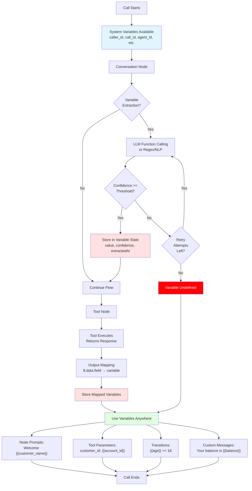

## Overview

Hamsa's variable system enables dynamic, context-aware conversations by storing and passing data between nodes. Variables act as the "memory" of your conversation flow, allowing agents to reference information collected earlier and make intelligent decisions.

### Variable Lifecycle



### Variable Flow Through Nodes

```mermaid
graph LR
    subgraph "Start Node"
        S1[System Variables<br/>Available]
    end

    subgraph "Node 1: Greeting"
        N1[Extract: customer_name]
    end

    subgraph "Node 2: Account Lookup"
        N2[Tool: Get Account<br/>Output Mapping:<br/>account_id, balance]
    end

    subgraph "Node 3: Router"
        N3[Condition:<br/>balance > 0]
    end

    subgraph "Node 4: Conversation"
        N4[Use: {{customer_name}}<br/>{{balance}}]
    end

    S1 -->|caller_id, call_id| N1
    N1 -->|+ customer_name| N2
    N2 -->|+ account_id, balance| N3
    N3 -->|All variables| N4

    style S1 fill:#e1f5ff
    style N1 fill:#fff4e1
    style N2 fill:#ffe1f5
    style N3 fill:#f5e1ff
    style N4 fill:#e1ffe1
```

## Variable Syntax

All variables use double curly brace syntax:

```
{{variable_name}}
```

**Valid examples:**

- `{{user_name}}`
- `{{account_number}}`
- `{{appointment_date}}`
- `{{customer_email}}`

**Invalid examples:**

- `{user_name}` - Single braces
- `{{User Name}}` - Spaces not allowed
- `{{user-name}}` - Hyphens not allowed
- `{{userName}}` - camelCase not recommended

**Naming convention:** Use `snake_case` (lowercase with underscores)

## Variable Types

Hamsa provides three types of variables:

### 1. System Variables

Built-in variables always available throughout your flow. Hamsa automatically populates these with real-time data.

### 2. Extracted Variables

Data collected from conversations using variable extraction in conversation nodes. Automatically synced to the variable store and available to downstream nodes.

### 3. Custom Variables

Workflow-level variables you define that can be populated via API when initiating calls. Useful for passing caller-specific data.

---

## System Variables

Hamsa provides **17 built-in system variables** that are always available throughout your conversation flow:

### Time Variables (8)

| Variable            | Type   | Description                         | Example                |
| ------------------- | ------ | ----------------------------------- | ---------------------- |
| `current_time`      | string | Current time in HH:MM format        | `15:45`                |
| `current_date`      | string | Current date in YYYY-MM-DD format   | `2024-01-15`           |
| `current_datetime`  | string | Current date and time in ISO format | `2024-01-15T15:45:30Z` |
| `current_timestamp` | string | Current timestamp in milliseconds   | `1705333530000`        |
| `current_day`       | string | Current day of the month (1-31)     | `15`                   |
| `current_month`     | string | Current month (1-12)                | `1`                    |
| `current_year`      | string | Current year (YYYY)                 | `2024`                 |
| `current_weekday`   | string | Current day of the week             | `Monday`               |

**Usage example:**

```
"Good morning! Today is {{current_weekday}}, {{current_date}}.
The current time is {{current_time}}."
```

### Call Variables (4)

| Variable          | Type   | Description                              | Example                 |
| ----------------- | ------ | ---------------------------------------- | ----------------------- |
| `call_id`         | string | Unique identifier for this specific call | `call_abc123`           |
| `call_type`       | string | Type of call                             | `voice`                 |
| `direction`       | string | Direction of the call                    | `inbound` or `outbound` |
| `call_start_time` | string | Timestamp when call began (ISO format)   | `2024-01-15T15:30:00Z`  |

**Enum values for `direction`:**

- `inbound` - User called your agent
- `outbound` - Your agent called user

**Usage example:**

```
"I see this is an {{direction}} call that started at {{call_start_time}}.
Your call ID is {{call_id}} for reference."
```

### User Variables (2)

| Variable                | Type   | Description                      | Example        |
| ----------------------- | ------ | -------------------------------- | -------------- |
| `user_number`           | string | User's phone number              | `+14155551234` |
| `user_number_area_code` | string | Area code of user's phone number | `415`          |

**Usage example:**

```
"Thank you for calling from {{user_number}}.
I see you're calling from area code {{user_number_area_code}}."
```

### Agent Variables (3)

| Variable       | Type   | Description                             | Example                |
| -------------- | ------ | --------------------------------------- | ---------------------- |
| `agent_number` | string | Agent's phone number                    | `+14155550000`         |
| `agent_name`   | string | Name of the current agent               | `Customer Support Bot` |
| `agent_id`     | string | Unique identifier for the current agent | `agent_001`            |

**Usage example:**

```
"You've reached {{agent_name}}.
If you need to call back, our number is {{agent_number}}."
```

---

## Extracted Variables

### What are Extracted Variables?

Data automatically collected from conversations and made available to subsequent nodes in the flow.

### How to Extract Variables

**In conversation nodes:**

1. Enable "Extract Variables"
2. Add variable name(s)
3. Provide extraction instructions

**Example configuration:**

```yaml
Variable Name: customer_name
Extraction Instructions: "Extract the customer's full name"

Variable Name: email_address
Extraction Instructions: "Extract email in format user@domain.com"

Variable Name: order_number
Extraction Instructions: "Extract order number (format: ORD-12345)"
```

### Extraction Behavior

- **Automatic sync:** Extracted variables immediately available to downstream nodes
- **Overwriting:** If variable already exists, new extraction updates value
- **Visibility:** Available in variable selector, autocomplete, and validation
- **Scope:** Once extracted, available for entire conversation flow

### DTMF Captured Variables

DTMF input capture creates extracted variables automatically:

```yaml
DTMF Input Capture:
  Variable Name: account_number
  Digit Limit: 10
```

Creates `{{account_number}}` variable containing the digits entered.

**[→ Learn More: DTMF Features](./dtmf)**

### Variable Extraction Methods

Hamsa provides three extraction methods for collecting data from conversations. Choose the method that best fits your use case.

**Available methods:**

1. **llm_function_calling** (default)

   - Uses LLM function calling for structured data extraction
   - Most accurate and flexible
   - Best for natural language understanding
   - Recommended for most use cases

2. **regex**

   - Pattern-based extraction using regular expressions
   - Fast and deterministic
   - Best for well-formatted data (emails, phone numbers, IDs)
   - Requires specific patterns

3. **nlp**
   - Natural language processing for entity extraction
   - Good for extracting named entities (names, dates, locations)
   - Balance between speed and accuracy

**When to use each method:**

| Method                 | Use When                                      | Examples                                                                  |
| ---------------------- | --------------------------------------------- | ------------------------------------------------------------------------- |
| `llm_function_calling` | Extracting complex or unstructured data       | "Extract the customer's issue description", "Extract appointment details" |
| `regex`                | Extracting formatted data with known patterns | Email addresses, phone numbers, order IDs, account numbers                |
| `nlp`                  | Extracting named entities from text           | Person names, locations, dates, organizations                             |

**Configuration:**

```yaml
Extract Variables Config:
  enabled: true
  extractionMethod: llm_function_calling # or 'regex', 'nlp'
  variables:
    - name: customer_email
      extractionPrompt: 'Extract email address'
```

### Extraction Quality Controls

Configure extraction quality and retry behavior to ensure reliable data collection.

**confidenceThreshold** (0.0 - 1.0, default: 0.8)

- Minimum confidence score required for successful extraction
- Higher values = stricter requirements = fewer false positives
- Lower values = more permissive = fewer missed extractions

**retryAttempts** (0 - 3, default: 1)

- Number of retry attempts if extraction fails or confidence is too low
- 0 = No retries
- 1 = One retry (default)
- 2-3 = Multiple retries for critical data

**How confidence affects extraction:**

- **confidence >= threshold**: Variable extracted successfully
- **confidence < threshold**: Extraction rejected, retry if attempts remain
- **no data found**: Empty value, retry if attempts remain

**Configuration:**

```yaml
Extract Variables Config:
  enabled: true
  extractionMethod: llm_function_calling
  confidenceThreshold: 0.8 # Require 80% confidence
  retryAttempts: 1 # Retry once if failed
  variables:
    - name: account_number
      extractionPrompt: 'Extract the 10-digit account number'
```

**Example configurations:**

```yaml
# Strict extraction for critical data
Extract Variables:
  confidenceThreshold: 0.95   # Very strict
  retryAttempts: 2            # Multiple retries
  variables:
    - name: payment_card_number
      extractionPrompt: "Extract credit card number"

# Lenient extraction for optional data
Extract Variables:
  confidenceThreshold: 0.6    # More permissive
  retryAttempts: 0            # No retries
  variables:
    - name: customer_feedback
      extractionPrompt: "Extract any feedback mentioned"

# Balanced extraction (default)
Extract Variables:
  confidenceThreshold: 0.8    # Standard threshold
  retryAttempts: 1            # One retry
  variables:
    - name: appointment_date
      extractionPrompt: "Extract the appointment date"
```

### Using Extracted Variables

**In prompts:**

```
"Thank you, {{customer_name}}! I have your email as {{email_address}}.
Is that correct?"
```

**In tool parameters:**

```
Tool: send_email
Parameters:
  to: {{email_address}}
  name: {{customer_name}}
  subject: "Your order {{order_number}}"
```

**In transitions:**

```
Condition: {{order_number}} exists
→ Next Node: Process_Order

Condition: {{order_number}} == ""
→ Next Node: Ask_For_Order
```

---

## Custom Variables

### What are Custom Variables?

Variables you define at the workflow level that can be populated via API when initiating calls.

### How to Define

**In global settings:**

1. Navigate to "Custom Variables" section
2. Add variable name
3. Set data type (string, number, boolean, integer)
4. Optionally set default value
5. Optionally define enum constraints

**Example:**

```yaml
Custom Variables:
  - customer_tier: string, default: "standard"
  - account_balance: number, default: 0
  - is_vip: boolean, default: false
  - preferred_language: string, default: "en"
  - age: integer, default: 0
  - status: string, enum: ["active", "pending", "inactive"]
```

### Enum Constraints

Variables can have enum constraints that restrict values to a predefined set. This ensures data consistency and enables better validation.

**Schema:**

```typescript
enumValues: [
  { value: 'active', label: 'Active' },
  { value: 'pending', label: 'Pending' },
  { value: 'inactive', label: 'Inactive' },
];
```

**Example use cases:**

```yaml
Variable: order_status
Data Type: string
Enum Values:
  - { value: "pending", label: "Pending" }
  - { value: "processing", label: "Processing" }
  - { value: "shipped", label: "Shipped" }
  - { value: "delivered", label: "Delivered" }

Variable: priority_level
Data Type: string
Enum Values:
  - { value: "low", label: "Low Priority" }
  - { value: "medium", label: "Medium Priority" }
  - { value: "high", label: "High Priority" }
  - { value: "critical", label: "Critical" }

Variable: language_preference
Data Type: string
Enum Values:
  - { value: "en", label: "English" }
  - { value: "es", label: "Spanish" }
  - { value: "fr", label: "French" }
```

### How to Populate

**Via API when creating call:**

```json
{
  "agent_id": "agent_123",
  "phone_number": "+14155551234",
  "custom_variables": {
    "customer_tier": "premium",
    "account_balance": 15000,
    "is_vip": true,
    "preferred_language": "es"
  }
}
```

### Using Custom Variables

**In prompts:**

```
if {{is_vip}} == true:
  "Welcome back, valued VIP customer!
   Your current balance is ${{account_balance}}."
```

**In transitions:**

```
Condition: {{customer_tier}} == "premium"
→ Next Node: VIP_Service_Path

Condition: {{account_balance}} < 0
→ Next Node: Collections_Workflow
```

---

## Variable Availability Rules

### System Variables

**Always available:** All 16 system variables
**Shown in:** Variables Panel, all input components, all node types

### Extracted Variables

**Flow position dependent:** Only available from nodes that come after the extraction point
**Not available to:** Global nodes (since they can be triggered from any point in flow)

### Custom Variables

**Always available:** Throughout entire flow
**Shown in:** Variables Panel, all input components, all node types
**Available to:** All nodes including global nodes

### Global Node Limitation

**Global nodes** (with `isGlobal: true`) can access:

- ✅ All system variables (16)
- ✅ All custom variables
- ❌ **NOT** extracted variables from specific flow paths

**Why?** Global nodes can be triggered from anywhere, so they can't rely on variables that might not exist yet.

---

## Variable State Tracking

Hamsa tracks the runtime state of variables during conversation execution, providing metadata about when, how, and where each variable was extracted.

### Runtime State Schema

Each variable maintains the following state information at runtime:

```typescript
{
  variableId: string,        // Unique identifier
  value: string | number | boolean | null,  // Current value
  extractedAt: string,       // ISO datetime when extracted
  confidence: number,        // Confidence score (0.0-1.0)
  source: string,           // Where the value came from
  nodeId: string            // Node that extracted the variable
}
```

### Source Types

Variables can be populated from four different sources:

| Source         | Description                             | Example                                     |
| -------------- | --------------------------------------- | ------------------------------------------- |
| `user_input`   | Extracted from user's conversation      | "My name is John" → `customer_name: "John"` |
| `api_response` | Retrieved from API/tool response        | Database lookup → `account_balance: 1500`   |
| `system`       | System-generated values                 | `call_id`, `current_time`, `current_date`   |
| `default`      | Default values from variable definition | Custom variable defaults                    |

### State Information Usage

**Tracking extraction timing:**

```yaml
Node: Verify_Data
Prompt: |
  I collected your information at {{customer_name.extractedAt}}.
  Let me verify these details with you.
```

**Debugging low confidence:**

```yaml
# Check extraction confidence in transitions
Condition: {{email_address.confidence}} < 0.7
→ Next Node: Re_Collect_Email

Condition: {{email_address.confidence}} >= 0.7
→ Next Node: Proceed_With_Email
```

**Understanding data flow:**

```yaml
# Know which node extracted the data
Variable: order_number
  source: user_input
  nodeId: "node_abc123"
  extractedAt: "2024-01-15T10:30:00Z"
  confidence: 0.95
```

### Practical Examples

**Example 1: Audit Trail**

```yaml
Node: Create_Support_Ticket
Tool: ticket_system
Parameters:
  customer_name: { { customer_name } }
  email: { { email_address } }
  issue: { { issue_description } }
  metadata:
    extraction_confidence:
      name: { { customer_name.confidence } }
      email: { { email_address.confidence } }
    extracted_at:
      name: { { customer_name.extractedAt } }
      email: { { email_address.extractedAt } }
```

**Example 2: Quality Control**

```yaml
Node: Quality_Check (Router)
Transitions:
  - {{customer_phone.confidence}} < 0.8 → Re_Ask_Phone
  - {{customer_email.confidence}} < 0.8 → Re_Ask_Email
  - Always → Proceed_To_Next_Step
```

**Example 3: Data Source Routing**

```yaml
Node: Data_Router
Transitions:
  - {{user_id.source}} == "api_response" → API_Flow
  - {{user_id.source}} == "user_input" → Manual_Flow
  - {{user_id.source}} == "default" → New_User_Flow
```

---

## Intelligent Context Rules Engine

Hamsa features a powerful context-aware rules engine that analyzes node content and purpose to provide intelligent variable recommendations. This helps you build flows faster by suggesting the most relevant variables for each scenario.

### How the Context Engine Works

The context engine:

1. **Analyzes node type** - Identifies whether it's a conversation, tool, transfer, or end-call node
2. **Examines content** - Scans prompts and messages for keywords and patterns
3. **Applies priority-based rules** - Matches against 10 built-in context rules
4. **Generates recommendations** - Suggests relevant existing variables
5. **Proposes new variables** - Suggests variable templates you might need

### Built-In Context Rules

Hamsa includes **10 intelligent context rules** organized by node type and scenario:

#### Conversation Node Rules (3 rules)

**1. User Data Collection** (Priority: 90)

- **Triggers when**: Content mentions "user", "customer", or "name"
- **Recommended variables**: `caller_id`, `caller_name`, `user_input`, `customer_name`, `phone_number`, `call_duration`, `call_start_time`
- **Suggests creating**:
  - `customer_name` - "Name of the customer/caller"
  - `customer_phone` - "Customer phone number"

**2. Appointment Scheduling** (Priority: 85)

- **Triggers when**: Content mentions "appointment", "schedule", "booking", "time", or "date"
- **Recommended variables**: `appointment_date`, `appointment_time`, `service_type`, `duration`, `location`, `current_date`, `current_time`, `current_weekday`
- **Suggests creating**:
  - `appointment_date` - "Scheduled appointment date"
  - `appointment_time` - "Scheduled appointment time"
  - `service_type` - "Type of service requested"

**3. Customer Support** (Priority: 80)

- **Triggers when**: Content mentions "issue", "problem", "help", "support", or "ticket"
- **Recommended variables**: `issue_description`, `ticket_id`, `priority_level`, `category`, `previous_contact`, `urgency_level`, `call_id`
- **Suggests creating**:
  - `issue_description` - "Description of the customer issue"
  - `urgency_level` - "Urgency level: low, medium, high, critical"

#### Tool Node Rules (3 rules)

**4. API Integration Tool** (Priority: 88)

- **Triggers when**: Tool type includes "api" or "http", or tool name contains "api"
- **Recommended variables**: `api_response`, `request_id`, `status_code`, `response_data`, `error_message`, `execution_time`
- **Suggests creating**:
  - `api_response_status` - "Status of the API call (success/error)"
  - `api_response_data` - "Data returned from API"

**5. Database Tool** (Priority: 85)

- **Triggers when**: Tool type includes "database" or "sql", or tool name contains "db"
- **Recommended variables**: `query_result`, `record_count`, `user_id`, `record_id`, `last_updated`, `created_at`
- **Suggests creating**:
  - `user_record` - "User record from database"
  - `record_found` - "Whether record was found (boolean)"

**6. Notification Tool** (Priority: 82)

- **Triggers when**: Tool type includes "email", "sms", or "notification"
- **Recommended variables**: `recipient`, `message_id`, `delivery_status`, `sent_time`, `message_content`, `notification_type`
- **Suggests creating**:
  - `notification_sent` - "Whether notification was sent successfully"
  - `delivery_confirmation` - "Delivery confirmation details"

#### End Call & Transfer Rules (2 rules)

**7. Call Summary** (Priority: 90)

- **Triggers when**: Node type is end-call
- **Recommended variables**: `call_duration`, `call_outcome`, `next_action`, `customer_satisfaction`, `resolution_status`, `follow_up_required`
- **Suggests creating**:
  - `call_summary` - "Summary of the entire call conversation"
  - `action_items` - "Action items or follow-ups needed"

**8. Transfer Context** (Priority: 87)

- **Triggers when**: Node type is transfer-call or transfer-agent
- **Recommended variables**: `transfer_reason`, `customer_context`, `conversation_summary`, `priority_level`, `customer_id`, `case_number`
- **Suggests creating**:
  - `transfer_context` - "Context for the transfer recipient"
  - `customer_mood` - "Customer emotional state"

#### Special Pattern Rules (2 rules)

**9. Emergency Handling** (Priority: 95)

- **Triggers when**: Global node content mentions "emergency", "urgent", or "critical"
- **Recommended variables**: `emergency_type`, `priority_level`, `escalation_required`, `contact_info`, `location`
- **Excludes**: `non_essential_data`, `optional_fields`

**10. Data Collection Flow Pattern** (Priority: 75)

- **Triggers when**: Tool node follows conversation nodes with variable extraction
- **Recommended variables**: `validation_result`, `data_completeness`, `missing_fields`, `collected_data`, `next_step`

### Content Analysis Patterns

The engine also analyzes content for 10 additional semantic patterns:

| Pattern           | Keywords                                | Suggested Variables                                   |
| ----------------- | --------------------------------------- | ----------------------------------------------------- |
| `customer_info`   | customer, client, user, caller          | `customer_name`, `customer_id`, `user_type`           |
| `contact_details` | phone, email, address, contact          | `phone_number`, `email_address`, `contact_method`     |
| `scheduling`      | appointment, schedule, book, time, date | `appointment_date`, `appointment_time`, `duration`    |
| `support_case`    | issue, problem, ticket, case, help      | `issue_description`, `priority_level`, `category`     |
| `product_info`    | product, service, order, purchase       | `product_name`, `service_type`, `order_id`            |
| `payment`         | payment, billing, invoice, charge, cost | `payment_amount`, `payment_method`, `transaction_id`  |
| `location`        | address, location, zip, city, state     | `customer_address`, `service_location`, `zip_code`    |
| `urgency`         | urgent, emergency, critical, asap       | `priority_level`, `urgency_type`, `escalation_needed` |
| `satisfaction`    | satisfaction, feedback, rating, review  | `satisfaction_score`, `feedback_comment`, `rating`    |
| `follow_up`       | follow-up, next, action, todo           | `next_action`, `follow_up_date`, `action_required`    |

### Priority-Based Recommendations

The engine ranks recommendations by priority:

- **High Priority** (90-100): Most relevant to current context, show first
- **Medium Priority** (80-89): Moderately relevant, show second
- **Low Priority** (70-79): Potentially useful, show last

### Practical Examples

**Example 1: Automatic Detection**

```yaml
Node: Collect_Info
Type: Conversation
Message: "What issue are you experiencing today?"

# Context Engine Detects:
- Rule: Customer Support (keyword "issue")
- Priority: High
- Recommendations:
  ✓ issue_description
  ✓ urgency_level
  ✓ category
  ✓ ticket_id

# Suggested Variables to Create:
+ issue_description (string) - "Description of the customer issue"
+ urgency_level (string) - "Urgency: low, medium, high, critical"
```

**Example 2: Tool Context**

```yaml
Node: Lookup_User
Type: Tool
Tool: user_database_api

# Context Engine Detects:
- Rule: Database Tool (tool name contains "database")
- Priority: High
- Recommendations:
  ✓ query_result
  ✓ user_id
  ✓ record_found
  ✓ record_count

# Suggested Variables to Create:
+ user_record (string) - "User record from database"
+ record_found (boolean) - "Whether record was found"
```

**Example 3: Multi-Pattern Detection**

```yaml
Node: Schedule_Appointment
Type: Conversation
Message: "Let's schedule your appointment. What date works for you?"

# Context Engine Detects:
- Rule 1: Appointment Scheduling (keywords: "schedule", "appointment", "date")
- Rule 2: Content Pattern: scheduling
- Combined Recommendations:
  ✓ appointment_date
  ✓ appointment_time
  ✓ service_type
  ✓ duration
  ✓ current_date
  ✓ current_weekday

# Suggested Variables to Create:
+ appointment_date (string) - "Scheduled appointment date"
+ appointment_time (string) - "Scheduled appointment time"
+ service_type (string) - "Type of service requested"
```

**Example 4: Transfer with Context**

```yaml
Node: Transfer_To_Agent
Type: Transfer Agent
Message: "I'm transferring you to a specialist"

# Context Engine Detects:
- Rule: Transfer Context (node type: transfer-agent)
- Priority: High
- Recommendations:
  ✓ transfer_reason
  ✓ customer_context
  ✓ conversation_summary
  ✓ priority_level

# Suggested Variables to Create:
+ transfer_context (string) - "Context for the transfer recipient"
+ customer_mood (string) - "Customer emotional state"
```

### Using Context Recommendations

The context engine powers several features:

1. **Variable Selector** - Shows recommended variables at the top
2. **Autocomplete** - Prioritizes contextually relevant suggestions
3. **Quick Add** - One-click to add suggested variable templates
4. **Validation** - Warns if you're missing commonly needed variables
5. **Smart Defaults** - Pre-fills extraction prompts based on context

---

## Usage in Components

### Variables Panel

- **Shows:** System variables (16), extracted variables, custom variables
- **Purpose:** Overview of available workflow-level variables
- **Location:** Left sidebar in flow builder

### Variable Input Components

- **Shows:** Context-appropriate variables (system + extracted + custom)
- **Purpose:** Variable insertion with context awareness
- **Location:** Prompt editors, tool parameters, transition conditions

### Variable Selection Modal

- **Shows:** Filtered variables based on node context and position
- **Purpose:** Comprehensive variable selection with recommendations
- **Location:** Variable selector in any input field

---

## Advanced Features

### Variable Validation

**Real-time validation checks:**

- Variable name format (snake_case)
- Variable existence
- Circular dependencies
- Type compatibility
- Missing required variables

### Variable Existence Checking

**In transition conditions:**

```
{{customer_email}} exists
→ Next Node: Send_Confirmation

{{customer_email}} NOT exists
→ Next Node: Collect_Email
```

---

## Examples

### Example 1: Personalized Greeting

```yaml
Node: Welcome
Prompt: |
  Greet the caller by name if we have it.
  Mention their VIP status if applicable.
  State the current day and time.

Variables used:
  - {{customer_name}} (custom variable from API)
  - {{is_vip}} (custom variable from API)
  - {{current_time}} (system variable)
  - {{current_weekday}} (system variable)

Agent might say:
"Good morning, {{customer_name}}! Happy {{current_weekday}}.
As a VIP member, you'll be connected immediately."
```

### Example 2: Conditional Routing by Time

```yaml
Node: Router_By_Time
Type: Router Node

Transitions:
  - {{current_weekday}} IN ["Saturday", "Sunday"] → Weekend_Hours
  - {{current_time}} > "17:00" → After_Hours
  - {{current_time}} < "09:00" → Before_Hours
  - Always → Business_Hours_Team
```

### Example 3: Data Collection Flow

```yaml
Node: Collect_Info
Extract Variables:
  - customer_name: "Extract full name"
  - customer_email: "Extract email address"
  - issue_type: "Extract the type of issue they're calling about"

Node: Verify_Info
Prompt: |
  Confirm the collected information:
  - Name: {{customer_name}}
  - Email: {{customer_email}}
  - Issue: {{issue_type}}

  Is this information correct?

Node: Create_Ticket (Tool)
Parameters:
  name: {{customer_name}}
  email: {{customer_email}}
  issue: {{issue_type}}
  call_id: {{call_id}}
  timestamp: {{current_datetime}}
```

### Example 4: DTMF + Variables

```yaml
Node: Account_Login
Message: "Please enter your account number followed by the pound key"

DTMF Capture:
  Variable: account_number
  Termination: #

Node: Verify_PIN
Message: "Now enter your 4-digit PIN"

DTMF Capture:
  Variable: pin_code
  Digit Limit: 4

Node: Authenticate (Tool)
Parameters:
  account: {{account_number}}
  pin: {{pin_code}}
  call_id: {{call_id}}
  timestamp: {{current_timestamp}}
```

### Example 5: Inbound vs Outbound Routing

```yaml
Node: Direction_Router
Type: Router Node

Transitions:
  - {{direction}} == "inbound" → Inbound_Greeting
  - {{direction}} == "outbound" → Outbound_Greeting
  - Always → Default_Greeting

Node: Inbound_Greeting
Message: "Thank you for calling {{agent_name}}. How can I help you today?"

Node: Outbound_Greeting
Message: "Hello! This is {{agent_name}} calling from {{user_number_area_code}}."
```

---

## Best Practices

### ✅ Do's

- **Use descriptive names:** `appointment_date` not `date1`
- **Follow snake_case:** `customer_email` not `customerEmail`
- **Check existence:** Test if variable exists before using
- **Validate format:** Ensure extracted data matches expected format
- **Provide defaults:** Set sensible default values for custom variables
- **Document variables:** Comment what each variable contains

### ❌ Don'ts

- **Don't use spaces:** `user name` won't work
- **Don't use hyphens:** `user-name` won't work
- **Don't assume extraction:** Verify variables were actually captured
- **Don't create circular dependencies:** Variable A depends on Variable B which depends on Variable A
- **Don't expose sensitive data:** Be careful with PII in logs
- **Don't forget scope:** Global nodes can't access extracted variables from paths

---

## Troubleshooting

### Variable not showing in dropdown

**Possible causes:**

- Variable not extracted yet (check predecessor nodes)
- Node is global (can't access extracted variables)
- Variable name typo or format error
- Variable hasn't been defined in custom variables

**Solution:** Check variable extraction configuration and node flow position.

### Variable showing as {{variable_name}} literally

**Cause:** Variable doesn't exist or wasn't populated

**Solution:**

- Verify extraction happened before usage
- Check custom variable was provided via API
- Ensure variable name matches exactly
- Test variable existence in transitions

### Extracted variable empty or incorrect

**Cause:** Extraction prompt unclear or conversation didn't contain data

**Solution:**

- Improve extraction instructions
- Verify conversation actually collected data
- Test with explicit user responses
- Add validation before extraction

---

## Complete System Variables Reference

Here's a quick reference of all 16 system variables:

```yaml
# Time Variables (8)
current_time          # HH:MM format
current_date          # YYYY-MM-DD format
current_datetime      # ISO format
current_timestamp     # Milliseconds
current_day           # 1-31
current_month         # 1-12
current_year          # YYYY
current_weekday       # Monday, Tuesday, etc.

# Call Variables (4)
call_id              # Unique call identifier
call_type            # voice, video, etc.
direction            # inbound or outbound
call_start_time      # ISO timestamp

# User Variables (2)
user_number          # Phone number
user_number_area_code # Area code

# Agent Variables (3)
agent_number         # Agent phone number
agent_name           # Agent display name
agent_id             # Agent unique ID
```

---

## Next Steps

- **[DTMF Features](./dtmf)** - Capture data via keypad
- **[Transition Conditions](./transitions)** - Use variables in routing logic
- **[Tool Nodes](./nodes/tool-node)** - Pass variables to tools
- **[Global Settings](./global-settings)** - Define custom variables

---

## Summary of Variable Features

### Core Variable Types

- **16 System Variables** - Always available, auto-populated
- **Extracted Variables** - Collected from conversations with 3 extraction methods
- **Custom Variables** - Workflow-level, populated via API

### Data Types Supported

- `string` - Text values
- `number` - Numeric values (decimals)
- `integer` - Whole numbers
- `boolean` - True/false values

### Advanced Extraction

- **3 Extraction Methods**: llm_function_calling (default), regex, nlp
- **Quality Controls**: confidenceThreshold (0.0-1.0), retryAttempts (0-3)
- **Enum Constraints**: Restrict values to predefined sets

### Runtime Intelligence

- **State Tracking**: value, extractedAt, confidence, source, nodeId
- **4 Source Types**: user_input, api_response, system, default
- **Context Engine**: 10 built-in rules + 10 content analysis patterns
- **Priority-Based**: High/Medium/Low priority recommendations

### Integration Points

- Variable Panel (overview)
- Variable Input Components (insertion)
- Variable Selection Modal (comprehensive selection)
- Context-Aware Autocomplete
- Real-time Validation

---

**Note:** This documentation reflects the current implementation in the dev branch. All features documented here are available in the codebase and fully functional.
