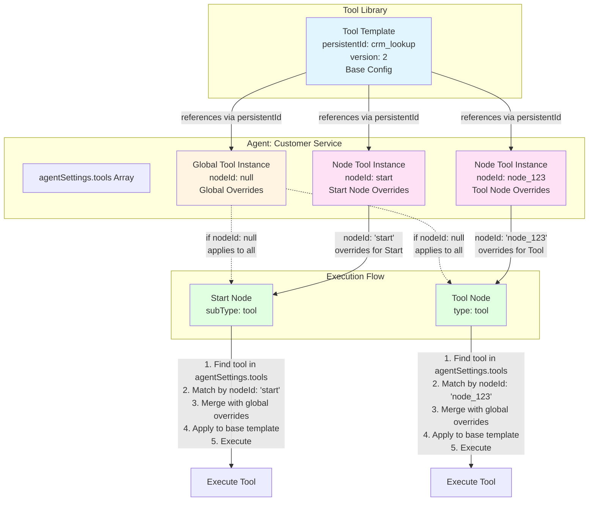
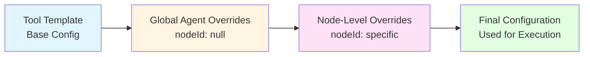

## Overview

Tools allow your voice agents to interact with external systems, fetch data, and perform actions beyond conversation. Create reusable tool templates that can be configured once and used across multiple agents with customizable overrides.

<Info>
**Two Tool Types Available:**
- **API Request**: Make HTTP requests to external APIs
- **MCP Server**: Connect to Model Context Protocol servers
</Info>

## Tool Reference Architecture

Understanding how tools work in Hamsa requires understanding the distinction between **tool templates** and **tool instances**.

### Template vs Instance Concept

**Tool Template** (Global Tool Library)

- Created in the **Tools** section of the platform
- Stores base configuration: name, description, URL, method, parameters, auth
- Shared across all agents and nodes
- Has a unique `persistentId` that remains stable across versions
- Versioned using `toolId` (versioned identifier) and `version` (number)

**Tool Instance** (Agent/Node Usage)

- Reference to a tool template with optional overrides
- Stored in `agentSettings.tools` array
- Contains `persistentId` to reference the template
- Contains overrides specific to this agent or node
- Distinguished by `nodeId`:
  - `nodeId: null` → Global agent-level tool
  - `nodeId: "abc123"` → Node-specific tool

### How Tools Are Matched to Nodes

When a tool is used in an agent:

1. **Global Tool Usage** (Single Prompt Agent or Flow Agent global tools):

   ```json
   {
     "persistentId": "tool_abc123",
     "nodeId": null,
     "overrides": {
       "headers": { "X-Custom": "value" }
     }
   }
   ```

2. **Node-Specific Tool Usage** (Flow Agent Tool Node):

   ```json
   {
     "persistentId": "tool_abc123",
     "nodeId": "node_xyz789",
     "overrides": {
       "parameters": { "source": "node_override" }
     }
   }
   ```

3. **Override Resolution Hierarchy**:
   ```
   Tool Template Base Configuration
     ↓ (overridden by)
   Global Agent Overrides (nodeId: null)
     ↓ (overridden by)
   Node-Level Overrides (nodeId: specific node)
   ```

### Visual Architecture



**Override Resolution Order:**



### Storage Architecture

**Tool Template** (in Tools collection):

```json
{
  "persistentId": "tool_abc123_v1",
  "toolId": "tool_abc123_v1",
  "version": 1,
  "name": "Get Customer Data",
  "type": "FUNCTION",
  "toolSettings": {
    "methodType": "GET",
    "url": "https://api.acme.com/customers/:customerId"
  }
}
```

**Agent Reference** (in agentSettings.tools):

```json
[
  {
    "persistentId": "tool_abc123_v1",
    "nodeId": null,
    "overrides": {
      "headers": { "Authorization": "Bearer {{token}}" },
      "parameters": { "include_history": true }
    }
  },
  {
    "persistentId": "tool_abc123_v1",
    "nodeId": "node_456",
    "overrides": {
      "parameters": { "include_history": false }
    }
  }
]
```

## Tool Versioning System

Tools use a versioning system to manage updates while maintaining stability and preventing breaking changes.

### Version Identifiers

Every tool has three key identifiers:

**1. persistentId** (Stable Identifier)

- Format: `tool_<uuid>_v<number>` or `tool_<uuid>`
- Remains stable within a version
- Used to reference tools from agents
- Example: `tool_abc123def456_v1`

**2. toolId** (Versioned Identifier)

- Same as `persistentId` for most tools
- Includes version in the identifier
- Used for version-specific lookups
- Example: `tool_abc123def456_v1`

**3. version** (Version Number)

- Numeric version counter
- Starts at 1, increments on updates
- Example: `1`, `2`, `3`

### Version Increment Logic

Versions are incremented when:

**Breaking Changes** (Always creates new version):

- Tool type changes (FUNCTION ↔ MCP ↔ WEB_TOOL)
- Tool name changes
- Parameter schema changes (add/remove required fields)
- URL structure changes (for FUNCTION tools)
- Method type changes (GET → POST, etc.)

**Non-Breaking Changes** (May update in-place):

- Description updates
- Adding optional parameters
- Header modifications
- Timeout adjustments
- Message text changes

**Version Creation:**

```javascript
// Old version
{
  "persistentId": "tool_abc123_v1",
  "toolId": "tool_abc123_v1",
  "version": 1,
  "name": "Get Customer"
}

// After breaking change
{
  "persistentId": "tool_abc123_v2",
  "toolId": "tool_abc123_v2",
  "version": 2,
  "name": "Get Customer Data"
}
```

### Version Detection and Checking

**Check if Update Available:**

Compare the version referenced in your agent vs. the latest version in the tool library:

```javascript
// Agent references
agentSettings.tools = [
  { "persistentId": "tool_abc123_v1" }
]

// Tool library has
{
  "persistentId": "tool_abc123_v2",
  "version": 2
}

// Update available: v1 → v2
```

**UI Indicators:**

- Tool selector shows "Update Available" badge
- Version mismatch warnings in agent configuration
- Sync tool shows version diff

### Syncing to Latest Version

**Automatic Sync:**
When you sync a tool to the latest version:

1. Platform finds latest version by base persistentId
2. Updates agent's `agentSettings.tools` array
3. Replaces old `persistentId` with new `persistentId`
4. Preserves existing overrides (if compatible)
5. Warns if overrides conflict with new version

**Manual Sync Process:**

```
1. Navigate to Agent Settings → Tools
2. See "v1 (Update to v2 available)" indicator
3. Click "Sync to Latest"
4. Review changes and breaking differences
5. Confirm sync
6. Agent now uses v2
```

**Example Sync:**

```json
// Before sync
{
  "tools": [
    {
      "persistentId": "tool_abc123_v1",
      "overrides": { "headers": { "X-Version": "1.0" } }
    }
  ]
}

// After sync
{
  "tools": [
    {
      "persistentId": "tool_abc123_v2",
      "overrides": { "headers": { "X-Version": "1.0" } }
    }
  ]
}
```

### Conflict Cleanup When Syncing

When syncing to a new version, conflicts may arise:

**Parameter Conflicts:**

- Old version had parameter `customer_id`
- New version renamed to `customerId`
- **Resolution**: Remove old parameter overrides, add warning

**URL Structure Conflicts:**

- Old: `https://api.acme.com/v1/customers/:id`
- New: `https://api.acme.com/v2/customers/:customerId`
- **Resolution**: Clear pathParameter overrides, require manual update

**Schema Conflicts:**

- Old: Parameter was `type: "string"`
- New: Parameter is `type: "number"`
- **Resolution**: Remove incompatible overrides, show error

**Cleanup Process:**

```javascript
// Sync algorithm
1. Load new tool version
2. Compare parameter schemas
3. Filter out incompatible overrides
4. Preserve compatible overrides
5. Log conflicts for user review
6. Update persistentId reference
```

**Conflict Warning Example:**

```
⚠️ Conflicts detected during sync:

- Parameter "customer_id" no longer exists (was overridden in your agent)
- Header "X-API-Version" changed from required to optional
- Path parameter ":id" renamed to ":customerId"

Actions taken:
✓ Removed override for "customer_id"
✓ Preserved "X-API-Version" header override
⚠️ Cleared path parameter overrides (requires manual update)
```

### Version Best Practices

**For Tool Creators:**

- Increment version for breaking changes
- Document changes in tool description
- Provide migration guides for major versions
- Test new versions before publishing

**For Tool Users:**

- Review version changes before syncing
- Test agent behavior after version updates
- Keep overrides minimal to ease version migrations
- Pin to specific versions for production agents

## Tool Types

### API Request (Function)

API Request tools enable your agent to call external HTTP endpoints with custom parameters, headers, and authentication.

**Execution Context:**

- **Server-side**: Tools execute on Hamsa's servers during phone calls
- **Client-side (Web Tools)**: When deployed via SDK, tools can execute in the user's browser with form interfaces

**Common Use Cases:**

- Look up customer data from your CRM
- Check appointment availability
- Submit form data
- Retrieve order status
- Update database records

**Configuration Options:**

- **HTTP Method**: GET, POST, PUT, DELETE, PATCH
- **URL**: Endpoint URL with path parameter support (e.g., `https://api.example.com/users/:userId`)
- **Authentication**: None, JWT Bearer Token
- **Headers**: Custom HTTP headers
- **Path Parameters**: Dynamic URL segments with default values
- **Timeout**: Request timeout in seconds (1-30s)
- **Parameters**: JSON schema defining input parameters
- **Messages**: Custom messages for request start/complete states
- **Async Mode**: Execute tool calls asynchronously

### MCP Server

Model Context Protocol (MCP) servers provide standardized interfaces for AI models to interact with external systems and data sources.

**Configuration Options:**

- **Server URL**: MCP server endpoint
- **Authentication**: Connection credentials
- **Timeout**: Connection timeout settings
- **Parameters**: MCP-specific parameter schema

<Tip>
MCP servers offer a structured way to connect agents to databases, APIs, and local system resources.
</Tip>

## Web Tools (Browser-Based Execution)

Web Tools are a special execution mode for API Request tools that run in the user's browser when your agent is deployed via the Hamsa SDK on web applications.

### How Web Tools Work

**Traditional Tool Flow** (Phone Calls):

```
User speaks → Agent decides to use tool → Tool executes on server → Response to user
```

**Web Tool Flow** (Web SDK Deployment):

```
User types/speaks → Agent triggers tool → Form appears in browser → User fills form →
Tool executes in browser → Data sent to agent → Agent responds
```

### Key Features

**Browser-Based Forms**

- Tools render as interactive forms in the web interface
- Users can input data directly into form fields
- Real-time client-side validation
- Better UX for complex data entry (dates, selections, multi-field inputs)

**SDK Integration**

- Tools are passed to the SDK when agent is deployed
- Execute in user's browser context
- Access to browser APIs and local storage if needed
- Reduced server load for simple operations

**Configuration**

- Same tool definition as regular API Request tools
- Configured via "Web Tools Configuration" section
- Override parameters and headers for web execution
- Tool parameters define form fields

### When to Use Web Tools

**Best for:**

- Forms with multiple fields
- Complex data input (addresses, credit cards, dates)
- File uploads from user's device
- Real-time validation and feedback
- Operations requiring user confirmation
- Client-side data processing

**Not ideal for:**

- Voice-only interactions (phone calls)
- Server-side only operations
- Tools requiring backend authentication
- Real-time API lookups during conversation

### Configuring Web Tools

#### In Single Prompt Agents

1. Navigate to **Configuration** → **Tools**
2. Select the tools you want to use
3. Open **Web Tools Configuration** section
4. Add web tool overrides:
   - Select the tool
   - Configure HTTP headers for browser execution
   - Override parameters with client-side values
   - Set path parameters

#### In Flow Agents

**Global Web Tools** (Agent-level):

1. Open Flow Agent settings
2. Navigate to **Web Tools Configuration**
3. Add tools that should be available globally
4. Configure overrides for browser execution

**Node-Level Web Tools**:

1. Select a Tool Node or Web Tool Node
2. In node settings, configure web tool overrides
3. Overrides apply only to that specific node

### Web Tool Overrides

Web Tools support **limited overrides** due to browser security constraints:

<Warning>
**Important Override Limitations for Web Tools:**
- ✅ **Can Override**: name, description, parameters
- ❌ **Cannot Override**: headers, URL, method, auth, timeout, pathParameters

This is a security measure to prevent exposing sensitive credentials in the browser.
</Warning>

**What You CAN Override:**

**1. Tool Name**

```json
{
  "name": "Customer Registration (Web Form)"
}
```

**2. Tool Description**

```json
{
  "description": "Register new customer with enhanced browser-side validation"
}
```

**3. Parameters**
Override parameter values for browser context:

```json
{
  "parameters": {
    "source": "web_sdk",
    "client_id": "{{clientId}}",
    "timestamp": "{{currentTime}}",
    "browser_timezone": "{{timezone}}"
  }
}
```

**What You CANNOT Override:**

**HTTP Headers** ❌

```json
{
  "headers": {
    "Authorization": "Bearer token" // NOT ALLOWED in Web Tools
  }
}
```

**URL or Path Parameters** ❌

```json
{
  "url": "https://different-api.com/endpoint", // NOT ALLOWED
  "pathParameters": {
    "userId": "{{userId}}" // NOT ALLOWED
  }
}
```

**Authentication** ❌

```json
{
  "authType": "jwtAuth", // NOT ALLOWED
  "authToken": "Bearer ..." // NOT ALLOWED
}
```

**Complete Web Tool Override Example:**

**Template:**

```json
{
  "name": "Register Customer",
  "description": "Customer registration tool",
  "type": "WEB_TOOL",
  "parameters": {
    "type": "object",
    "properties": {
      "source": { "type": "string", "default": "unknown" },
      "tracking_id": { "type": "string" }
    }
  }
}
```

**Valid Override (Agent Level):**

```json
{
  "persistentId": "tool_web123_v1",
  "nodeId": null,
  "overrides": {
    "name": "Register Customer (Production)",
    "description": "Customer registration with enhanced validation",
    "parameters": {
      "source": "web_sdk_v2",
      "tracking_id": "{{sessionId}}"
    }
  }
}
```

**Invalid Override (Will Be Rejected):**

```json
{
  "persistentId": "tool_web123_v1",
  "nodeId": null,
  "overrides": {
    "headers": { "X-Custom": "value" }, // ❌ Not allowed for WEB_TOOL
    "url": "https://new-url.com", // ❌ Not allowed for WEB_TOOL
    "authToken": "Bearer token" // ❌ Not allowed for WEB_TOOL
  }
}
```

**Why These Limitations?**

Web Tools execute in the user's browser, which means:

- **Security**: Headers and auth tokens would be exposed to client-side JavaScript
- **Trust**: Users could inspect and modify sensitive configuration
- **Compliance**: Cannot safely handle API keys or credentials client-side
- **CORS**: Changing URLs could violate CORS policies

**Alternative Approaches:**

If you need full override capabilities:

1. Use **FUNCTION** tool type instead of WEB_TOOL
2. Handle authentication server-side via proxy
3. Use environment-specific tool templates
4. Configure tools per deployment environment

### Tool Parameters as Form Fields

Tool parameters automatically map to form fields in the web interface:

**String Parameter** → Text input

```json
{
  "name": {
    "type": "string",
    "description": "Customer name"
  }
}
```

Renders as: `<input type="text" placeholder="Customer name" />`

**Number Parameter** → Number input

```json
{
  "age": {
    "type": "number",
    "description": "Customer age",
    "minimum": 18,
    "maximum": 120
  }
}
```

Renders as: `<input type="number" min="18" max="120" />`

**Boolean Parameter** → Checkbox

```json
{
  "newsletter": {
    "type": "boolean",
    "description": "Subscribe to newsletter"
  }
}
```

Renders as: `<input type="checkbox" />`

**Enum Parameter** → Select dropdown

```json
{
  "country": {
    "type": "string",
    "enum": ["US", "CA", "UK", "AU"],
    "description": "Country"
  }
}
```

Renders as: `<select><option>US</option>...</select>`

### Example: Customer Registration Web Tool

**Tool Configuration:**

```json
{
  "name": "Register Customer",
  "type": "FUNCTION",
  "toolSettings": {
    "methodType": "POST",
    "url": "https://api.acme.com/customers",
    "authType": "jwtAuth",
    "authToken": "Bearer {{apiToken}}"
  },
  "parameters": {
    "type": "object",
    "properties": {
      "first_name": {
        "type": "string",
        "description": "First name"
      },
      "last_name": {
        "type": "string",
        "description": "Last name"
      },
      "email": {
        "type": "string",
        "format": "email",
        "description": "Email address"
      },
      "phone": {
        "type": "string",
        "pattern": "^\\+?[1-9]\\d{1,14}$",
        "description": "Phone number"
      },
      "preferred_contact": {
        "type": "string",
        "enum": ["email", "phone", "sms"],
        "description": "Preferred contact method"
      },
      "newsletter": {
        "type": "boolean",
        "default": false,
        "description": "Subscribe to newsletter"
      }
    },
    "required": ["first_name", "last_name", "email"]
  }
}
```

**Web SDK Rendering:**
The SDK automatically creates a form with:

- Text input for first name (required)
- Text input for last name (required)
- Email input with validation (required)
- Phone input with pattern validation
- Dropdown for preferred contact method
- Checkbox for newsletter subscription

**User Flow:**

1. Agent: "I can help you register. Let me bring up the registration form."
2. Form appears in chat interface
3. User fills out form fields
4. User clicks "Submit"
5. Tool executes in browser with form data
6. Agent: "Thank you! Your registration is complete."

### Web Tools vs Regular Tools

| Feature    | Regular Tools           | Web Tools              |
| ---------- | ----------------------- | ---------------------- |
| Execution  | Server-side             | Browser (client-side)  |
| Use Case   | Phone calls, automation | Web chat interfaces    |
| User Input | Voice/conversational    | Forms and fields       |
| Latency    | Network dependent       | Near-instant (local)   |
| Validation | Server-side             | Client + Server        |
| Access     | Backend APIs            | Browser APIs + Backend |
| Best For   | Voice agents            | Web SDK deployments    |

### Best Practices

**Design for Both Contexts:**
Create tools that work well in both phone and web contexts:

- Define clear parameter schemas
- Include helpful descriptions
- Set appropriate validation rules
- Provide sensible defaults

**Security Considerations:**

- Don't expose sensitive API tokens in web tool configs
- Validate all inputs server-side even with client validation
- Use HTTPS for all tool URLs
- Sanitize user inputs before submission

**Form UX:**

- Keep forms concise (3-7 fields ideal)
- Use clear field labels and placeholders
- Provide inline validation feedback
- Show required fields clearly
- Group related fields logically

**Testing:**

- Test tools in both phone and web contexts
- Verify form rendering in SDK
- Check validation behavior
- Test error handling

### Troubleshooting Web Tools

**Form Not Appearing**

- Verify tool is configured in Web Tools Configuration
- Check SDK integration is correct
- Ensure tool parameters are properly defined

**Validation Errors**

- Review parameter schema constraints
- Check required fields are marked correctly
- Verify regex patterns are valid

**Submission Failures**

- Check authentication headers
- Verify API endpoint is accessible from browser
- Review CORS settings on target API
- Check network console for errors

## Creating Tools

### Step 1: Choose Tool Type

1. Navigate to **Tools** in the sidebar
2. Click **Add New Tool**
3. Select tool type:
   - **API Request** - For HTTP endpoints
   - **MCP Server** - For MCP protocol connections

### Step 2: Configure Basic Information

**Tool Name** (Required)

- Descriptive name for the tool
- Max 250 characters
- Example: "Check Order Status", "Get Customer Info"

**Description** (Required)

- Clear explanation of what the tool does
- Max 1000 characters
- The AI uses this to understand when to call the tool
- Be specific about inputs and outputs

<Warning>
The description is critical! The AI decides when to use this tool based on the description. Make it clear and comprehensive.
</Warning>

**Example Descriptions:**

```
Good: "Retrieves customer account information by phone number. Returns name,
account number, balance, and membership tier. Use when caller asks about their
account or needs account verification."

Poor: "Gets customer data"
```

### Step 3: Configure Tool Settings

#### For API Request Tools

**Method Type**
Select the HTTP method:

- `GET` - Retrieve data
- `POST` - Create new data
- `PUT` - Update entire resource
- `PATCH` - Partial update
- `DELETE` - Remove resource

**URL** (Required)

- Must use HTTPS
- Supports path parameters: `:paramName`
- Example: `https://api.acme.com/customers/:customerId/orders/:orderId`

**Authentication**

- **None**: No authentication required
- **JWT Auth**: Bearer token authentication
  - Token format: `Bearer eyJhbGc...`
  - Must start with "Bearer " prefix

**HTTP Headers** (Optional)
Add custom headers as key-value pairs:

```
Content-Type: application/json
X-API-Version: 2.0
X-Custom-Header: value
```

<Info>
Forbidden headers (automatically handled): accept-encoding, connection, content-length, cookie, host, origin, user-agent
</Info>

**Path Parameters** (Optional)

Define default values for URL path parameters:

| Parameter  | Default Value |
| ---------- | ------------- |
| customerId | 12345         |
| orderId    | ORD-001       |

These defaults are used when testing the tool or when the parameter isn't provided during a call.

**Timeout** (Optional)

- Range: 1-30 seconds
- Recommended: 5-10 seconds for most APIs
- Leave empty for no timeout

#### For MCP Server Tools

**Server URL** (Required)

- MCP server endpoint
- Must use HTTPS

**Timeout** (Optional)

- Connection timeout in seconds

### Step 4: Define Parameters

Use the **JSON Schema Builder** to define input parameters for your tool.

**Example: Customer Lookup Tool**

```json
{
  "type": "object",
  "properties": {
    "phone_number": {
      "type": "string",
      "description": "Customer's phone number in E.164 format"
    },
    "include_orders": {
      "type": "boolean",
      "description": "Whether to include recent order history",
      "default": false
    }
  },
  "required": ["phone_number"]
}
```

<Tip>
You can also use the visual Parameters Builder to create schemas without writing JSON.
</Tip>

### Step 5: Configure Messages (Optional)

Customize what the agent says during tool execution:

**Request Start** - Spoken while making the API call

```
"Let me look that up for you..."
```

**Request Complete** - Spoken after receiving the response

```
"I found your account information."
```

<Note>
If no messages are configured, the agent will handle tool calls silently or use default behaviors.
</Note>

### Step 6: Save and Test

1. Click **Save Tool** to create the tool template
2. Tool is now available for use in all agents
3. Test the tool from the tool details page

## Using Tools in Agents

### In Single Prompt Agents

1. Open your Single Prompt Agent
2. Navigate to **Configuration** → **Tools**
3. Click **Add Tool**
4. Select tools from your library
5. (Optional) Override parameters or headers for this specific agent

**Tool Overrides:**

- Override HTTP headers with agent-specific values
- Override parameter default values
- Override path parameters
- Overrides only affect this agent, not the template

### In Flow Agents

#### Tool Node

1. Add a **Tool Node** to your flow
2. Select a tool template
3. Configure when to use this tool (transition conditions)
4. Map variables to tool parameters

**Example: Customer Lookup in Flow**

```
Start Node: "Hello! I can help you with your account."
  ↓ (Natural language transition: mentions account, order, or balance)
Conversation Node: "Can you provide your phone number?"
  ↓ (Extract variable: caller_phone)
Tool Node: Get Customer Info
  - Tool: "Lookup Customer by Phone"
  - Parameters:
    - phone_number: {{caller_phone}}
    - include_orders: true
  ↓ (Always transition)
Conversation Node: "I found your account, {{customer_name}}..."
```

#### Web Tool Node

Web Tool nodes are specialized tool nodes for API requests with advanced features:

- Same configuration as API Request tools
- Can be used directly in flow without creating a template
- Supports all HTTP methods and authentication types

**When to use:**

- **Tool Template**: For reusable tools across multiple agents
- **Web Tool Node**: For one-off API calls specific to a single flow

## Tool Overrides

The override system allows you to customize tool behavior for specific agents or nodes without modifying the template. **Override capabilities vary significantly by tool type.**

### Override Rules by Tool Type

Different tool types support different levels of customization:

#### FUNCTION Tools (API Request) - Full Overrides

FUNCTION tools support **complete overrides** of all configuration:

**Fully Overridable Fields:**

- ✅ **name**: Tool name
- ✅ **description**: Tool description
- ✅ **url**: API endpoint URL
- ✅ **methodType**: HTTP method (GET, POST, PUT, PATCH, DELETE)
- ✅ **headers**: HTTP headers (add, modify, remove)
- ✅ **parameters**: Parameter values and defaults
- ✅ **pathParameters**: URL path parameter values
- ✅ **authType**: Authentication type (none, jwtAuth)
- ✅ **authToken**: Authentication token/credentials
- ✅ **timeoutSeconds**: Request timeout
- ✅ **async**: Async execution mode

**Example Full Override:**

```json
{
  "persistentId": "tool_abc123_v1",
  "nodeId": null,
  "overrides": {
    "name": "Get Customer (Production)",
    "url": "https://prod-api.acme.com/v2/customers/:id",
    "methodType": "POST",
    "headers": {
      "Authorization": "Bearer {{prodToken}}",
      "X-Environment": "production",
      "X-Request-Source": "voice-agent"
    },
    "parameters": {
      "include_history": true,
      "max_results": 50
    },
    "pathParameters": {
      "id": "{{customerId}}"
    },
    "authType": "jwtAuth",
    "authToken": "Bearer sk_prod_...",
    "timeoutSeconds": 15,
    "async": true
  }
}
```

#### WEB_TOOL Tools - Limited Overrides

WEB_TOOL tools support **limited overrides** only:

**Overridable Fields:**

- ✅ **name**: Tool name
- ✅ **description**: Tool description
- ✅ **parameters**: Parameter values only

**NOT Overridable:**

- ❌ **headers**: Cannot override HTTP headers
- ❌ **url**: Cannot change API endpoint
- ❌ **methodType**: Cannot change HTTP method
- ❌ **authType**: Cannot change authentication
- ❌ **authToken**: Cannot modify credentials
- ❌ **timeoutSeconds**: Cannot adjust timeout
- ❌ **pathParameters**: Cannot override path params

**Why Limited?**
WEB_TOOL tools execute in the user's browser. Security restrictions prevent modifying URL, headers, or authentication to avoid exposing sensitive credentials client-side.

**Example WEB_TOOL Override:**

```json
{
  "persistentId": "tool_web123_v1",
  "nodeId": null,
  "overrides": {
    "name": "Customer Registration Form",
    "description": "Register new customer with enhanced validation",
    "parameters": {
      "source": "web_sdk",
      "default_country": "US"
    }
  }
}
```

#### MCP Tools - NO Overrides

MCP (Model Context Protocol) tools support **NO overrides**:

**NOT Overridable:**

- ❌ All fields are server-managed
- ❌ Cannot override any configuration
- ❌ MCP server controls all behavior

**Why No Overrides?**
MCP servers manage their own tool definitions and behavior. The platform cannot override server-controlled tools without breaking the MCP protocol contract.

**MCP Tool Reference:**

```json
{
  "persistentId": "mcp_server_tool_123",
  "nodeId": null,
  "overrides": null // Always null for MCP tools
}
```

### Override Storage

All overrides are stored in the **agentSettings.tools** array, not in the tool template itself.

**Storage Structure:**

```json
{
  "agentSettings": {
    "tools": [
      {
        "persistentId": "tool_abc123_v1", // References template
        "nodeId": null, // null = global, "id" = node-specific
        "overrides": {
          // Custom overrides
          "headers": { "X-Custom": "value" },
          "parameters": { "source": "agent" }
        }
      }
    ]
  }
}
```

**Key Points:**

- Tool template remains unchanged
- Each agent/node stores its own overrides
- Multiple agents can reference same template with different overrides
- Overrides are merged with template at runtime

### Override Hierarchy

Overrides are applied in a three-level hierarchy:

```
1. Tool Template (Base Configuration)
   ↓ (merged with)
2. Global Agent Overrides (nodeId: null)
   ↓ (merged with)
3. Node-Level Overrides (nodeId: specific)
   = Final Tool Configuration
```

**Example Resolution:**

**Template:**

```json
{
  "name": "Get Customer",
  "url": "https://api.acme.com/customers/:id",
  "headers": {
    "Content-Type": "application/json",
    "X-API-Version": "1.0"
  },
  "parameters": {
    "include_history": false,
    "max_results": 10
  }
}
```

**Global Override (Agent Level):**

```json
{
  "persistentId": "tool_abc123_v1",
  "nodeId": null,
  "overrides": {
    "headers": {
      "X-API-Version": "2.0",
      "Authorization": "Bearer {{agentToken}}"
    },
    "parameters": {
      "include_history": true
    }
  }
}
```

**Node Override (Node Level):**

```json
{
  "persistentId": "tool_abc123_v1",
  "nodeId": "node_456",
  "overrides": {
    "parameters": {
      "max_results": 50
    }
  }
}
```

**Final Merged Configuration:**

```json
{
  "name": "Get Customer",
  "url": "https://api.acme.com/customers/:id",
  "headers": {
    "Content-Type": "application/json", // From template
    "X-API-Version": "2.0", // From global override
    "Authorization": "Bearer {{agentToken}}" // From global override
  },
  "parameters": {
    "include_history": true, // From global override
    "max_results": 50 // From node override
  }
}
```

### NodeId Differentiation

The `nodeId` field determines override scope:

**Global Overrides** (`nodeId: null`)

- Apply to ALL uses of this tool in the agent
- Used in Single Prompt Agents
- Used for Flow Agent global tools
- Affects every node that uses this tool (unless node has its own override)

**Node-Specific Overrides** (`nodeId: "specific_node_id"`)

- Apply ONLY to a specific Tool Node in Flow Agent
- Override global overrides
- Isolated to single node
- Allow different configurations in different parts of flow

**Example: Same Tool, Different Configs:**

```json
{
  "tools": [
    // Global configuration
    {
      "persistentId": "tool_abc123_v1",
      "nodeId": null,
      "overrides": {
        "parameters": { "environment": "production" }
      }
    },
    // Node A: Use production with verbose logging
    {
      "persistentId": "tool_abc123_v1",
      "nodeId": "node_A",
      "overrides": {
        "parameters": {
          "environment": "production",
          "verbose": true
        }
      }
    },
    // Node B: Use staging for testing
    {
      "persistentId": "tool_abc123_v1",
      "nodeId": "node_B",
      "overrides": {
        "parameters": {
          "environment": "staging",
          "debug": true
        }
      }
    }
  ]
}
```

### Configuring Overrides

#### In Single Prompt Agents

1. Navigate to **Configuration** → **Tools**
2. Select a tool from your library
3. Click **Override Settings** icon
4. Configure overrides:
   - Modify headers (FUNCTION only)
   - Override parameter values (FUNCTION and WEB_TOOL)
   - Set path parameters (FUNCTION only)
   - Change URL/method/auth (FUNCTION only)
5. Save agent

**Override stored with `nodeId: null` (global to agent)**

#### In Flow Agents - Global Overrides

1. Open Flow Agent settings
2. Navigate to **Tools** section
3. Select tool and click **Override**
4. Configure global overrides
5. Apply to all nodes using this tool

**Override stored with `nodeId: null` (global to agent)**

#### In Flow Agents - Node-Level Overrides

1. Add **Tool Node** to canvas
2. Select the tool node
3. Open **Node Settings**
4. Click **Override Tool Settings**
5. Configure node-specific overrides
6. Save node

**Override stored with `nodeId: <node_id>` (specific to node)**

### Override Best Practices

**Use Global Overrides For:**

- Environment-specific configurations (prod vs staging URLs)
- Agent-wide authentication tokens
- Common header values
- Default parameter values shared across all uses

**Use Node-Level Overrides For:**

- Node-specific parameter values
- Different API versions in different flow paths
- Conditional configurations based on flow logic
- A/B testing different configurations

**Security Best Practices:**

- Never hardcode sensitive tokens in overrides
- Use variable substitution: `{{variableName}}`
- Store credentials in secure environment variables
- Review overrides before deploying to production

**Maintenance Best Practices:**

- Document why overrides are needed
- Keep overrides minimal and focused
- Test override behavior thoroughly
- Review overrides when syncing to new tool versions

### Override Limitations

**Per Tool Type:**
| Tool Type | Override Support |
|-----------|------------------|
| FUNCTION | Full (all fields) |
| WEB_TOOL | Limited (name, description, parameters only) |
| MCP | None (server-managed) |

**Per Field:**
| Field | FUNCTION | WEB_TOOL | MCP |
|-------|----------|----------|-----|
| name | ✅ | ✅ | ❌ |
| description | ✅ | ✅ | ❌ |
| url | ✅ | ❌ | ❌ |
| methodType | ✅ | ❌ | ❌ |
| headers | ✅ | ❌ | ❌ |
| parameters | ✅ | ✅ | ❌ |
| pathParameters | ✅ | ❌ | ❌ |
| authType | ✅ | ❌ | ❌ |
| authToken | ✅ | ❌ | ❌ |
| timeoutSeconds | ✅ | ❌ | ❌ |
| async | ✅ | ❌ | ❌ |

### Troubleshooting Overrides

**Override Not Applied**

- Check nodeId matches (null vs specific node)
- Verify tool type supports that field override
- Confirm agent is saved after override configuration
- Test with different override values

**Override Conflicts After Version Sync**

- Review conflict warnings after sync
- Update parameter names if schema changed
- Adjust path parameters if URL structure changed
- Test thoroughly after resolving conflicts

**WEB_TOOL Override Rejected**

- Verify you're only overriding name, description, or parameters
- Cannot override headers, URL, auth, or timeout for WEB_TOOL
- Use FUNCTION tool type if you need full overrides

**MCP Tool Won't Override**

- MCP tools cannot be overridden
- Configuration is managed by MCP server
- Contact MCP server administrator for configuration changes

## Testing Tools

Tool testing allows you to validate tool configurations before deploying them in agents. **Only FUNCTION tools can be tested.**

### Testing Availability by Tool Type

| Tool Type | Can Test? | Reason                                            |
| --------- | --------- | ------------------------------------------------- |
| FUNCTION  | ✅ Yes    | HTTP APIs can be called and validated             |
| WEB_TOOL  | ❌ No     | Requires browser context, cannot test server-side |
| MCP       | ❌ No     | Server-managed, testing handled by MCP server     |

### Test Result Storage

Test results are stored in the tool's **testResult** field:

```json
{
  "toolId": "tool_abc123_v1",
  "name": "Get Customer Data",
  "type": "FUNCTION",
  "testResult": {
    "success": true,
    "statusCode": 200,
    "response": {
      "customer_id": "12345",
      "name": "John Doe",
      "status": "active"
    },
    "executionTime": 234,
    "timestamp": "2025-11-18T10:30:00Z",
    "error": null
  }
}
```

**TestResult Schema:**

```typescript
{
  success: boolean,           // Whether test succeeded
  statusCode?: number,        // HTTP status code
  response?: any,             // Response body
  executionTime: number,      // Time in milliseconds
  timestamp: string,          // ISO timestamp
  error?: string              // Error message if failed
}
```

### Test Parameters and Validation

When testing a tool, you must provide values for all parameters defined in the tool's parameter schema.

**Parameter Requirements:**

- **Required parameters**: Must be provided
- **Optional parameters**: Can be omitted (uses default if defined)
- **Type validation**: Values must match schema types
- **Format validation**: Strings must match format constraints (email, date, etc.)
- **Enum validation**: Values must be in allowed enum list

**Example Tool with Parameters:**

```json
{
  "name": "Search Customers",
  "parameters": {
    "type": "object",
    "properties": {
      "search_term": {
        "type": "string",
        "description": "Search query",
        "minLength": 2
      },
      "max_results": {
        "type": "number",
        "description": "Maximum results",
        "minimum": 1,
        "maximum": 100,
        "default": 10
      },
      "status": {
        "type": "string",
        "enum": ["active", "inactive", "all"],
        "default": "active"
      }
    },
    "required": ["search_term"]
  }
}
```

**Valid Test Parameters:**

```json
{
  "search_term": "John",
  "max_results": 25,
  "status": "active"
}
```

**Invalid Test Parameters:**

```json
{
  // Missing required "search_term"
  "max_results": 25
}
// Error: "search_term" is required

{
  "search_term": "J",  // Too short (minLength: 2)
  "max_results": 200   // Exceeds maximum (100)
}
// Error: Validation failed

{
  "search_term": "John",
  "status": "pending"  // Not in enum
}
// Error: "status" must be one of: active, inactive, all
```

### Test Execution

**Testing from Tool Details Page:**

1. Navigate to **Tools** in sidebar
2. Open the tool you want to test
3. Click **Test Tool** button
4. Fill in test parameters:
   - Enter values for required parameters
   - Optionally override path parameters
   - Review HTTP headers and auth
5. Click **Run Test**
6. View results:
   - Success/failure status
   - HTTP status code
   - Response body
   - Execution time
   - Any errors

**Test Execution Flow:**

```
1. Validate test parameters against schema
   ↓
2. Merge test parameters with tool configuration
   ↓
3. Replace path parameters in URL
   ↓
4. Build HTTP request with headers and auth
   ↓
5. Execute HTTP request
   ↓
6. Capture response (or error)
   ↓
7. Store testResult in tool
   ↓
8. Display results to user
```

**Example Test Execution:**

**Tool Configuration:**

```json
{
  "name": "Get Order Status",
  "type": "FUNCTION",
  "toolSettings": {
    "methodType": "GET",
    "url": "https://api.acme.com/orders/:orderId",
    "authType": "jwtAuth",
    "authToken": "Bearer sk_test_...",
    "timeoutSeconds": 10
  },
  "parameters": {
    "type": "object",
    "properties": {
      "include_items": {
        "type": "boolean",
        "default": false
      }
    }
  }
}
```

**Test Parameters:**

```json
{
  "include_items": true
}
```

**Path Parameters:**

```json
{
  "orderId": "ORD-12345"
}
```

**Executed Request:**

```
GET https://api.acme.com/orders/ORD-12345?include_items=true
Headers:
  Authorization: Bearer sk_test_...
  Content-Type: application/json
```

**Test Result (Success):**

```json
{
  "success": true,
  "statusCode": 200,
  "response": {
    "order_id": "ORD-12345",
    "status": "shipped",
    "items": [{ "sku": "ITEM-001", "quantity": 2 }]
  },
  "executionTime": 187,
  "timestamp": "2025-11-18T14:22:33Z"
}
```

**Test Result (Error):**

```json
{
  "success": false,
  "statusCode": 404,
  "response": {
    "error": "Order not found"
  },
  "executionTime": 95,
  "timestamp": "2025-11-18T14:22:33Z",
  "error": "HTTP 404: Order not found"
}
```

### Testing from Nodes

**Testing Tool Nodes in Flow Agents:**

You can test tools directly from Tool Nodes in the Flow Agent canvas:

1. Select a **Tool Node** in your flow
2. Click **Test Node** button
3. Provide test parameters (with variable context)
4. Execute test
5. View results inline

**Node Testing Features:**

- Test with actual variable values from flow
- Preview parameter substitution
- See how overrides are applied
- Validate tool behavior in flow context

**Example: Testing with Variables**

**Tool Node Configuration:**

```json
{
  "toolId": "tool_abc123_v1",
  "parameters": {
    "customer_id": "{{customerId}}",
    "fetch_history": true
  }
}
```

**Test Context (Variable Values):**

```json
{
  "customerId": "CUST-98765"
}
```

**Executed Request:**

```
POST https://api.acme.com/customers
Body: {
  "customer_id": "CUST-98765",
  "fetch_history": true
}
```

### Test Result Persistence

**How Long Test Results Are Stored:**

- Test results persist in the tool's `testResult` field
- Overwritten each time tool is tested
- Only the **latest** test result is stored
- Cleared when tool is deleted

**When Test Results Are Useful:**

- Debugging tool configuration issues
- Verifying API endpoint changes
- Confirming authentication works
- Documenting expected responses
- Training new team members

**Viewing Historical Tests:**
Test results are not versioned. To track test history:

- Use external testing tools (Postman, Insomnia)
- Log test results in documentation
- Capture screenshots of successful tests
- Version control tool configurations with test notes

### Test Best Practices

**Before Deploying to Production:**

1. Test with realistic parameter values
2. Test all required and optional parameters
3. Test edge cases (empty strings, max values, etc.)
4. Verify authentication tokens are valid
5. Check response format matches expectations
6. Test timeout scenarios with slow APIs
7. Test error handling (404, 500, etc.)

**Security Testing:**

- Never test with production data in development
- Use test API keys, not production keys
- Sanitize test results before sharing
- Verify auth tokens aren't exposed in responses

**Performance Testing:**

- Test with expected data volumes
- Check execution time is acceptable
- Test concurrent calls if tool is used frequently
- Verify timeout settings are appropriate

**Common Test Scenarios:**

**Scenario 1: Customer Lookup**

```json
// Happy path
{ "phone": "+15551234567" }
// Expected: 200, customer data

// Not found
{ "phone": "+15559999999" }
// Expected: 404, error message

// Invalid format
{ "phone": "invalid" }
// Expected: 400, validation error
```

**Scenario 2: Data Submission**

```json
// Complete submission
{
  "name": "John Doe",
  "email": "john@example.com",
  "consent": true
}
// Expected: 201, created resource

// Missing required field
{
  "name": "John Doe"
}
// Expected: 400, missing field error
```

**Scenario 3: Authentication**

```json
// Valid token
Headers: { "Authorization": "Bearer valid_token" }
// Expected: 200, success

// Expired token
Headers: { "Authorization": "Bearer expired_token" }
// Expected: 401, authentication error

// Missing token
Headers: {}
// Expected: 401, missing auth error
```

### Testing Limitations

**Cannot Test:**

- WEB_TOOL tools (require browser context)
- MCP tools (server-managed)
- Tools with circular dependencies
- Tools requiring user interaction
- Tools with file upload requirements (in test UI)

**Test Environment Considerations:**

- Tests run from Hamsa servers, not your local machine
- IP restrictions may affect test results
- CORS doesn't apply to server-side tests
- Test environment may differ from production

**When Tests Pass But Agent Fails:**

- Check variable substitution in agent context
- Verify overrides are applied correctly
- Test with actual conversation flow
- Review agent logs for runtime errors

### Troubleshooting Test Failures

**401 Unauthorized**

- Verify authentication token is valid and not expired
- Check authType matches API requirements
- Ensure token has "Bearer " prefix if required
- Test token directly with curl/Postman

**404 Not Found**

- Verify URL is correct
- Check path parameters are replaced correctly
- Ensure API endpoint exists
- Test URL manually in browser/Postman

**Timeout Errors**

- Increase timeout setting (max 30 seconds)
- Check if API is slow or down
- Verify network connectivity
- Consider enabling async mode

**Parameter Validation Errors**

- Review parameter schema requirements
- Check required fields are provided
- Verify data types match (string vs number)
- Ensure enum values are valid

**CORS Errors (Should Not Occur)**

- Server-side tests don't trigger CORS
- If you see CORS errors, contact support
- CORS only affects browser-based execution

## Best Practices

### Tool Descriptions

**Do:**

- Explain what the tool does clearly
- Specify expected inputs and outputs
- Mention when the tool should be used
- Include examples if helpful

**Don't:**

- Write vague descriptions like "Gets data"
- Omit critical information about required parameters
- Make assumptions about what's obvious

### Parameter Design

**Use descriptive parameter names:**

```json
Good: "customer_phone_number"
Bad: "phone", "num", "p"
```

**Provide helpful descriptions:**

```json
{
  "phone_number": {
    "type": "string",
    "description": "Customer's phone number in E.164 format (e.g., +15551234567)"
  }
}
```

**Set sensible defaults:**

```json
{
  "include_metadata": {
    "type": "boolean",
    "default": false,
    "description": "Include additional metadata in response"
  }
}
```

### Error Handling

**Set appropriate timeouts:**

- Fast APIs: 3-5 seconds
- External services: 10-15 seconds
- Slow operations: 20-30 seconds (consider async)

**Use async mode for long operations:**
Enable async mode if the tool takes >5 seconds to respond. The agent will continue the conversation while waiting.

### Security

**Protect sensitive data:**

- Never hardcode API keys in tools
- Use authentication tokens for sensitive endpoints
- Store credentials securely (not in tool configuration)

**Use HTTPS only:**
All tool URLs must use HTTPS for secure communication.

**Validate inputs:**
Define strict parameter schemas to prevent invalid data submission.

## Auto-Save Drafts

When creating tools, your progress is automatically saved:

**Features:**

- Drafts save to browser localStorage
- Recover unsaved work after browser closes
- Warning dialog before navigating away with unsaved changes
- Option to discard or save as draft

**Draft Lifecycle:**

1. Start creating new tool
2. Fill in name, description, settings
3. Navigate away → "Save as draft?" dialog appears
4. Return later → draft loads automatically
5. Complete and save → draft is removed

<Info>
Drafts are stored locally in your browser. They're not synced across devices or visible to other team members until published.
</Info>

## Organizing Tools

### Search and Filter

**Search by:**

- Tool name
- Tool description

**Filter by:**

- Tool type (All, API Request, MCP Server)
- Status (All, Active, Inactive)

### Tool Status

**Active** - Tool is available for use in agents
**Inactive** - Tool is disabled and won't appear in agent tool selectors

Toggle status from the tool details page.

## Examples

### Example 1: Weather API

```json
{
  "name": "Get Current Weather",
  "description": "Retrieves current weather conditions for a city. Use when caller asks about weather, temperature, or conditions. Returns temperature, conditions, humidity, and wind speed.",
  "type": "FUNCTION",
  "toolSettings": {
    "methodType": "GET",
    "url": "https://api.weather.com/v1/current/:city",
    "authType": "jwtAuth",
    "authToken": "Bearer eyJhbG...",
    "timeoutSeconds": 5,
    "pathParameters": [
      {
        "name": "city",
        "defaultValue": "New York"
      }
    ]
  },
  "parameters": {
    "type": "object",
    "properties": {
      "city": {
        "type": "string",
        "description": "City name"
      },
      "units": {
        "type": "string",
        "enum": ["imperial", "metric"],
        "default": "imperial",
        "description": "Temperature units"
      }
    },
    "required": ["city"]
  },
  "messages": [
    {
      "type": "REQUEST_START",
      "content": "Let me check the current weather for you..."
    },
    {
      "type": "REQUEST_COMPLETE",
      "content": "I have the weather information."
    }
  ]
}
```

### Example 2: CRM Customer Lookup

```json
{
  "name": "CRM Customer Lookup",
  "description": "Looks up customer information from CRM by phone number or email. Returns customer name, account ID, membership status, and recent activity. Use when caller identifies themselves or requests account information.",
  "type": "FUNCTION",
  "toolSettings": {
    "methodType": "POST",
    "url": "https://api.crm.acme.com/v2/customers/search",
    "authType": "jwtAuth",
    "authToken": "Bearer sk_live_...",
    "timeoutSeconds": 10,
    "headers": [
      {
        "name": "Content-Type",
        "value": "application/json"
      },
      {
        "name": "X-API-Version",
        "value": "2.0"
      }
    ]
  },
  "parameters": {
    "type": "object",
    "properties": {
      "search_by": {
        "type": "string",
        "enum": ["phone", "email"],
        "description": "Field to search by"
      },
      "search_value": {
        "type": "string",
        "description": "Phone number or email to search for"
      },
      "include_activity": {
        "type": "boolean",
        "default": true,
        "description": "Include recent activity history"
      }
    },
    "required": ["search_by", "search_value"]
  }
}
```

### Example 3: Appointment Booking

```json
{
  "name": "Book Appointment",
  "description": "Creates a new appointment booking in the scheduling system. Use when caller wants to schedule, book, or make an appointment. Requires customer ID, preferred date/time, and appointment type.",
  "type": "FUNCTION",
  "async": true,
  "toolSettings": {
    "methodType": "POST",
    "url": "https://api.scheduler.acme.com/appointments",
    "authType": "jwtAuth",
    "authToken": "Bearer pk_...",
    "timeoutSeconds": 15
  },
  "parameters": {
    "type": "object",
    "properties": {
      "customer_id": {
        "type": "string",
        "description": "Customer ID from CRM"
      },
      "appointment_type": {
        "type": "string",
        "enum": ["consultation", "followup", "emergency"],
        "description": "Type of appointment"
      },
      "preferred_date": {
        "type": "string",
        "format": "date",
        "description": "Preferred date (YYYY-MM-DD)"
      },
      "preferred_time": {
        "type": "string",
        "description": "Preferred time (HH:MM in 24-hour format)"
      },
      "notes": {
        "type": "string",
        "description": "Additional notes or requirements"
      }
    },
    "required": [
      "customer_id",
      "appointment_type",
      "preferred_date",
      "preferred_time"
    ]
  },
  "messages": [
    {
      "type": "REQUEST_START",
      "content": "Let me schedule that appointment for you..."
    },
    {
      "type": "REQUEST_COMPLETE",
      "content": "Your appointment has been booked."
    }
  ]
}
```

## Troubleshooting

### Tool Not Appearing in Agent

**Possible causes:**

- Tool is inactive - check tool status
- Wrong project selected - tools are project-specific
- Browser cache - refresh the page

### Tool Calls Failing

**Check:**

1. **URL is correct** - Test the endpoint manually
2. **Authentication** - Verify JWT token is valid
3. **Parameters match API requirements** - Check API documentation
4. **Timeout is sufficient** - Increase if API is slow
5. **HTTPS is used** - HTTP is not supported

### "Invalid URL Format" Error

**Ensure:**

- URL starts with `https://`
- Path parameters use `:paramName` format
- No spaces or invalid characters
- URL is valid when parameters are replaced

### Override Not Working

**Verify:**

- Override is saved properly
- Using correct override level (global vs node)
- Parameter names match exactly
- Variable references use correct syntax: `{{variable_name}}`

## Related Documentation

<CardGroup cols={2}>
  <Card title="Tool Node" href="/agents/flow-agent/nodes/tool-node">
    Learn about using tools in Flow Agents
  </Card>
  <Card title="Web Tool Node" href="/agents/flow-agent/nodes/web-tool-node">
    Create one-off API integrations in flows
  </Card>
  <Card title="Variables" href="/agents/flow-agent/variables">
    Pass variables to tool parameters
  </Card>
  <Card title="Single Prompt Configuration" href="/agents/single-prompt/configure-settings">
    Configure tools in Single Prompt Agents
  </Card>
</CardGroup>
