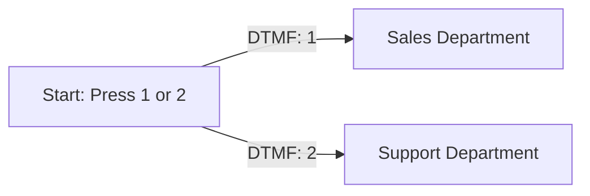

## Overview

Interactive Voice Response (IVR) menus allow callers to navigate options using their phone keypad. Hamsa makes it easy to build sophisticated IVR systems that combine traditional DTMF menu navigation with AI-powered conversation.

<Info>
**What You'll Learn:**
- Building traditional IVR menus with DTMF
- Combining IVR with conversational AI
- Best practices for menu design
- Advanced multi-level menu structures
- Accessibility and user experience
</Info>

## IVR Fundamentals

### What is IVR?

IVR (Interactive Voice Response) is a telephony technology that allows callers to interact with a phone system through voice or keypad input. In Hamsa, you can build IVR menus using:

- **DTMF (Dual-Tone Multi-Frequency)** - Keypad button presses
- **Natural Language** - Spoken responses understood by AI
- **Hybrid** - Combination of both

### DTMF Keys Available

**Standard Keys:**

- **0-9** - Numeric keys
- **\*** (Star) - Often used for "back" or special functions
- **#** (Pound/Hash) - Often used for "confirm" or "submit"

**Common Conventions:**

```
0 = Operator/Human Agent
1-9 = Menu options
* = Go back/Previous menu
# = Confirm/Submit/Continue
```

## Building Your First IVR Menu

### Simple Two-Option Menu

Let's build a basic menu: "Press 1 for Sales, Press 2 for Support"

<Steps>
  <Step title="Create Flow Agent">
    Navigate to **Agents** → **Create New Agent** → **Flow Agent**
  </Step>
  <Step title="Configure Start Node">
    Set the greeting message:
    ```
    "Thank you for calling Acme Corporation.
    Press 1 for Sales, or Press 2 for Support."
    ```
  </Step>
  <Step title="Add DTMF Transitions">
    On the Start node:
    - Click **Add Transition**
    - Select **DTMF** as transition type
    - Click key **1** on the keypad
    - Label: "Press 1"
  </Step>
  <Step title="Create Sales Node">
    - Add a new Conversation node
    - Connect the "Press 1" transition to it
    - Set message: "Connecting you to Sales..."
  </Step>
  <Step title="Repeat for Support">
    - Add transition for key **2**
    - Create Support node
    - Connect transition
  </Step>
  <Step title="Test">
    Test the flow by pressing 1 or 2 during the greeting
  </Step>
</Steps>

**Flow Diagram:**



### Adding Natural Language Fallback

Enhance your menu to accept both DTMF and spoken responses:

```yaml
Start Node:
  Message: "Thank you for calling Acme Corporation.
           Press 1 or say 'Sales' for our sales team.
           Press 2 or say 'Support' for customer support."

  Transitions:
    - Type: DTMF, Key: 1 → Sales Node
    - Type: DTMF, Key: 2 → Support Node
    - Type: Natural Language, Condition: "caller mentions sales" → Sales Node
    - Type: Natural Language, Condition: "caller mentions support" → Support Node
    - Type: Always (Fallback) → Clarification Node
```

<Tip>
**Hybrid Approach Benefits:**
- Accessible to users who prefer keypad
- Natural for users who prefer speaking
- Faster navigation for power users
- Better accessibility compliance
</Tip>

## Multi-Level Menu Structures

### Three-Level Menu Example

Build a comprehensive support system:

**Level 1: Main Menu**

```yaml
Main Menu Node:
  Message: 'Welcome to Acme Support.
    Press 1 for Product Support.
    Press 2 for Billing Questions.
    Press 3 for Technical Support.
    Press 0 to speak with an operator.'

  Transitions:
    - DTMF: 1 → Product Support Menu
    - DTMF: 2 → Billing Menu
    - DTMF: 3 → Technical Support Menu
    - DTMF: 0 → Operator Transfer
```

**Level 2: Product Support Sub-Menu**

```yaml
Product Support Menu:
  Message: "Product Support.
           Press 1 for Software Products.
           Press 2 for Hardware Products.
           Press 3 for Accessories.
           Press * to return to the main menu."

  Transitions:
    - DTMF: 1 → Software Support
    - DTMF: 2 → Hardware Support
    - DTMF: 3 → Accessories Support
    - DTMF: * → Main Menu
```

**Level 3: Specific Product Support**

```yaml
Software Support Node:
  Message: "Software Support.
           Press 1 for installation help.
           Press 2 for licensing questions.
           Press 3 for troubleshooting.
           Press * to go back."

  Transitions:
    - DTMF: 1 → Installation Agent
    - DTMF: 2 → Licensing Agent
    - DTMF: 3 → Troubleshooting Agent
    - DTMF: * → Product Support Menu
```

**Visual Flow:**

```
Main Menu
├─ 1: Product Support
│  ├─ 1: Software
│  │  ├─ 1: Installation
│  │  ├─ 2: Licensing
│  │  └─ 3: Troubleshooting
│  ├─ 2: Hardware
│  └─ 3: Accessories
├─ 2: Billing
├─ 3: Technical Support
└─ 0: Operator
```

### Managing Menu Depth

<Warning>
**Don't Go Too Deep**
- Maximum 3 levels recommended
- Users get lost beyond 3 levels
- Each level increases abandonment risk
- Consider conversational AI for complex routing
</Warning>

**When to use deep menus:**

- Large organization with many departments
- Complex product catalog
- Specialized support teams
- Compliance requirements

**When to use conversational AI instead:**

- Fewer than 10 total options
- Options require explanation
- User intent is ambiguous
- Better user experience desired

## Global DTMF Triggers

Create shortcuts accessible from anywhere in the call.

### Setting Up Global Shortcuts

**Operator Transfer (Always Available)**

<Steps>
  <Step title="Create Transfer Node">
    Add a Transfer Call node to your flow
  </Step>
  <Step title="Enable Global Mode">
    In node settings:
    - Toggle **Global** ON
    - Select trigger type: **DTMF**
    - Choose key: **0**
  </Step>
  <Step title="Configure Transfer">
    - Phone number: `+1-800-OPERATOR`
    - Message: "Transferring you to an operator..."
  </Step>
</Steps>

**Result:** Users can press 0 at any point to reach an operator.

### Common Global Shortcuts

```yaml
Global Shortcuts:

Press 0: Operator Transfer
  Type: Transfer Call Node
  Global: Yes
  DTMF Key: 0
  Message: "Connecting you to an operator..."

Press 9: Repeat Menu
  Type: Conversation Node
  Global: Yes
  DTMF Key: 9
  Message: "Main menu: Press 1 for Sales, 2 for Support..."

Press *: Go Back
  Type: Router Node
  Global: Yes
  DTMF Key: *
  Logic: Return to previous menu (context-aware)

Press #: Main Menu
  Type: Conversation Node
  Global: Yes
  DTMF Key: #
  Message: "Returning to main menu..."
```

<Note>
**Global Triggers Best Practices:**
- Always offer 0 for operator
- Use 9 for menu repeat
- Use * for back/previous
- Use # for main menu/start over
- Announce these options in welcome greeting
</Note>

## Advanced Menu Patterns

### Time-Based Routing

Route calls differently based on time of day:

```yaml
Start Node:
  Message: "Thank you for calling Acme Corporation."

Router Node: Time Check
  Conditions:
    - {{current_weekday}} IN ["Saturday", "Sunday"] → Weekend Menu
    - {{current_time}} < "09:00" → After Hours Menu
    - {{current_time}} > "17:00" → After Hours Menu
    - Always → Business Hours Menu

Weekend Menu:
  Message: "Our offices are closed on weekends.
           Press 1 to leave a message.
           Press 2 for emergency support.
           Press 3 to hear our business hours."

Business Hours Menu:
  Message: "Press 1 for Sales.
           Press 2 for Support.
           Press 3 for Billing."
```

### Language Selection Menu

Offer multi-language support:

```yaml
Language Selection Node:
  Message: 'Thank you for calling Acme Corporation.
    For English, press 1.
    Para Español, oprima el dos.
    Pour le Français, appuyez sur le trois.'

  Transitions:
    - DTMF: 1 → English Menu
    - DTMF: 2 → Spanish Menu
    - DTMF: 3 → French Menu

English Menu:
  Language: en-US
  Voice: aura-asteria-en
  Message: 'Welcome! How can I help you today?'

Spanish Menu:
  Language: es-MX
  Voice: aura-sofia-es
  Message: 'Bienvenido! ¿Cómo puedo ayudarte hoy?'
```

### Priority Routing Menu

Fast-track VIP or urgent calls:

```yaml
Priority Menu:
  Message: "Thank you for calling.
    If this is an emergency, press 1 now.
    If you're a VIP member, press 2.
    For all other callers, press 3."

  Transitions:
    - DTMF: 1 → Emergency Transfer (Immediate)
    - DTMF: 2 → VIP Verification → VIP Queue
    - DTMF: 3 → Standard Menu
```

### Callback Offer Menu

Reduce wait times with callback option:

```yaml
Queue Status Node:
  Message: 'All agents are currently busy.
    Your estimated wait time is {{estimated_wait}} minutes.
    Press 1 to hold.
    Press 2 to request a callback.
    Press 3 to leave a voicemail.'

  Transitions:
    - DTMF: 1 → Hold Music Node
    - DTMF: 2 → Callback Collection Flow
    - DTMF: 3 → Voicemail Node
```

## Menu Design Best Practices

### Clear Menu Announcements

<AccordionGroup>
  <Accordion title="Keep Options Short">
    **Good:**
    ```
    "Press 1 for Sales. Press 2 for Support."
    ```

    **Bad:**
    ```
    "If you're interested in learning more about our products, speaking
    with a sales representative, getting a quote, or discussing pricing,
    please press 1. If you're experiencing technical difficulties, need
    help with your account, want to report a problem, or have general
    questions about using our service, please press 2."
    ```

    **Why:** Callers forget early options by the time you finish.

  </Accordion>

  <Accordion title="Limit Options Per Menu">
    **Recommended:** 3-5 options per menu

    **Maximum:** 7 options

    **Why:**
    - Human working memory limit
    - Reduces cognitive load
    - Faster decision making
    - Lower abandonment rate

    **If you have 10+ options:**
    - Break into sub-menus
    - Use conversational AI instead
    - Prioritize most common options

  </Accordion>

  <Accordion title="Order Options Strategically">
    **Put most common options first:**
    ```
    "Press 1 for Customer Support (80% of calls)
    Press 2 for Sales (15% of calls)
    Press 3 for Billing (5% of calls)"
    ```

    **Consider priority:**
    ```
    "If this is an emergency, press 1.
    For all other calls, press 2."
    ```

    **Alphabetical can work:**
    ```
    "Press 1 for Accounting
    Press 2 for Billing
    Press 3 for Customer Service"
    ```

  </Accordion>

  <Accordion title="Always Provide Operator Option">
    **Include in every menu:**
    ```
    "...or press 0 to speak with an operator."
    ```

    **Why:**
    - Required by many regulations
    - Accessibility requirement
    - Handles edge cases
    - Reduces frustration
    - Improves satisfaction

  </Accordion>
</AccordionGroup>

### Menu Pacing

**Timing Recommendations:**

```yaml
Menu Timing:
  Pause after greeting: 0.5 seconds
  Pause between options: 0.3 seconds
  Pause before repeat: 1.0 seconds
  Wait for input: 5-10 seconds
  Timeout after: 10 seconds

Example:
"Thank you for calling Acme."
[0.5s pause]
"Press 1 for Sales."
[0.3s pause]
"Press 2 for Support."
[0.3s pause]
"Or press 0 for an operator."
[Wait 10s for input]
```

### Repeat and Replay Options

**Automatic Repeat:**

```yaml
Menu Node:
  Message: "Press 1 for Sales, 2 for Support."

  Timeout Handling:
    After 10s silence:
      "I didn't receive a selection.
      Press 1 for Sales, 2 for Support, or 0 for an operator."

    After 2nd timeout:
      "I'll transfer you to an operator who can help."
      → Transfer to Operator
```

**Manual Repeat:**

```yaml
Global Repeat Menu Node:
  Global: Yes
  DTMF Key: 9
  Message: 'Main menu: Press 1 for Sales, 2 for Support,
    3 for Billing, or 0 for an operator.'
```

## Error Handling

### Invalid Input Handling

```yaml
Menu Node:
  Message: "Press 1 for Sales or 2 for Support."

Invalid Input Node:
  Message: "I didn't recognize that selection.
           Press 1 for Sales or 2 for Support."

  After 2 invalid attempts:
    "Let me connect you with someone who can help."
    → Transfer to Operator
```

### No Input Handling

```yaml
No Input Strategy:

First timeout (10s):
  "Are you still there? Press any key to continue,
  or I can connect you with an operator."

Second timeout (10s):
  "I haven't heard from you. I'll transfer you to
  someone who can assist."
  → Transfer to Operator

Third timeout (10s):
  "Thank you for calling. Goodbye."
  → End Call
```

### Wrong Menu Navigation

```yaml
Wrong Menu Detection:

If caller presses invalid key multiple times:
  "It seems like you're having trouble with the menu.
  Let me connect you to an operator."
  → Transfer

If caller says "operator" or "representative":
  → Bypass menu, transfer immediately

If caller says "I don't know" or similar:
  "No problem! Let me ask you a few questions to help."
  → Conversational routing
```

## Combining IVR with AI

### Hybrid Menu Pattern

Best of both worlds: structure + flexibility

```yaml
Hybrid Menu Node:
  Message: "Thank you for calling Acme.
           You can press a number or just tell me what you need.
           Press 1 for Sales.
           Press 2 for Support.
           Or simply tell me how I can help."

  Transitions:
    - DTMF: 1 → Sales
    - DTMF: 2 → Support
    - Natural Language: "mentions sales, pricing, quote" → Sales
    - Natural Language: "mentions problem, issue, help" → Support
    - Natural Language: "any other input" → AI Router

AI Router Node:
  Type: Conversation
  Prompt: "Understand what the caller needs and route appropriately."

  Transitions:
    - Condition: "sales related" → Sales
    - Condition: "support related" → Support
    - Condition: "unclear" → Clarification
```

### Smart Menu Skip

Skip menus for known callers:

```yaml
Entry Point:

Router: Check Caller History
  Conditions:
    - {{user_number}} IN known_customers AND
      {{last_call_reason}} == "support" →
      "Welcome back! Are you calling about the same issue?"
      → Support (skip menu)

    - {{is_vip}} == true →
      "Welcome, {{customer_name}}. How can I help you today?"
      → VIP Agent (skip menu)

    - Always →
      → Main Menu
```

### Conversational Menu Navigation

Let AI handle complex menu structures:

```yaml
AI Menu Navigator:
  Message: 'What can I help you with today?'

  Agent Prompt: 'The caller can ask for:
    - Sales (route to sales team)
    - Support (ask for product type, then route)
    - Billing (verify account, then route)
    - General info (answer directly)

    Classify their intent and route appropriately.
    If unclear, ask one clarifying question.'

  Transitions: Based on AI classification → Appropriate department
```

## Complete IVR Examples

### Example 1: Small Business Reception

```yaml
Main Menu:
  Message: "Thank you for calling Acme Services.
           Press 1 for our Business Hours and Location.
           Press 2 to Schedule an Appointment.
           Press 3 for Billing Questions.
           Or press 0 to speak with someone.
           You can also just tell me what you need."

  DTMF Transitions:
    1 → Business Info
    2 → Appointment Scheduler
    3 → Billing Department
    0 → Receptionist

  Natural Language:
    "mentions hours, location, address" → Business Info
    "mentions appointment, schedule, book" → Appointment Scheduler
    "mentions bill, payment, invoice" → Billing Department
    Other → Receptionist

Business Info Node:
  Message: "We're open Monday through Friday, 9 AM to 5 PM.
           We're located at 123 Main Street, Suite 100.
           Would you like directions? Press 1 for yes, 2 for no."

  Transitions:
    DTMF: 1 → Send Directions (SMS/Email)
    DTMF: 2 → Main Menu
```

### Example 2: Healthcare Clinic

```yaml
Main Menu:
  Message: "Welcome to City Health Clinic.
           If this is a medical emergency, hang up and dial 911.

           To schedule or change an appointment, press 1.
           For prescription refills, press 2.
           For test results, press 3.
           For billing, press 4.
           For all other questions, press 5."

  Transitions:
    DTMF: 1 → Appointment System
    DTMF: 2 → Prescription Refills
    DTMF: 3 → Test Results (requires verification)
    DTMF: 4 → Billing
    DTMF: 5 → Nurse Line

Appointment System:
  Message: "Appointment scheduling.
           Press 1 for a new appointment.
           Press 2 to change an existing appointment.
           Press 3 to cancel an appointment."

  Transitions:
    DTMF: 1 → New Appointment Flow
    DTMF: 2 → Change Appointment Flow
    DTMF: 3 → Cancel Appointment Flow
```

### Example 3: E-commerce Order Status

```yaml
Main Menu:
  Message: "Thank you for calling ShopNow.
           Press 1 to track your order.
           Press 2 for returns and exchanges.
           Press 3 to speak with customer service.

           Or you can say your order number,
           and I'll look it up for you."

  Transitions:
    DTMF: 1 → Order Tracking
    DTMF: 2 → Returns Menu
    DTMF: 3 → Customer Service
    Natural Language: Extract order number → Direct Lookup

Order Tracking:
  Message: "Please enter your order number using your keypad,
           followed by the pound key. Or you can say it."

  DTMF Input Capture:
    Variable: order_number
    Termination Key: #
    Digit Limit: 10

  Transitions:
    Always → Lookup Order Tool → Order Status Response
```

## Testing IVR Menus

### Test Checklist

- [ ] **All DTMF keys work**

  - Test each number (0-9)
  - Test \* and # if used
  - Verify transitions go to correct nodes

- [ ] **Menu audio is clear**

  - Options easily understood
  - Proper pacing between options
  - Professional voice quality

- [ ] **Timeouts handled gracefully**

  - Test silence handling
  - Verify repeat behavior
  - Confirm timeout transfers work

- [ ] **Error handling works**

  - Test invalid key presses
  - Verify multiple errors escalate
  - Check error messages are helpful

- [ ] **Global shortcuts functional**

  - Test 0 for operator from every menu
  - Test \* for back if implemented
  - Verify shortcuts work globally

- [ ] **Navigation is intuitive**
  - Users can find what they need
  - Menus aren't too deep
  - Back navigation works
  - Can return to main menu

### Common Issues

<AccordionGroup>
  <Accordion title="Menu Too Long">
    **Problem:** Callers forget options

    **Solution:**
    - Limit to 5 options max
    - Break into sub-menus
    - Use AI routing instead

  </Accordion>

  <Accordion title="Keys Not Responding">
    **Problem:** DTMF not detected

    **Solution:**
    - Check DTMF transitions configured
    - Verify key selection in builder
    - Test with actual phone (not just browser)
    - Check network supports DTMF

  </Accordion>

  <Accordion title="Callers Getting Lost">
    **Problem:** Too many levels or unclear options

    **Solution:**
    - Simplify menu structure
    - Add "press 9 to repeat" option
    - Provide operator option
    - Add breadcrumb navigation

  </Accordion>
</AccordionGroup>

## Accessibility Considerations

<Tip>
**Make IVR Accessible:**
- Always provide operator option (0)
- Support speech input, not just DTMF
- Clear, slow menu announcements
- Repeat options on request
- Handle timeouts gracefully
- Provide alternative contact methods
</Tip>

## Next Steps

<CardGroup cols={2}>
  <Card title="DTMF Features" href="/agents/flow-agent/dtmf">
    Deep dive into DTMF capabilities
  </Card>
  <Card title="Data Collection" href="/guides/data-collection">
    Collect information with DTMF input
  </Card>
  <Card title="Call Routing" href="/guides/call-routing">
    Advanced routing patterns
  </Card>
  <Card title="Flow Agents" href="/agents/flow-agent/overview">
    Build complex conversation flows
  </Card>
</CardGroup>
