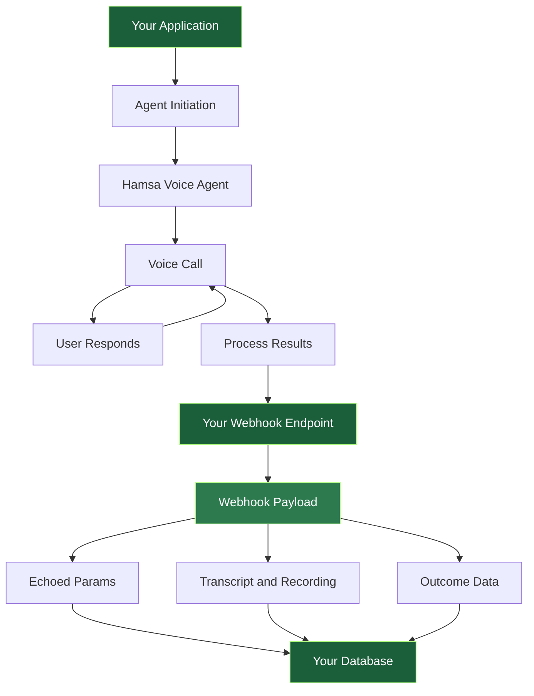

## Overview

This comprehensive guide walks you through integrating with Hamsa Voice Agent webhooks, from initial setup to production deployment. Whether you're just getting started or implementing advanced patterns, this guide has you covered.

<Info>
**What You'll Learn:**
- How to set up and configure webhook endpoints
- Understanding webhook data structures and events
- Implementing secure and reliable webhook handlers
- Best practices for production deployments
- Troubleshooting common issues
</Info>

---

## Stage 1: Getting Started

### What Are Webhooks?

Webhooks allow your applications to receive real-time notifications about call events, transcriptions, and conversation outcomes. When a voice call completes or specific events occur, Hamsa sends HTTP POST requests to your configured endpoint with relevant data.

<CardGroup cols={2}>
  <Card title="Real-time Events" icon="bolt">
    Instant notifications as calls progress, from start to completion
  </Card>
  <Card title="Call Data" icon="database">
    Full transcripts, recordings, and extracted information
  </Card>
  <Card title="Custom Parameters" icon="sliders">
    Pass ANY custom data that gets echoed back for identification
  </Card>
  <Card title="Secure Delivery" icon="shield">
    HTTPS-only with Bearer token authentication support
  </Card>
</CardGroup>

### How It Works - Complete Flow



**The flow works in three stages:**

**Initiation**: Your application sends configuration with `agentId` and custom `params` (identifiers, context data).

**Call**: User interacts with AI agent, which collects information through conversation.

**Webhook**: Hamsa POSTs results to your endpoint with transcript, recording, outcome data, and your original params echoed back.

### Key Concepts

<AccordionGroup>
  <Accordion title="Custom Parameters (params)">
    **What are they?**

    Custom parameters are ANY data you send during agent initiation. They serve two crucial purposes:

    1. **Provide context** to the agent during the conversation
    2. **Get echoed back** in webhook responses for matching records

    **Example:**
    ```json
    {
      "application_id": "12345",
      "user_id": "user-789",
      "session_id": "sess-abc-def"
    }
    ```

    All these fields will be available in the webhook's `outcomeResult` object.
  </Accordion>

  <Accordion title="Webhook Events">
    **Types of Events:**

    - `call.started` - Call begins
    - `call.answered` - Call connected
    - `transcription.update` - Real-time speech updates
    - `tool.executed` - Agent uses a tool
    - `call.ended` - Call completes (includes full data)

    Each event contains relevant data for that stage of the call lifecycle.
  </Accordion>

  <Accordion title="Echo Pattern">
    **How it works:**

    1. You send: `{ params: { application_id: "12345" } }`
    2. Agent conducts call
    3. You receive: `{ outcomeResult: { application_id: "12345", ... } }`

    This pattern allows you to match webhook responses to your database records without maintaining state.
  </Accordion>

  <Accordion title="Outcome Result">
    **What is it?**

    The `outcomeResult` object in webhook responses contains:
    - **Echoed data** - All your custom params (unchanged)
    - **Outcome data** - Information collected by the agent

    This combination lets you identify the record AND get the collected information in one payload.
  </Accordion>
</AccordionGroup>

---

## Stage 2: Setup & Configuration

### Prerequisites

Before setting up webhooks, ensure you have:

<Steps>
  <Step title="A publicly accessible server">
    Your webhook endpoint must be reachable from the internet. Use ngrok for local development.
  </Step>
  <Step title="HTTPS enabled">
    All webhook URLs must use HTTPS. HTTP endpoints will be rejected.
  </Step>
  <Step title="A web framework">
    Express.js, Flask, FastAPI, or any framework that can handle POST requests.
  </Step>
  <Step title="Basic authentication setup">
    Prepare to implement Bearer token authentication (recommended for production).
  </Step>
</Steps>

### Setting Up Your Webhook URL

#### Webhook URL Requirements

<Warning>
**HTTPS Required:**
- All webhook URLs must use HTTPS protocol
- HTTP endpoints will be rejected
- Self-signed certificates are not supported
- Certificate must be valid and not expired
</Warning>

**Valid Examples:**

```
✅ https://api.yourcompany.com/webhook/hamsa
✅ https://webhook.example.com/hamsa/events
✅ https://your-app.herokuapp.com/webhooks/calls

❌ http://api.yourcompany.com/webhook (HTTP not allowed)
❌ https://192.168.1.100/webhook (local IPs not accessible)
❌ https://localhost:3000/webhook (localhost not accessible)
```

#### Local Development Setup

For local development, use ngrok to expose your localhost:

```bash
# Install ngrok
npm install -g ngrok
# or brew install ngrok

# Start your local server
node server.js  # Runs on port 3000

# In another terminal, start ngrok
ngrok http 3000

# Use the ngrok HTTPS URL in your webhook configuration
# Example: https://abc123.ngrok.io/webhook
```

### Configuring Authentication

#### Option 1: No Authentication (Development Only)

Use for development or testing:

```json Configuration
{
  "webhookUrl": "https://abc123.ngrok.io/webhook",
  "webhookAuth": {
    "authKey": "noAuth"
  }
}
```

<Warning>
Not recommended for production. Anyone who discovers your webhook URL can send requests to it.
</Warning>

#### Option 2: Bearer Token Authentication (Recommended)

Use for production environments:

```json Configuration
{
  "webhookUrl": "https://api.yourcompany.com/webhook",
  "webhookAuth": {
    "authKey": "bearer",
    "authSecret": "Bearer your_secret_token_here"
  }
}
```

**Generating Secure Tokens:**

```bash
# Generate a random token (Linux/Mac)
openssl rand -base64 32

# Or use Node.js
node -e "console.log(require('crypto').randomBytes(32).toString('base64'))"

# Or use Python
python -c "import secrets; print(secrets.token_urlsafe(32))"
```

**Token Format Requirements:**

- Must include the word "Bearer" followed by your token
- Example: `Bearer sk_live_abc123xyz789`
- Token should be long and randomly generated
- Never commit tokens to source control

### Adding Webhook to Your Agent

<Steps>
  <Step title="Navigate to Agent Configuration">
    Go to your agent's configuration page in the Hamsa dashboard
  </Step>
  <Step title="Find Call Webhook Section">
    Scroll to the **Call Webhook** section and click to expand
  </Step>
  <Step title="Enter Webhook URL">
    Input your publicly accessible HTTPS webhook URL
  </Step>
  <Step title="Configure Authentication">
    Choose authentication method and enter your Bearer token if applicable
  </Step>
  <Step title="Save Configuration">
    Save your agent configuration to activate the webhook
  </Step>
</Steps>

<Note>
Webhooks are configured per agent. Each agent can have its own webhook URL and authentication settings.
</Note>

---

## Stage 3: Understanding Data Structures

### Agent Initiation - What You Send

When initiating the agent, you send a configuration object with the following structure:

```typescript
{
  agentId: string,           // Required: Your Hamsa agent ID
  params?: object,           // Optional: Custom parameters (ANY data you want)
  userId?: string,           // Optional: User identifier for tracking
  voiceEnablement?: boolean, // Optional: Enable voice (default: true)
  preferHeadphonesForIosDevices?: boolean, // Optional: iOS optimization
  connectionDelay?: {        // Optional: Platform-specific delays
    android?: number,
    ios?: number,
    default?: number
  }
}
```

#### Configuration Fields Reference

| Field | Type | Required | Description |
|-------|------|----------|-------------|
| `agentId` | string | ✅ Yes | Your Hamsa agent configuration ID |
| `params` | object | ⚠️ Optional | Custom parameters object - can contain ANY fields |
| `userId` | string | ⚠️ Optional | User identifier for tracking purposes |
| `voiceEnablement` | boolean | ⚠️ Optional | Enable voice interaction (default: true) |
| `preferHeadphonesForIosDevices` | boolean | ⚠️ Optional | iOS audio optimization |
| `connectionDelay` | object | ⚠️ Optional | Platform-specific connection delays |

### The `params` Object - Your Custom Data

<Info>
**Important:** The `params` object can contain ANY fields you want. All fields you pass here will be:
1. Available to the agent during the conversation
2. **Echoed back** to you in the webhook response inside `outcomeResult`
</Info>

#### Recommended Pattern

```typescript
params: {
  // IDENTIFIERS (highly recommended - used to match webhook to your records)
  user_id: string,              // Your user/customer ID
  session_id: string,           // Unique session identifier
  application_id: string,       // Application/form ID

  // CONTEXT DATA (optional - helps agent personalize conversation)
  user_name: string,            // User's name
  user_email: string,           // User's email
  user_phone: string,           // User's phone

  // BUSINESS DATA (optional - agent can reference during conversation)
  job_title: string,            // Job position
  company_name: string,         // Company name
  custom_field_1: string,       // Any other data
  custom_field_2: number,       // Can be strings, numbers, booleans
  custom_field_3: boolean,

  // INSTRUCTIONS (optional - guide agent behavior)
  interview_questions: string,  // JSON stringified array of questions
  context_data: string,         // Any additional context (CV, resume, etc.)
}
```

#### Data Types Supported in `params`

| Type | Supported | Notes |
|------|-----------|-------|
| string | ✅ Yes | Most common, use for text data |
| number | ✅ Yes | Integers and decimals |
| boolean | ✅ Yes | true/false values |
| null | ✅ Yes | Explicit null values |
| Array | ⚠️ Use JSON string | Convert arrays to JSON string: `JSON.stringify([1,2,3])` |
| Object | ⚠️ Use JSON string | Convert objects to JSON string: `JSON.stringify({key: 'value'})` |

<Note>
**Best Practice:** For complex data (arrays, objects), convert to JSON strings before passing.
</Note>

#### Complete Initiation Example

```json
{
  "agentId": "agent-123-abc",
  "params": {
    "application_id": "12345",
    "user_id": "user-789",
    "session_id": "sess-abc-def",
    "candidate_name": "John Doe",
    "candidate_email": "john@example.com",
    "candidate_phone": "+1234567890",
    "job_title": "Software Engineer",
    "company_name": "Acme Corp",
    "interview_questions": "[\"Tell me about your experience\",\"What are your salary expectations?\"]",
    "custom_note": "VIP candidate",
    "priority_level": 1,
    "require_background_check": true
  },
  "userId": "user-789",
  "voiceEnablement": true
}
```

### Webhook Events - What You Receive

#### Event Types Reference

Your webhook receives various events throughout a call's lifecycle:

| Event | When It Fires | Contains |
|-------|---------------|----------|
| **call.started** | Call begins | Caller info, timestamp, custom params |
| **call.answered** | Call connected | Connection details, ring duration |
| **transcription.update** | User/agent speaks | Real-time text, speaker identification |
| **tool.executed** | Agent uses a tool | Tool name, input, output, duration |
| **call.ended** | Call completes | Full transcript, recording, outcome data |

#### Standard Event Structure

All webhook events follow this structure:

```json
{
  "eventType": "call.ended",
  "callId": "call_uuid_12345",
  "timestamp": "2024-01-15T14:30:00.000Z",
  "projectId": "proj_abc123",
  "agentId": "agent_xyz789",
  "agentName": "Customer Support Agent",
  "data": {
    // Event-specific data
  }
}
```

### Call Ended Event - The Most Important

The `call.ended` event contains the complete conversation data:

```json
{
  "eventType": "call.ended",
  "callId": "call_uuid_12345",
  "timestamp": "2024-01-15T14:35:00.000Z",
  "projectId": "proj_abc123",
  "agentId": "agent_xyz789",
  "agentName": "Customer Support Agent",
  "data": {
    "timestamp": "2025-11-27T09:10:35.000Z",
    "data": {
      "conversationId": "conv-123-abc-456-def",
      "conversationRecording": "https://hamsa-recordings.s3.amazonaws.com/conv-123.mp3",
      "transcription": [
        { "Agent": "Hello! Thank you for joining. What is your name?" },
        { "User": "Hi, my name is John Doe." },
        { "Agent": "Nice to meet you, John. Can you tell me about your experience?" },
        { "User": "I have 5 years of experience in software development." },
        { "Agent": "Excellent. What are your salary expectations?" },
        { "User": "I'm looking for around 80,000 dollars per year." },
        { "Agent": "Thank you. What is your notice period?" },
        { "User": "I have a 2-week notice period." },
        { "Agent": "Great! That concludes our interview. Thank you!" },
        { "User": "Thank you!" }
      ],
      "outcomeResult": {
        "application_id": "12345",
        "user_id": "user-789",
        "session_id": "sess-abc-def",
        "candidate_name": "John Doe",
        "candidate_email": "john@example.com",
        "candidate_phone": "+1234567890",
        "job_title": "Software Engineer",
        "company_name": "Acme Corp",
        "interview_questions": "[\"Tell me about your experience\",\"What are your salary expectations?\"]",
        "custom_note": "VIP candidate",
        "priority_level": 1,
        "require_background_check": true,
        "expectedSalary": "80000 dollars per year",
        "noticePeriod": "2 weeks",
        "number_of_speakers": "1",
        "sentiment_score": 0.8
      }
    }
  }
}
```

#### Field Descriptions

**Top-Level Event Fields:**

| Field | Type | Description |
|-------|------|-------------|
| `eventType` | string | Type of event (e.g., "call.ended") |
| `callId` | string | Unique identifier for this call |
| `timestamp` | string | ISO 8601 timestamp when event occurred |
| `projectId` | string | Your Hamsa project ID |
| `agentId` | string | ID of the agent that handled the call |
| `agentName` | string | Name of the agent configuration |

**Conversation Data Fields (`data.data`):**

| Field | Type | Description |
|-------|------|-------------|
| `conversationId` | string | Hamsa's unique identifier for this conversation |
| `conversationRecording` | string | Full URL to audio recording file<br />Format: `.mp3` or `.wav`<br />Accessible for download |
| `transcription` | Array&lt;object&gt; | Ordered array of conversation turns |
| `outcomeResult` | object | Contains echoed params + outcome data |

#### Transcription Array Format

Each element represents one turn in the conversation:

```typescript
{
  Agent?: string,  // Present when agent spoke
  User?: string    // Present when user spoke
}
```

### Understanding `outcomeResult`

The `outcomeResult` object is where the magic happens - it contains both your echoed parameters AND newly collected outcome data.

#### Echoed Parameters (What You Sent)

These are the exact same parameters you included in the `params` object when initiating the agent. They come from your application and are returned unchanged in the webhook payload, allowing you to match the webhook to your database records.

```json
{
  "application_id": "12345",
  "user_id": "user-789",
  "session_id": "sess-abc-def",
  "candidate_name": "John Doe",
  "candidate_email": "john@example.com",
  "candidate_phone": "+1234567890",
  "job_title": "Software Engineer",
  "company_name": "Acme Corp",
  "interview_questions": "[...]",
  "custom_note": "VIP candidate",
  "priority_level": 1,
  "require_background_check": true
}
```

#### Outcome Data (New from Call)

These fields are generated during the voice call based on the conversation between the agent and the user. They come from the agent's analysis of the call and are defined in your agent's outcome configuration.

```json
{
  "expectedSalary": "80000 dollars per year",
  "noticePeriod": "2 weeks",
  "number_of_speakers": "1",
  "sentiment_score": 0.8
}
```

### Common Extracted Fields

These are fields commonly extracted by Hamsa agents (depending on your agent's configuration):

| Field | Type | Description | When Present |
|-------|------|-------------|--------------|
| `expectedSalary` | string \| null | Salary mentioned by user | If agent asked about salary |
| `noticePeriod` | string \| null | Notice period mentioned | If agent asked about availability |
| `number_of_speakers` | string \| number | Count of different speakers detected | If audio analysis enabled |
| `sentiment_score` | number \| null | Conversation sentiment (-1 to 1) | If sentiment analysis enabled |
| `intent` | string \| null | Identified user intent | If intent detection enabled |
| `resolved` | boolean \| null | Whether issue was resolved | If resolution tracking enabled |

<Info>
**Note:** The exact fields depend on your agent's configuration and outcome schema. Check with your Hamsa agent setup to see what fields are extracted.
</Info>

---

## Stage 4: Implementation

### Creating Your Webhook Endpoint

#### Node.js/Express Implementation

<Tabs>
  <Tab title="Basic Handler">
    ```typescript
    import express from 'express';

    const app = express();
    app.use(express.json());

    // Middleware to verify Bearer token
    function verifyToken(req, res, next) {
      const authHeader = req.headers.authorization;
      const expectedToken = process.env.WEBHOOK_SECRET; // Bearer your_secret_token

      if (authHeader !== expectedToken) {
        return res.status(401).json({ error: 'Unauthorized' });
      }

      next();
    }

    // Webhook endpoint
    app.post('/webhook', verifyToken, async (req, res) => {
      try {
        const event = req.body;

        console.log('Received event:', event.eventType);
        console.log('Call ID:', event.callId);

        // Handle different event types
        switch (event.eventType) {
          case 'call.started':
            await handleCallStarted(event);
            break;
          case 'call.ended':
            await handleCallEnded(event);
            break;
          case 'transcription.update':
            await handleTranscription(event);
            break;
          default:
            console.log('Unhandled event type:', event.eventType);
        }

        // Respond quickly to acknowledge receipt
        res.status(200).json({ received: true });

      } catch (error) {
        console.error('Webhook error:', error);
        res.status(500).json({ error: 'Internal server error' });
      }
    });

    app.listen(3000, () => {
      console.log('Webhook server listening on port 3000');
    });
    ```
  </Tab>

  <Tab title="Call Ended Handler">
    ```typescript
    async function handleCallEnded(event) {
      // Extract webhook data
      const { timestamp } = event.data;
      const {
        conversationId,
        conversationRecording,
        transcription,
        outcomeResult
      } = event.data.data;

      console.log('Call completed:', conversationId);
      console.log('Completed at:', timestamp);

      // Extract your custom identifiers (echoed back)
      const applicationId = outcomeResult.application_id;
      const userId = outcomeResult.user_id;
      const sessionId = outcomeResult.session_id;

      console.log('Identifiers:', { applicationId, userId, sessionId });

      // Extract collected data (new)
      const expectedSalary = outcomeResult.expectedSalary;
      const noticePeriod = outcomeResult.noticePeriod;
      const numberOfSpeakers = outcomeResult.number_of_speakers;

      console.log('Collected data:', {
        expectedSalary,
        noticePeriod,
        numberOfSpeakers
      });

      // Build transcript text from array
      const transcriptText = transcription
        .map(turn => {
          if (turn.Agent) return `Agent: ${turn.Agent}`;
          if (turn.User) return `User: ${turn.User}`;
          return '';
        })
        .filter(Boolean)
        .join('\n');

      console.log('Transcript length:', transcriptText.length);
      console.log('Recording URL:', conversationRecording);

      // Update your database
      await updateDatabase({
        applicationId,
        userId,
        sessionId,
        conversationId,
        recordingUrl: conversationRecording,
        transcript: transcriptText,
        extractedData: {
          expectedSalary,
          noticePeriod,
          numberOfSpeakers,
          sentimentScore: outcomeResult.sentiment_score
        },
        completedAt: timestamp
      });
    }

    async function updateDatabase(data) {
      // TODO: Implement your database update logic
      // Example using Prisma:
      // await prisma.call.update({
      //   where: { applicationId: data.applicationId },
      //   data: {
      //     conversationId: data.conversationId,
      //     recordingUrl: data.recordingUrl,
      //     transcript: data.transcript,
      //     expectedSalary: data.extractedData.expectedSalary,
      //     noticePeriod: data.extractedData.noticePeriod,
      //     completedAt: data.completedAt
      //   }
      // });
    }
    ```
  </Tab>
</Tabs>

#### Python/Flask Implementation

<Tabs>
  <Tab title="Basic Handler">
    ```python
    from flask import Flask, request, jsonify
    import os

    app = Flask(__name__)

    def verify_token():
        auth_header = request.headers.get('Authorization')
        expected_token = os.environ.get('WEBHOOK_SECRET')

        if auth_header != expected_token:
            return False
        return True

    @app.route('/webhook', methods=['POST'])
    def webhook():
        # Verify authentication
        if not verify_token():
            return jsonify({'error': 'Unauthorized'}), 401

        try:
            # Parse event data
            event = request.get_json()

            print(f"Event Type: {event.get('eventType')}")
            print(f"Call ID: {event.get('callId')}")

            # Handle different event types
            event_type = event.get('eventType')
            if event_type == 'call.started':
                handle_call_started(event)
            elif event_type == 'call.ended':
                handle_call_ended(event)
            elif event_type == 'transcription.update':
                handle_transcription(event)

            # Acknowledge receipt
            return jsonify({'received': True}), 200

        except Exception as e:
            print(f'Webhook error: {str(e)}')
            return jsonify({'error': 'Internal server error'}), 500

    if __name__ == '__main__':
        app.run(port=3000)
    ```
  </Tab>

  <Tab title="Call Ended Handler">
    ```python
    def handle_call_ended(event):
        # Extract webhook data
        data = event['data']
        timestamp = data['timestamp']
        conversation_data = data['data']

        conversation_id = conversation_data['conversationId']
        recording_url = conversation_data['conversationRecording']
        transcription = conversation_data['transcription']
        outcome_result = conversation_data['outcomeResult']

        print(f'Call completed: {conversation_id}')
        print(f'Completed at: {timestamp}')

        # Extract your custom identifiers (echoed back)
        application_id = outcome_result.get('application_id')
        user_id = outcome_result.get('user_id')
        session_id = outcome_result.get('session_id')

        print(f'Identifiers: {application_id}, {user_id}, {session_id}')

        # Extract collected data (new)
        expected_salary = outcome_result.get('expectedSalary')
        notice_period = outcome_result.get('noticePeriod')
        num_speakers = outcome_result.get('number_of_speakers')

        print(f'Collected data: {expected_salary}, {notice_period}, {num_speakers}')

        # Build transcript text
        transcript_parts = []
        for turn in transcription:
            if 'Agent' in turn:
                transcript_parts.append(f"Agent: {turn['Agent']}")
            elif 'User' in turn:
                transcript_parts.append(f"User: {turn['User']}")

        transcript_text = '\n'.join(transcript_parts)

        print(f'Transcript length: {len(transcript_text)}')
        print(f'Recording URL: {recording_url}')

        # Update your database
        update_database({
            'application_id': application_id,
            'user_id': user_id,
            'session_id': session_id,
            'conversation_id': conversation_id,
            'recording_url': recording_url,
            'transcript': transcript_text,
            'extracted_data': {
                'expected_salary': expected_salary,
                'notice_period': notice_period,
                'num_speakers': num_speakers,
                'sentiment_score': outcome_result.get('sentiment_score')
            },
            'completed_at': timestamp
        })

    def update_database(data):
        # TODO: Implement your database update logic
        pass
    ```
  </Tab>
</Tabs>

### Processing Events

#### Handling Different Event Types

```javascript
async function handleCallStarted(event) {
  const { callId, data } = event;
  const { callDirection, fromNumber, toNumber, params } = data.data;

  console.log(`Call started: ${callId}`);
  console.log(`Direction: ${callDirection}`);
  console.log(`From: ${fromNumber} To: ${toNumber}`);

  // Store initial call data
  await database.calls.create({
    callId,
    direction: callDirection,
    fromNumber,
    toNumber,
    customParams: params,
    status: 'in_progress',
    startedAt: data.callStartedAt
  });
}

async function handleTranscription(event) {
  const { callId, data } = event;
  const { speaker, text, confidence } = data.data;

  // Store real-time transcription
  await database.transcriptions.create({
    callId,
    speaker,
    text,
    confidence,
    timestamp: event.timestamp
  });

  // Optionally trigger real-time actions
  if (speaker === 'user' && text.toLowerCase().includes('urgent')) {
    await notifySupport({
      callId,
      message: 'User mentioned urgent issue',
      transcript: text
    });
  }
}

async function handleToolExecution(event) {
  const { callId, data } = event;
  const { toolName, input, output, duration } = data.data;

  console.log(`Tool executed: ${toolName}`);
  console.log(`Duration: ${duration}ms`);

  // Log tool usage
  await database.toolExecutions.create({
    callId,
    toolName,
    input,
    output,
    duration,
    executedAt: event.timestamp
  });
}
```

### Error Handling

#### Comprehensive Error Handling

```javascript
app.post('/webhook', async (req, res) => {
  try {
    // 1. Verify authentication
    if (!verifyToken(req)) {
      console.warn('Authentication failed:', {
        ip: req.ip,
        headers: req.headers
      });
      return res.status(401).json({ error: 'Unauthorized' });
    }

    // 2. Validate payload structure
    const event = req.body;
    if (!event.callId || !event.eventType) {
      console.error('Invalid payload:', event);
      return res.status(400).json({ error: 'Invalid payload' });
    }

    // 3. Validate event type
    const validEventTypes = [
      'call.started',
      'call.answered',
      'transcription.update',
      'tool.executed',
      'call.ended'
    ];

    if (!validEventTypes.includes(event.eventType)) {
      console.warn('Unknown event type:', event.eventType);
      // Still return 200 to acknowledge receipt
      return res.status(200).json({
        received: true,
        warning: 'Unknown event type'
      });
    }

    // 4. Process event (with timeout)
    const timeoutPromise = new Promise((_, reject) => {
      setTimeout(() => reject(new Error('Processing timeout')), 4000);
    });

    const processingPromise = processEvent(event);

    await Promise.race([processingPromise, timeoutPromise]);

    // 5. Respond successfully
    res.status(200).json({ received: true });

  } catch (error) {
    console.error('Webhook error:', {
      error: error.message,
      stack: error.stack,
      body: req.body
    });

    // Still return 200 to prevent retries for processing errors
    // Log the error for investigation
    res.status(200).json({
      received: true,
      processing_error: true,
      error_id: generateErrorId()
    });
  }
});

function generateErrorId() {
  return `err_${Date.now()}_${Math.random().toString(36).substr(2, 9)}`;
}
```

#### Validation Helper

```javascript
const Joi = require('joi');

const eventSchema = Joi.object({
  eventType: Joi.string().required(),
  callId: Joi.string().uuid().required(),
  timestamp: Joi.string().isoDate().required(),
  projectId: Joi.string().required(),
  agentId: Joi.string().required(),
  agentName: Joi.string().required(),
  data: Joi.object().required(),
});

function validateEvent(event) {
  const { error, value } = eventSchema.validate(event);

  if (error) {
    console.error('Validation error:', error.details);
    return { valid: false, error: error.details };
  }

  return { valid: true, value };
}

// Usage
app.post('/webhook', async (req, res) => {
  const validation = validateEvent(req.body);

  if (!validation.valid) {
    return res.status(400).json({
      error: 'Invalid payload',
      details: validation.error
    });
  }

  // Process validated event
  await processEvent(validation.value);
  res.status(200).json({ received: true });
});
```

---

## Stage 5: Advanced Topics

### Async Processing

For production systems, always process webhooks asynchronously to avoid timeouts and ensure reliability.

#### Queue-Based Processing

<Tabs>
  <Tab title="Bull Queue (Node.js)">
    ```javascript
    const Queue = require('bull');
    const eventQueue = new Queue('call-events', {
      redis: {
        host: '127.0.0.1',
        port: 6379
      }
    });

    // Webhook endpoint - respond immediately
    app.post('/webhook', verifyToken, async (req, res) => {
      const event = req.body;

      try {
        // Add to queue for processing
        await eventQueue.add('process-event', event, {
          attempts: 3,
          backoff: {
            type: 'exponential',
            delay: 2000
          },
          removeOnComplete: true,
          removeOnFail: false
        });

        // Respond immediately
        res.status(200).json({ received: true });

      } catch (error) {
        console.error('Queue error:', error);
        res.status(500).json({ error: 'Failed to queue event' });
      }
    });

    // Process events in background
    eventQueue.process('process-event', async (job) => {
      const event = job.data;

      console.log(`Processing event: ${event.eventType} for call ${event.callId}`);

      try {
        if (event.eventType === 'call.ended') {
          await saveToDatabase(event);
          await sendNotifications(event);
          await updateAnalytics(event);
        } else if (event.eventType === 'transcription.update') {
          await processTranscription(event);
        }

        console.log(`Successfully processed: ${event.callId}`);

      } catch (error) {
        console.error(`Processing failed for ${event.callId}:`, error);
        throw error; // Will trigger retry
      }
    });

    // Monitor queue
    eventQueue.on('completed', (job) => {
      console.log(`Job ${job.id} completed`);
    });

    eventQueue.on('failed', (job, err) => {
      console.error(`Job ${job.id} failed:`, err.message);
    });
    ```
  </Tab>

  <Tab title="Celery (Python)">
    ```python
    from celery import Celery
    from flask import Flask, request, jsonify

    app = Flask(__name__)

    # Configure Celery
    celery = Celery('tasks', broker='redis://localhost:6379/0')

    @celery.task(bind=True, max_retries=3)
    def process_webhook_event(self, event):
        """Process webhook event asynchronously"""
        try:
            event_type = event.get('eventType')
            call_id = event.get('callId')

            print(f'Processing event: {event_type} for call {call_id}')

            if event_type == 'call.ended':
                save_to_database(event)
                send_notifications(event)
                update_analytics(event)
            elif event_type == 'transcription.update':
                process_transcription(event)

            print(f'Successfully processed: {call_id}')

        except Exception as e:
            print(f'Processing failed for {call_id}: {str(e)}')
            # Retry with exponential backoff
            self.retry(exc=e, countdown=2 ** self.request.retries)

    @app.route('/webhook', methods=['POST'])
    def webhook():
        if not verify_token():
            return jsonify({'error': 'Unauthorized'}), 401

        event = request.get_json()

        # Queue event for async processing
        process_webhook_event.delay(event)

        # Respond immediately
        return jsonify({'received': True}), 200
    ```
  </Tab>
</Tabs>

### Idempotency

Prevent duplicate processing of webhook events:

#### Redis-Based Idempotency

```javascript
const redis = require('redis');
const client = redis.createClient();

async function isEventProcessed(event) {
  const eventKey = `webhook:${event.callId}:${event.eventType}:${event.timestamp}`;

  // Check if already processed
  const exists = await client.exists(eventKey);
  if (exists) {
    return true;
  }

  // Mark as processed (expire after 24 hours)
  await client.setex(eventKey, 86400, 'processed');
  return false;
}

app.post('/webhook', async (req, res) => {
  const event = req.body;

  // Check for duplicates
  const alreadyProcessed = await isEventProcessed(event);
  if (alreadyProcessed) {
    console.log('Duplicate event, skipping:', event.callId);
    return res.status(200).json({
      received: true,
      duplicate: true
    });
  }

  // Process event
  await processEvent(event);

  res.status(200).json({ received: true });
});
```

#### Database-Based Idempotency

```javascript
async function processEventIdempotent(event) {
  const eventId = `${event.callId}-${event.eventType}-${event.timestamp}`;

  try {
    // Attempt to create event record (unique constraint on eventId)
    await database.webhookEvents.create({
      eventId,
      callId: event.callId,
      eventType: event.eventType,
      eventData: event,
      processedAt: new Date(),
      status: 'processing'
    });

    // Process event
    await processEvent(event);

    // Update status
    await database.webhookEvents.update({
      where: { eventId },
      data: { status: 'completed' }
    });

  } catch (error) {
    if (error.code === 'P2002') { // Unique constraint violation
      console.log('Duplicate event detected:', eventId);
      return { duplicate: true };
    }
    throw error;
  }

  return { duplicate: false };
}
```

### Security Best Practices

<Warning>
**Security Checklist:**
- ✅ Always use HTTPS endpoints
- ✅ Implement Bearer token authentication
- ✅ Validate all incoming data
- ✅ Use strong, randomly generated tokens
- ✅ Rotate tokens periodically
- ✅ Log authentication failures
- ✅ Rate limit webhook endpoint
- ✅ Monitor for suspicious patterns
</Warning>

#### Token Management

```javascript
// ✅ GOOD - Store tokens securely
require('dotenv').config();
const WEBHOOK_SECRET = process.env.WEBHOOK_SECRET;

// ❌ BAD - Never hardcode tokens
const WEBHOOK_SECRET = 'Bearer abc123';  // Don't do this!

// ✅ GOOD - Validate token format
function isValidBearerToken(token) {
  return token && token.startsWith('Bearer ') && token.length > 20;
}

// ✅ GOOD - Rotate tokens periodically
async function rotateWebhookToken() {
  const newToken = `Bearer ${crypto.randomBytes(32).toString('base64')}`;

  // Update in secure storage
  await secretManager.updateSecret('WEBHOOK_SECRET', newToken);

  // Update in Hamsa dashboard
  await hamsaApi.updateAgentWebhook({
    agentId: 'agent-123',
    webhookAuth: {
      authKey: 'bearer',
      authSecret: newToken
    }
  });

  console.log('Webhook token rotated successfully');
}
```

#### Rate Limiting

```javascript
const rateLimit = require('express-rate-limit');

const webhookLimiter = rateLimit({
  windowMs: 1 * 60 * 1000, // 1 minute
  max: 100, // Limit each IP to 100 requests per windowMs
  message: 'Too many webhook requests from this IP',
  standardHeaders: true,
  legacyHeaders: false,
  skip: (req) => {
    // Skip rate limiting for valid tokens
    return verifyToken(req);
  }
});

app.post('/webhook', webhookLimiter, verifyToken, async (req, res) => {
  // Process webhook
});
```

#### IP Whitelisting (Optional)

```javascript
const ALLOWED_IPS = [
  '34.123.45.67',  // Hamsa webhook server IP
  '52.89.12.34'    // Backup server IP
];

function checkIpWhitelist(req, res, next) {
  const clientIp = req.ip || req.connection.remoteAddress;

  if (!ALLOWED_IPS.includes(clientIp)) {
    console.warn('Unauthorized IP:', clientIp);
    return res.status(403).json({ error: 'Forbidden' });
  }

  next();
}

app.post('/webhook', checkIpWhitelist, verifyToken, async (req, res) => {
  // Process webhook
});
```

### Use Cases & Patterns

#### CRM Integration

```javascript
async function syncToCRM(event) {
  if (event.eventType !== 'call.ended') return;

  const { outcomeResult, transcription } = event.data.data;
  const { fromNumber } = event.data.data;

  // Build transcript text
  const transcriptText = transcription
    .map(turn => Object.values(turn)[0])
    .join('\n');

  // Update customer record
  await crm.contacts.upsert({
    where: { phone: fromNumber },
    update: {
      lastCallDate: event.timestamp,
      lastCallDuration: event.data.data.callDuration,
      lastCallNotes: transcriptText,
      customFields: {
        intent: outcomeResult.intent,
        sentiment: outcomeResult.sentiment_score,
        resolved: outcomeResult.resolved
      }
    },
    create: {
      phone: fromNumber,
      firstCallDate: event.timestamp,
      source: 'ai_agent'
    }
  });

  // Create activity record
  await crm.activities.create({
    type: 'phone_call',
    contactPhone: fromNumber,
    subject: `AI Agent Call - ${outcomeResult.intent || 'General'}`,
    description: transcriptText,
    outcome: outcomeResult.resolved ? 'resolved' : 'needs_followup',
    recordingUrl: event.data.data.conversationRecording,
    date: event.timestamp
  });
}
```

#### Analytics Dashboard

```javascript
async function updateAnalytics(event) {
  if (event.eventType !== 'call.ended') return;

  const { callDuration, outcomeResult } = event.data.data;

  await analytics.track({
    event: 'Call Completed',
    properties: {
      callId: event.callId,
      agentId: event.agentId,
      agentName: event.agentName,
      duration: callDuration,
      intent: outcomeResult.intent,
      sentiment: outcomeResult.sentiment_score,
      resolved: outcomeResult.resolved,
      speakers: outcomeResult.number_of_speakers,
      timestamp: event.timestamp
    }
  });

  // Update real-time dashboard metrics
  await dashboard.increment('total_calls');
  await dashboard.increment(`calls_by_intent.${outcomeResult.intent}`);
  await dashboard.addToAverage('average_duration', callDuration);

  if (outcomeResult.resolved) {
    await dashboard.increment('resolved_calls');
  }
}
```

#### Notification System

```javascript
async function sendNotifications(event) {
  if (event.eventType !== 'call.ended') return;

  const { outcomeResult, callDuration } = event.data.data;

  // High-priority notifications
  if (outcomeResult.priority === 'urgent' || !outcomeResult.resolved) {
    await slack.sendMessage({
      channel: '#support-team',
      text: '🚨 Urgent call requires attention',
      blocks: [
        {
          type: 'section',
          text: {
            type: 'mrkdwn',
            text: `*Call ID:* ${event.callId}\n*Agent:* ${event.agentName}\n*Duration:* ${callDuration}s`
          }
        },
        {
          type: 'section',
          fields: [
            { type: 'mrkdwn', text: `*Intent:*\n${outcomeResult.intent || 'Unknown'}` },
            { type: 'mrkdwn', text: `*Resolved:*\n${outcomeResult.resolved ? '✅ Yes' : '❌ No'}` },
            { type: 'mrkdwn', text: `*Sentiment:*\n${outcomeResult.sentiment_score || 'N/A'}` }
          ]
        },
        {
          type: 'actions',
          elements: [
            {
              type: 'button',
              text: { type: 'plain_text', text: 'View Details' },
              url: `https://dashboard.example.com/calls/${event.callId}`
            }
          ]
        }
      ]
    });
  }

  // Email summary
  await emailService.send({
    to: 'team@company.com',
    subject: `Call Summary - ${event.callId}`,
    template: 'call-summary',
    data: {
      callId: event.callId,
      agentName: event.agentName,
      duration: callDuration,
      transcript: event.data.data.transcription,
      outcome: outcomeResult,
      recordingUrl: event.data.data.conversationRecording
    }
  });
}
```

---

## Stage 6: Troubleshooting & Support

### Common Issues

<AccordionGroup>
  <Accordion title="Webhook not receiving data">
    **Symptoms:**
    - No webhook events arriving at your endpoint
    - Call completes but no POST request received

    **Possible Causes:**
    1. Webhook URL is not publicly accessible
    2. Webhook URL not configured in Hamsa dashboard
    3. Firewall/security rules blocking POST requests
    4. Server not running or crashed
    5. HTTPS certificate invalid

    **Solutions:**

    ```bash
    # Test your webhook endpoint
    curl -X POST https://your-endpoint.com/webhook \
      -H "Content-Type: application/json" \
      -H "Authorization: Bearer your_token" \
      -d '{"test": true, "eventType": "test", "callId": "test-123", "timestamp": "2024-01-01T00:00:00.000Z"}'

    # Should return 200 OK
    # If not, check:
    # 1. Is your server running?
    # 2. Is the URL correct?
    # 3. Is HTTPS configured properly?
    # 4. Are firewall rules allowing traffic?
    ```

    **For Local Development:**

    ```bash
    # Use ngrok to expose localhost
    ngrok http 3000

    # Use the ngrok HTTPS URL in your webhook configuration
    # Example: https://abc123.ngrok.io/webhook
    ```
  </Accordion>

  <Accordion title="Cannot match webhook to your record">
    **Symptoms:**
    - Receiving webhook data but can't identify which record it belongs to
    - Missing application_id or user_id in outcomeResult

    **Causes:**
    - Not passing unique identifier in `params` during initiation
    - Identifier not being echoed correctly
    - Wrong field name being checked

    **Solutions:**

    ```javascript
    // ✅ GOOD - Always include unique identifiers
    const config = {
      agentId: 'agent-123',
      params: {
        application_id: applicationId.toString(),  // Unique identifier
        user_id: userId.toString(),                // Secondary identifier
        session_id: generateSessionId()            // Session tracking
      }
    };

    // In webhook handler - verify identifiers exist
    app.post('/webhook', async (req, res) => {
      const { outcomeResult } = req.body.data.data;

      console.log('Received outcomeResult:', outcomeResult);

      const applicationId = outcomeResult.application_id;

      if (!applicationId) {
        console.error('Missing application_id in webhook');
        // Log full payload for debugging
        console.error('Full payload:', JSON.stringify(req.body, null, 2));
        return res.status(400).json({ error: 'Missing identifier' });
      }

      // Proceed with matching
      const record = await database.findByApplicationId(applicationId);
      // ...
    });
    ```

    **Debugging Tips:**

    ```javascript
    // Log what you're sending during initiation
    console.log('Initiating agent with params:', config.params);

    // Log what you receive in webhook
    console.log('Received in webhook:', outcomeResult);

    // Compare field names (case-sensitive!)
    // application_id !== applicationId
    ```
  </Accordion>

  <Accordion title="Authentication Failures (401 Unauthorized)">
    **Symptoms:**
    - Receiving 401 Unauthorized responses
    - Webhook attempts shown in logs but rejected

    **Causes:**
    - Bearer token mismatch
    - Token format incorrect
    - Missing "Bearer" prefix
    - Token changed in dashboard but not in code

    **Solutions:**

    ```javascript
    // ✅ CORRECT format
    {
      "webhookAuth": {
        "authKey": "bearer",
        "authSecret": "Bearer sk_live_abc123xyz789"
      }
    }

    // ❌ Common mistakes:
    // "authSecret": "sk_live_abc123xyz789"  // Missing "Bearer"
    // "authSecret": "bearer sk_live_abc123xyz789"  // Lowercase "bearer"
    // "authKey": "noAuth" with authSecret set  // Conflicting settings

    // Debug token mismatch:
    app.post('/webhook', (req, res) => {
      const receivedAuth = req.headers.authorization;
      const expectedAuth = process.env.WEBHOOK_SECRET;

      console.log('Received auth:', receivedAuth);
      console.log('Expected auth:', expectedAuth);
      console.log('Match:', receivedAuth === expectedAuth);

      if (receivedAuth !== expectedAuth) {
        console.error('Auth mismatch!');
        console.error('Length - Received:', receivedAuth?.length, 'Expected:', expectedAuth?.length);
        return res.status(401).json({ error: 'Unauthorized' });
      }

      // Continue...
    });
    ```
  </Accordion>

  <Accordion title="Missing Events">
    **Symptoms:**
    - Receiving some events but not all
    - `call.started` received but not `call.ended`

    **Causes:**
    1. Webhook endpoint returning errors for some events
    2. Timeout (not responding within 5 seconds)
    3. Network connectivity issues during specific events
    4. Processing logic throwing errors for certain event types

    **Solutions:**

    ```javascript
    // Always respond quickly (under 5 seconds)
    app.post('/webhook', async (req, res) => {
      const event = req.body;

      // Acknowledge immediately
      res.status(200).json({ received: true });

      // Process asynchronously
      setImmediate(() => {
        processEvent(event).catch((err) => {
          console.error('Processing error:', err);
          // Event already acknowledged, error won't cause retry
        });
      });
    });

    // Add monitoring to track all event types
    const eventCounts = {};

    app.post('/webhook', (req, res) => {
      const eventType = req.body.eventType;
      eventCounts[eventType] = (eventCounts[eventType] || 0) + 1;

      console.log('Event counts:', eventCounts);
      // Should see: { 'call.started': 1, 'transcription.update': 15, 'call.ended': 1 }

      res.status(200).json({ received: true });
    });
    ```
  </Accordion>

  <Accordion title="Duplicate Events">
    **Symptoms:**
    - Receiving the same event multiple times
    - Database records being created twice

    **Cause:**
    - Webhook retries due to slow responses
    - Network issues causing retransmission
    - Not implementing idempotency

    **Solution:**

    ```javascript
    // Implement idempotency using Redis
    const redis = require('redis').createClient();

    app.post('/webhook', async (req, res) => {
      const event = req.body;
      const eventKey = `webhook:${event.callId}:${event.eventType}:${event.timestamp}`;

      // Check if already processed
      const exists = await redis.exists(eventKey);
      if (exists) {
        console.log('Duplicate event detected:', eventKey);
        return res.status(200).json({
          received: true,
          duplicate: true
        });
      }

      // Mark as processed (expire after 24 hours)
      await redis.setex(eventKey, 86400, 'processed');

      // Process event
      await processEvent(event);

      res.status(200).json({ received: true });
    });
    ```
  </Accordion>

  <Accordion title="Missing or Null Fields in outcomeResult">
    **Symptoms:**
    - Expected fields are `null` or `undefined`
    - Outcome data not present

    **Causes:**
    - Agent didn't collect that information during call
    - Field name mismatch with agent configuration
    - User didn't provide the information
    - Agent configuration doesn't include that extraction

    **Solutions:**

    ```javascript
    // Always handle optional fields gracefully
    const expectedSalary = outcomeResult.expectedSalary ?? 'Not provided';
    const noticePeriod = outcomeResult.noticePeriod || null;

    // Distinguish between null (not collected) and undefined (field missing)
    if (outcomeResult.expectedSalary === undefined) {
      console.log('Field not in agent configuration');
    } else if (outcomeResult.expectedSalary === null) {
      console.log('User did not provide salary information');
    } else {
      console.log('Salary collected:', outcomeResult.expectedSalary);
    }

    // Log all available fields for debugging
    console.log('Available outcomeResult fields:',
      Object.keys(outcomeResult)
    );
    ```
  </Accordion>

  <Accordion title="Complex Data Not Preserved (Arrays/Objects)">
    **Symptoms:**
    - Arrays or objects sent in `params` are not preserved correctly
    - Receiving stringified data or corrupted structures

    **Cause:**
    - Not converting complex data to JSON strings before sending

    **Solution:**

    ```javascript
    // ✅ GOOD - Convert to JSON string before sending
    const config = {
      agentId: 'agent-123',
      params: {
        application_id: '12345',
        interview_questions: JSON.stringify([
          "Tell me about your experience",
          "What are your salary expectations?"
        ]),
        candidate_data: JSON.stringify({
          name: "John Doe",
          skills: ["JavaScript", "Python"]
        })
      }
    };

    // In webhook handler - parse JSON strings
    const questions = JSON.parse(outcomeResult.interview_questions);
    const candidateData = JSON.parse(outcomeResult.candidate_data);

    console.log('Questions:', questions);
    console.log('Candidate:', candidateData);
    ```
  </Accordion>
</AccordionGroup>

### Testing Your Webhook

#### Local Testing with cURL

```bash
# Test basic connectivity
curl -X POST https://your-endpoint.com/webhook \
  -H "Content-Type: application/json" \
  -d '{"test": true}'

# Test with authentication
curl -X POST https://your-endpoint.com/webhook \
  -H "Content-Type: application/json" \
  -H "Authorization: Bearer your_secret_token" \
  -d '{"test": true}'

# Test with full call.ended payload
curl -X POST https://your-endpoint.com/webhook \
  -H "Content-Type: application/json" \
  -H "Authorization: Bearer your_secret_token" \
  -d '{
    "eventType": "call.ended",
    "callId": "test-call-123",
    "timestamp": "2024-01-15T14:35:00.000Z",
    "projectId": "proj_test",
    "agentId": "agent_test",
    "agentName": "Test Agent",
    "data": {
      "timestamp": "2024-01-15T14:35:00.000Z",
      "data": {
        "conversationId": "conv-test-123",
        "conversationRecording": "https://example.com/recording.mp3",
        "transcription": [
          {"Agent": "Hello, how can I help you?"},
          {"User": "I need assistance."}
        ],
        "outcomeResult": {
          "application_id": "12345",
          "user_id": "user-789",
          "expectedSalary": "80000",
          "noticePeriod": "2 weeks"
        }
      }
    }
  }'
```

#### Monitoring & Logging

```javascript
// Add comprehensive logging
const winston = require('winston');

const logger = winston.createLogger({
  level: 'info',
  format: winston.format.json(),
  transports: [
    new winston.transports.File({ filename: 'webhook-errors.log', level: 'error' }),
    new winston.transports.File({ filename: 'webhook-all.log' })
  ]
});

app.post('/webhook', async (req, res) => {
  const event = req.body;

  logger.info('Webhook received', {
    eventType: event.eventType,
    callId: event.callId,
    timestamp: event.timestamp,
    ip: req.ip
  });

  try {
    await processEvent(event);

    logger.info('Webhook processed successfully', {
      callId: event.callId,
      eventType: event.eventType
    });

    res.status(200).json({ received: true });

  } catch (error) {
    logger.error('Webhook processing failed', {
      callId: event.callId,
      eventType: event.eventType,
      error: error.message,
      stack: error.stack
    });

    // Still return 200
    res.status(200).json({
      received: true,
      processing_error: true
    });
  }
});
```

---

## Integration Checklist

### Before Going Live

<Steps>
  <Step title="Data Structure Planning">
    Define what custom params you'll send in `params` (identifiers, context). Document your `params` structure for your team. Plan how you'll use echoed data to match records. Decide what outcome data you expect from agent. Ensure identifiers are unique and persistent.
  </Step>

  <Step title="Webhook Setup">
    Create webhook endpoint (POST route). Make endpoint publicly accessible (use ngrok for testing). Configure webhook URL in Hamsa dashboard. Test webhook receives POST requests. Verify webhook returns 200 OK within 5 seconds. Implement Bearer token authentication.
  </Step>

  <Step title="Implementation">
    Implement event type handling (call.started, call.ended, etc.). Add data extraction from outcomeResult. Implement database updates. Add transcript parsing. Handle recording URL storage. Test with missing/null fields.
  </Step>

  <Step title="Error Handling">
    Validate incoming payload structure. Handle authentication failures. Implement proper error logging. Add timeout handling. Test error scenarios.
  </Step>

  <Step title="Advanced Features">
    Implement async processing (queue-based). Add idempotency checks. Set up rate limiting. Add monitoring and alerting. Implement retry logic.
  </Step>

  <Step title="Testing">
    Test with sample initiation data. Verify all custom params are echoed correctly. Test transcript parsing. Test recording URL access. Test with missing/null fields. Test error handling (invalid data, missing identifiers). Load test with multiple concurrent webhooks.
  </Step>

  <Step title="Production Deployment">
    Use HTTPS for webhook endpoint. Use strong Bearer token authentication. Add webhook authentication verification. Add comprehensive logging and monitoring. Set up error alerts. Document your integration. Train team on monitoring.
  </Step>
</Steps>

---

## Summary

### Key Takeaways

<CardGroup cols={3}>
  <Card title="Initiation Data" icon="rocket">
    Send configuration with `agentId` and `params` containing ANY custom data
  </Card>

  <Card title="Echo Pattern" icon="repeat">
    All fields in `params` are echoed back in webhook's `outcomeResult`
  </Card>

  <Card title="Identifiers" icon="fingerprint">
    Always include unique identifiers to match webhooks to your records
  </Card>

  <Card title="Event Types" icon="bell">
    Handle different event types: started, answered, transcription, ended
  </Card>

  <Card title="Quick Response" icon="bolt">
    Always respond with 200 OK within 5 seconds to avoid timeouts
  </Card>

  <Card title="Async Processing" icon="clock">
    Use queues for time-consuming operations after acknowledging receipt
  </Card>

  <Card title="Idempotency" icon="shield-check">
    Implement duplicate detection using callId + eventType + timestamp
  </Card>

  <Card title="Validation" icon="check">
    Always validate echoed identifiers and handle missing fields
  </Card>

  <Card title="Security" icon="lock">
    Use HTTPS, Bearer tokens, and validate all incoming data
  </Card>
</CardGroup>

### Quick Reference

**Data Flow:**

```
YOU SEND (Initiation):
params: { application_id: "12345", user_name: "John", ... }

         ↓ [ Call Happens ] ↓

YOU RECEIVE (Webhook):
outcomeResult: {
  application_id: "12345",     // ← Your data (echoed)
  user_name: "John",           // ← Your data (echoed)
  expectedSalary: "80k",       // ← New data (collected)
  noticePeriod: "2 weeks"      // ← New data (collected)
}
```

**Integration Phases:**

| Phase | What You Send/Receive | Purpose |
|-------|----------------------|---------|
| **Initiation** | Configuration with `params` | Send identifiers + context to agent |
| **Call** | N/A (agent conducts call) | Agent collects information from user |
| **Webhook** | POST with echoed params + new data | Receive results and match to your records |

---

## Next Steps

<CardGroup cols={2}>
  <Card title="Webhooks Feature" href="/features/webhooks" icon="webhook">
    Detailed webhook events reference
  </Card>
  <Card title="API Integration" href="/guides/api-integration" icon="plug">
    Integrate with external APIs using tools
  </Card>
  <Card title="Voice Agents SDK" href="/api-reference/voice-agents-sdk" icon="code">
    Complete SDK documentation
  </Card>
  <Card title="Data Collection" href="/guides/data-collection" icon="clipboard-list">
    Advanced data extraction patterns
  </Card>
</CardGroup>

---

## Need Help?

<CardGroup cols={2}>
  <Card title="Contact Support" icon="headset" href="mailto:support@tryhamsa.com">
    Get technical assistance from our team
  </Card>
  <Card title="Documentation" icon="book" href="https://docs.tryhamsa.com">
    Browse complete documentation
  </Card>
</CardGroup>

<Info>
**Document Version:** 2.0<br />
**Last Updated:** 2025-12-08<br />
**Hamsa SDK Version:** Compatible with @hamsa-ai/voice-agents-sdk v2.x+

For support, contact [Hamsa Support](https://tryhamsa.com/contact/) or refer to official SDK documentation.
</Info>
